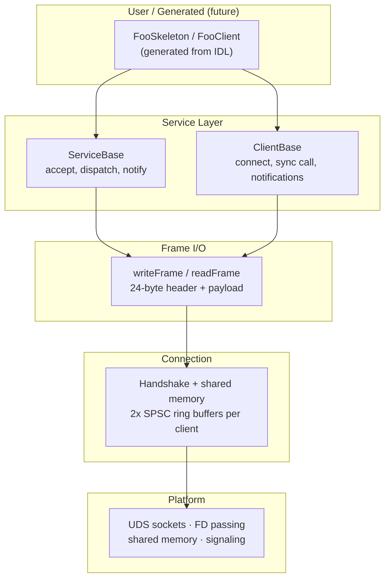

# ms-ipc

IPC framework for Linux — shared memory transport with UDS signaling.

Designed as a composable building block for RPC and notification systems.
Uses [ms-ringbuffer](https://github.com/Mrunmoy/ms-ringbuffer) for the
data plane and [ms-runloop](https://github.com/Mrunmoy/ms-runloop) for
event dispatch.

## Architecture



See [doc/architecture.md](doc/architecture.md) for detailed diagrams including
data flow, sequence diagrams, class hierarchy, and threading model.

## Features

- Split transport: shared memory for data, UDS for signaling only
- Lock-free SPSC ring buffers in shared memory (zero-copy data plane)
- FD passing via `SCM_RIGHTS` for shared memory handshake
- Abstract namespace sockets (no filesystem cleanup)
- Framed message protocol: 24-byte header + payload
- Server-side ServiceBase with accept thread + per-client receiver threads
- Client-side ClientBase with sync RPC (condition_variable + timeout)
- Virtual dispatch for request handling, broadcast notifications
- Virtual notification callbacks on client side
- Embedded-friendly: no `std::string`, no heap allocations in platform layer
- 42 unit tests

## Dependencies

- **C++17** compiler (GCC 7+, Clang 5+)
- **CMake** 3.14+
- **Linux** (primary target, macOS planned)
- **Python 3** (for build script, optional)
- **Google Test** v1.14.0 (bundled as submodule, tests only)
- **ms-ringbuffer** (bundled as submodule under `deps/`)

## Building

### Clone

```bash
git clone --recursive https://github.com/Mrunmoy/ms-ipc
```

### Build script

```bash
python3 build.py              # build only
python3 build.py -c           # clean build
python3 build.py -t           # build + run tests
python3 build.py -c -t        # clean build + tests
```

### CMake directly

```bash
cmake -B build -DCMAKE_BUILD_TYPE=Release
cmake --build build -j$(nproc)
ctest --test-dir build --output-on-failure
```

## Project structure

```
inc/Platform.h          OS-agnostic platform API
inc/Types.h             Error codes, frame header, protocol constants
inc/Connection.h        Connection struct + handshake (internal)
inc/FrameIO.h           Frame read/write through ring buffers
inc/ServiceBase.h       Server-side service base class
inc/ClientBase.h        Client-side RPC base class
src/PlatformLinux.cpp   Linux platform backend
src/Connection.cpp      Handshake implementation
src/FrameIO.cpp         readFrameAlloc (vector-based convenience read)
src/ServiceBase.cpp     Service lifecycle, threading, dispatch
src/ClientBase.cpp      Client connect, sync call, notifications
deps/ms-ringbuffer/     SPSC ring buffer (submodule)
test/                   Unit tests (see test/README.md)
doc/                    Design walkthroughs
```

## Walkthroughs

- [Architecture overview](doc/architecture.md) — layer stack, data flow, class hierarchy, threading
- [Platform layer](doc/Platform.md) — UDS, shared memory, FD passing
- [Connection handshake](doc/Connection.md) — how two peers establish shared ring buffers
- [Frame I/O](doc/FrameIO.md) — reading and writing framed messages
- [ServiceBase](doc/ServiceBase.md) — server-side service base class and threading model
- [ClientBase](doc/ClientBase.md) — client-side sync RPC and notification callbacks

## Further reading

- [test/README.md](test/README.md) — test organization and how to run
- [PLAN.md](PLAN.md) — implementation progress and roadmap

## License

MIT — see [LICENSE](LICENSE).
