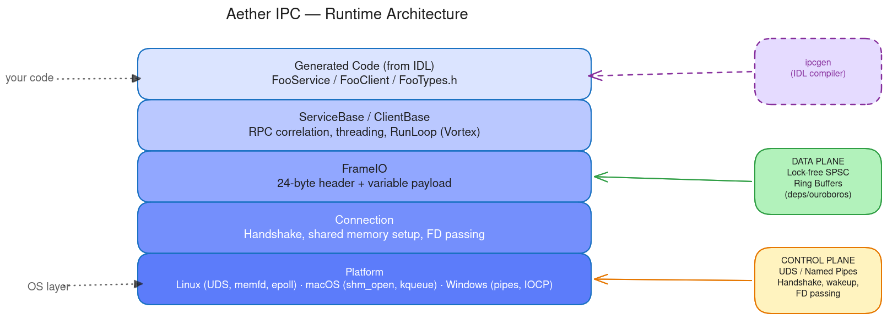

# Aether


[](LICENSE)


**Shared-memory IPC with IDL code generation for C++, Python, and C99.**

<p align="center">
  
</p>

Aether is an RPC framework that moves data through lock-free ring buffers in shared memory and uses an IDL compiler to generate typed server skeletons and client stubs. The same 24-byte wire protocol runs over shared memory on desktop and over serial/USB to microcontrollers.

## Features

- Shared-memory data plane with lock-free SPSC ring buffers
- IDL compiler (`ipcgen`) generating C++, C API, Python, and C99 MCU backends
- Fixed-size POD wire format with `memcpy` serialization
- Typed RPC methods and broadcast notifications from a single IDL definition
- `ITransport` abstraction for serial, USB, and custom byte-stream transports
- Single-threaded event-driven dispatch via RunLoop (epoll/kqueue)
- `aether-lite` -- standalone C99 bare-metal runtime for Cortex-M / AVR targets
- 287 tests (120 C++ / 167 Python), ASan + TSan in CI

## How It Works

### 1. Define your service in IDL

```idl
service TemperatureSensor
{
    [method=1]
    int GetTemperature([out] float32 celsius);

    [method=2]
    int SetThreshold([in] float32 high, [in] float32 low);
};

notifications TemperatureSensor
{
    [notify=1]
    void OverTemperature([in] float32 celsius);
};
```

### 2. Generate code

```bash
python3 -m ipcgen TemperatureSensor.idl --outdir gen/
```

### 3. Implement handlers and call methods

<p align="center">
  
</p>

**Server** -- subclass the generated skeleton and implement the virtual handlers:

```cpp
class MyTempSensor : public aether::ipc::TemperatureSensor
{
protected:
    int handleGetTemperature(float *celsius) override
    {
        *celsius = readSensor();
        return IPC_SUCCESS;
    }

    int handleSetThreshold(float high, float low) override
    {
        m_high = high;
        m_low = low;
        return IPC_SUCCESS;
    }
};

MyTempSensor service("temp_sensor");
service.start();
```

**Client** -- call typed methods directly:

```cpp
aether::ipc::TemperatureSensor client("temp_sensor");
client.connect();

float temp = 0;
int rc = client.GetTemperature(&temp);

client.SetThreshold(85.0f, -10.0f);
client.disconnect();
```

## Quick Start

**Prerequisites:**

- C++17 compiler (GCC 7+, Clang 5+, MSVC 2017+)
- CMake 3.14+
- Python 3 (build script and code generator)
- Linux, macOS, or Windows

**Build and test:**

```bash
git clone --recursive https://github.com/Mrunmoy/ms-ipc.git aether
cd aether
python3 build.py -t
```

**Generate code from IDL:**

```bash
python3 -m ipcgen path/to/YourService.idl --outdir gen/
```

Backends: `--backend c_api` (C API wrapper), `--backend python` (Python client), `--backend aether_lite` (C99 MCU dispatch).

## IDL at a Glance

### Type map

| IDL type | C++ type | Size |
|----------|----------|------|
| `uint8` .. `uint64` | `uint8_t` .. `uint64_t` | 1--8 bytes |
| `int8` .. `int64` | `int8_t` .. `int64_t` | 1--8 bytes |
| `float32` / `float64` | `float` / `double` | 4 / 8 bytes |
| `bool` | `bool` | 1 byte |
| `T[N]` | `std::array<T, N>` | N x sizeof(T) |
| `string[N]` | `char[N+1]` | N+1 bytes |

### Enums and structs

```idl
enum DeviceType { Unknown = 0, USB = 1, Bluetooth = 2 };

struct DeviceInfo
{
    uint32 id;
    DeviceType type;
    uint8[6] serial;
    string[64] name;
};
```

See [ipcgen-hld.md](doc/ipcgen-hld.md) for the full IDL grammar and backend details.

## Architecture

<p align="center">
  
</p>

The runtime is organized into five layers. Platform provides OS abstractions (sockets, shared memory, FD passing). Connection runs the handshake and sets up two 256 KB SPSC rings per client. FrameIO reads and writes 24-byte framed messages. ServiceBase/ClientBase handle accept loops, threading, RPC dispatch, and notifications. Generated code from `ipcgen` sits on top, giving users typed virtual handlers and typed call methods.

Full details in the [high-level design](doc/aether-hld.md).

## Transports

<p align="center">
  
</p>

| Transport | Mechanism | Use case |
|-----------|-----------|----------|
| **Shared Memory** | Lock-free SPSC rings; UDS/named pipe for handshake and wakeup only | Processes on the same machine |
| **Serial (UART)** | Byte stream over serial port; same 24-byte wire protocol | Desktop to embedded device |
| **USB** | USB CDC virtual serial port; same wire protocol | Desktop to embedded device |

All transports share the same frame format. The `ITransport` interface lets you plug in any byte-stream backend.

## Integration

### Pre-built SDK

Download a release tarball containing `aether_ipc.h` and `libaether.a`. Generate code with `--backend c_api`. Works with any C++17 toolchain regardless of which compiler built the SDK.

```cmake
set(AETHER_SDK "/path/to/aether-sdk" CACHE PATH "Aether SDK")

add_executable(my_server my_server.cpp gen/server/MyService.cpp)
target_include_directories(my_server PRIVATE gen gen/server ${AETHER_SDK}/include)
target_link_libraries(my_server ${AETHER_SDK}/lib/libaether.a stdc++ pthread)
target_compile_features(my_server PRIVATE cxx_std_17)
```

See [`examples/sdk-usage/`](examples/sdk-usage/) for a complete working project.

### Git submodule

Add Aether as a submodule and build from source. This gives full access to `ServiceBase`, `ClientBase`, and RunLoop integration.

```cmake
add_subdirectory(deps/aether)

add_executable(my_server my_server.cpp gen/server/MyService.cpp)
target_include_directories(my_server PRIVATE gen/server)
target_link_libraries(my_server aether)
```

See [`examples/echo/`](examples/echo/) for a source-build codegen example.

## Examples

| Example | Description |
|---------|-------------|
| [`examples/sdk-usage/`](examples/sdk-usage/) | IDL to C API server/client using the SDK release tarball |
| [`examples/echo/`](examples/echo/) | IDL to `ServiceBase`/`ClientBase` with codegen tests |
| [`examples/c-echo/`](examples/c-echo/) | Raw C API echo server and client, no codegen |
| [`examples/exhaust-analyzer/`](examples/exhaust-analyzer/) | Qt5 GUI with structs, enums, and notifications |
| [`examples/serial-loopback/`](examples/serial-loopback/) | `TransportClientBase` over a PTY-backed `ITransport` loopback |
| [`examples/serial-sensor/`](examples/serial-sensor/) | Host `TransportClientBase` talking to an `aether-lite` device over PTY |
| [`examples/mcu-firmware/`](examples/mcu-firmware/) | Bare-metal `aether-lite` UART template for Cortex-M targets |

## Documentation

| Document | Contents |
|----------|----------|
| [aether-hld.md](doc/aether-hld.md) | High-level design -- architecture and components |
| [aether-lld.md](doc/aether-lld.md) | Low-level design -- APIs, wire protocol, threading |
| [ipcgen-hld.md](doc/ipcgen-hld.md) | Code generator high-level design |
| [ipcgen-lld.md](doc/ipcgen-lld.md) | Code generator module APIs and code generation |
| [aether-vision.md](doc/aether-vision.md) | Vision, platform requirements, language roles |
| [architecture-guide.md](doc/architecture-guide.md) | Architecture walkthrough and design rationale |
| [phase5-runloop-plan.md](doc/phase5-runloop-plan.md) | Vortex RunLoop completion review and implementation plan |
| [dev-journal-phase5-p0.md](doc/dev-journal-phase5-p0.md) | Phase 5 P0 bug-fix development journal |
| [dev-journal-phase5-p1.md](doc/dev-journal-phase5-p1.md) | Phase 5 P1 hardening development journal |

## License

MIT -- see [LICENSE](LICENSE).
