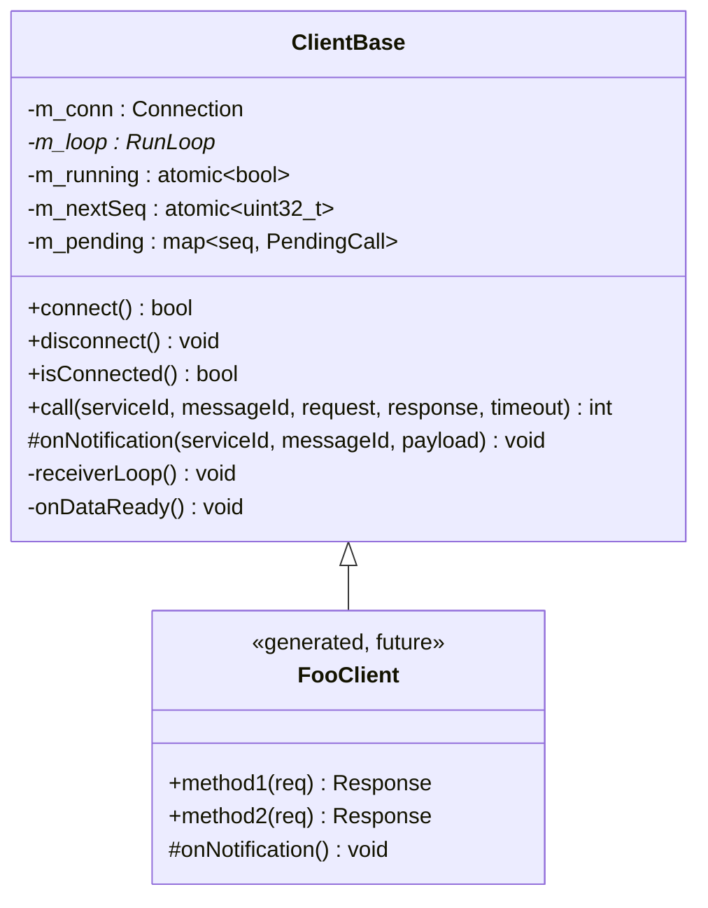
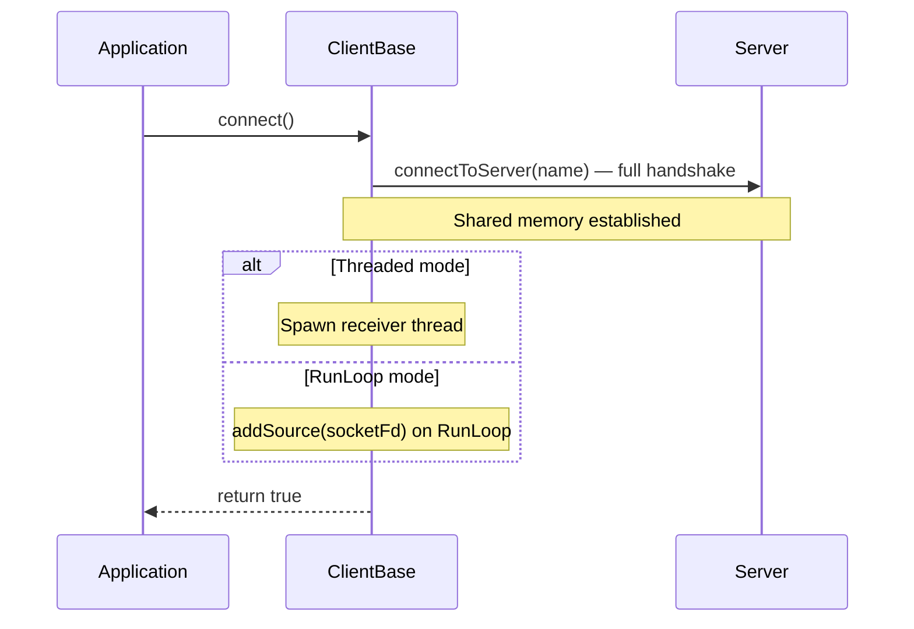
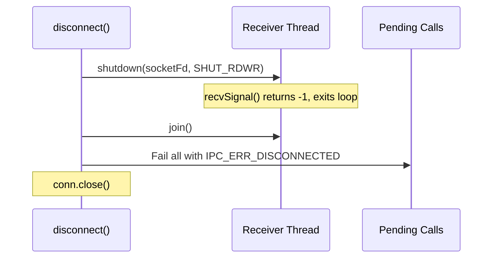
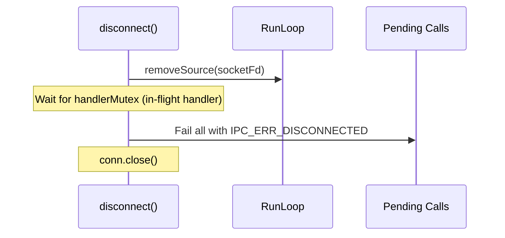
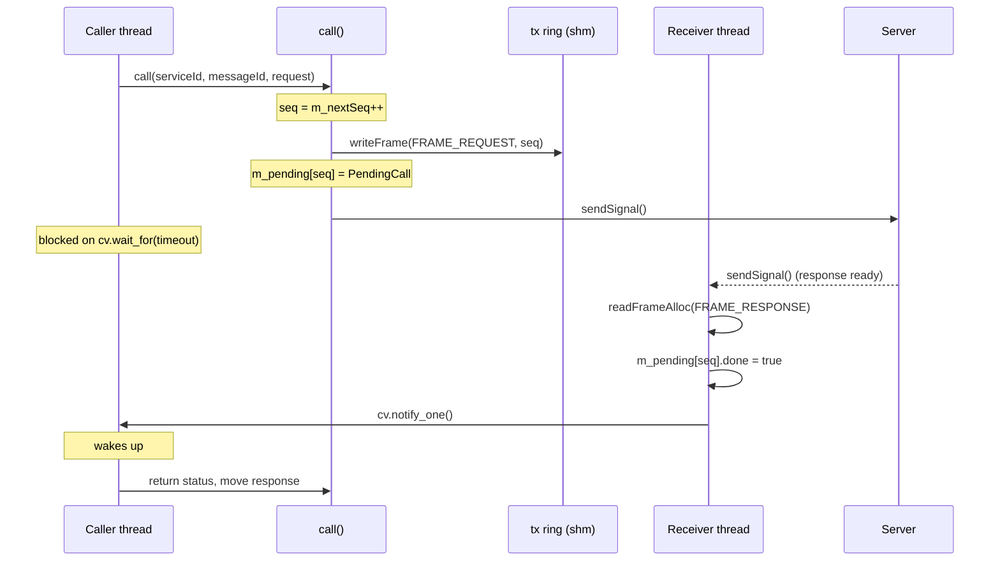
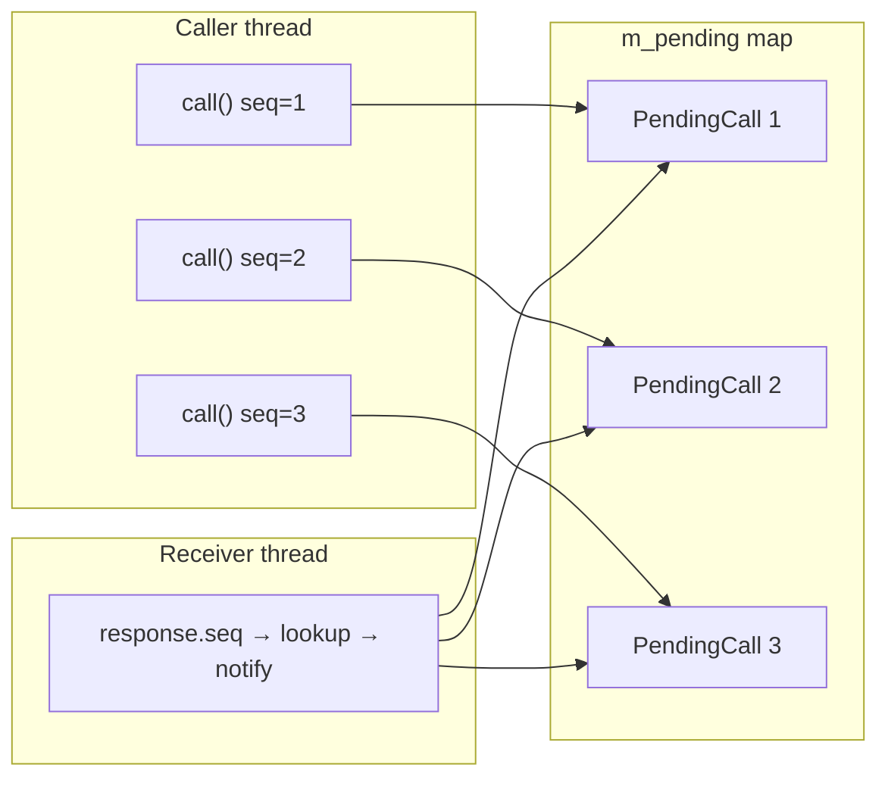
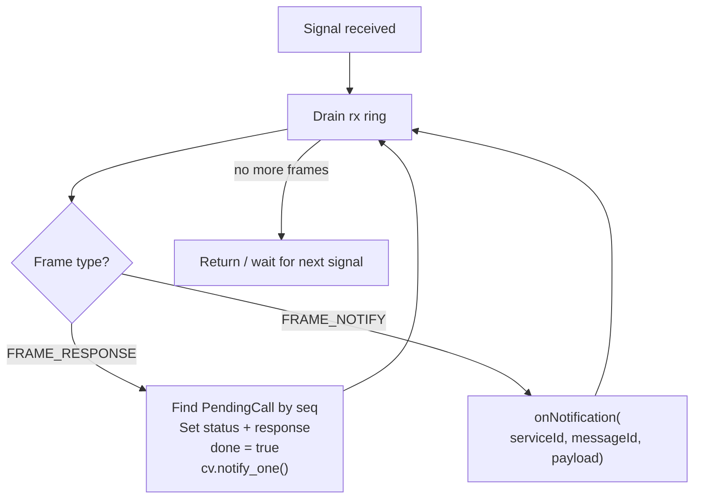

# ClientBase Walkthrough

ClientBase is the client-side base class for IPC services. Generated
FooClient classes inherit from it and provide typed call wrappers
(e.g., `fooMethod(req) -> response`) and virtual notification callbacks.



## Files

| File | Purpose |
|------|---------|
| `inc/ClientBase.h` | Class declaration |
| `src/ClientBase.cpp` | Connect, sync RPC, receiver thread, notifications |

## Lifecycle

### Connecting

```cpp
// Threaded mode (default):
ClientBase client("my-service");
client.connect();  // handshake + spawn receiver thread

// RunLoop mode:
ms::RunLoop loop;
loop.init("cli");
ClientBase client("my-service", &loop);
client.connect();  // handshake + register fd on RunLoop
```



`connect()` calls `connectToServer()` from Connection.h — creates shared
memory, sends the FD to the server, waits for ACK. In threaded mode, it
spawns a receiver thread. In RunLoop mode, it registers the socket fd
as a RunLoop source — responses and notifications arrive via `onDataReady()`.

### Disconnecting

```cpp
client.disconnect();
```

#### Threaded mode



#### RunLoop mode



The destructor calls `disconnect()` automatically.

## Synchronous RPC — call()

```cpp
int call(uint32_t serviceId, uint32_t messageId,
         const std::vector<uint8_t> &request,
         std::vector<uint8_t> *response,
         uint32_t timeoutMs = 2000);
```

### How it works



### Sequence number correlation



Each call generates a unique sequence number via `m_nextSeq.fetch_add(1)`.
The server echoes the sequence number in the response frame. The receiver
thread looks up the matching PendingCall by seq and notifies the waiting
caller.

### Error returns

| Return value | Meaning |
|-------------|---------|
| `IPC_SUCCESS` (0) | Response received successfully |
| `IPC_ERR_DISCONNECTED` (-1) | Not connected or connection lost |
| `IPC_ERR_TIMEOUT` (-2) | No response within timeoutMs |
| `IPC_ERR_RING_FULL` (-3) | Ring buffer full (request too large) |
| Server status (from aux) | Server-returned error code |

## Receiving frames

Both threaded mode (`receiverLoop()`) and RunLoop mode (`onDataReady()`)
use the same logic to process incoming frames:



Two frame types are handled:
- **FRAME_RESPONSE** — matches to a pending `call()` by sequence number
- **FRAME_NOTIFY** — dispatched to virtual `onNotification()`

In threaded mode, `receiverLoop()` blocks on `recvSignal()` in a loop.
In RunLoop mode, `onDataReady()` is called by the RunLoop when the socket
becomes readable; a `m_handlerMutex` prevents `disconnect()` from closing
the connection while the handler is executing.

## Notification callbacks

```cpp
// Default implementation does nothing.
virtual void onNotification(uint32_t serviceId, uint32_t messageId,
                            const std::vector<uint8_t> &payload);
```

Not pure virtual — clients that don't need notifications don't have to
override it. Generated FooClient overrides this with a switch on messageId,
calling typed virtual methods like `onTemperatureChanged(payload)`.

## Typical usage

```cpp
// Threaded mode (default):
ClientBase client("echo-service");
client.connect();

std::vector<uint8_t> request = {1, 2, 3};
std::vector<uint8_t> response;
int rc = client.call(1, 1, request, &response);
if (rc == IPC_SUCCESS) {
    // response contains the server's reply
}

client.disconnect();
```

```cpp
// RunLoop mode — call() from a non-RunLoop thread:
ms::RunLoop loop;
loop.init("app");
ClientBase client("echo-service", &loop);
client.connect();

// Start the RunLoop on a background thread.
std::thread loopThread([&loop] { loop.run(); });

// call() blocks the caller; response arrives on RunLoop thread.
int rc = client.call(1, 1, request, &response);

client.disconnect();
loop.stop();
loopThread.join();
```

**Important:** Do not call `call()` from the RunLoop thread — it will
deadlock because the response can only arrive via the same thread.

## Design decisions

**Optional RunLoop** — the RunLoop parameter is optional (`nullptr` by
default). Threaded mode works standalone; RunLoop mode integrates into
an event-driven application with zero internal threads.

**Virtual `onNotification()` instead of `std::function`** — matches the
ServiceBase pattern. Generated code overrides it with a switch, calling
typed virtual methods that users implement.

**Handler mutex (RunLoop mode)** — `m_handlerMutex` prevents `disconnect()`
from closing the connection while `onDataReady()` is executing on the
RunLoop thread, avoiding use-after-free.

**`shared_ptr<PendingCall>`** — the PendingCall is shared between the caller
(which waits on the cv) and the receiver/RunLoop thread (which sets done
and notifies). Using shared_ptr ensures the PendingCall lives long enough
even if the map entry is erased during cleanup.

**Atomic sequence counter** — `m_nextSeq.fetch_add(1)` is lock-free and
generates unique sequence numbers without contention. Safe for concurrent
calls from multiple threads.

**Timeout per call** — each call has its own timeout (default 2000ms). The
condition_variable `wait_for` handles this efficiently without a separate
timer thread.
