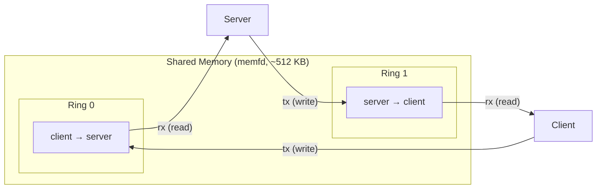
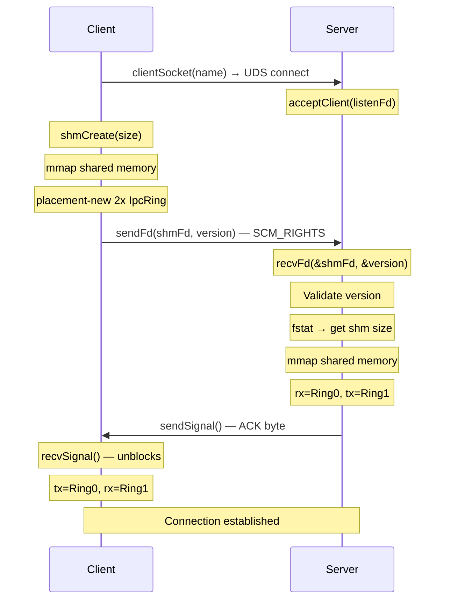
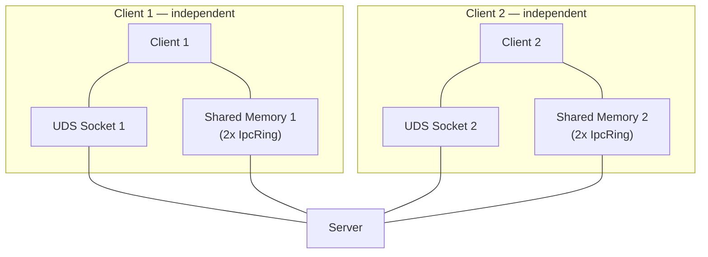

# Connection Handshake Walkthrough

The connection layer (`ms::ipc::Connection`) establishes a shared memory
data channel between two peers using the platform primitives.

This is **internal infrastructure** — users never interact with it directly.
The Service layer (and generated code) manages connections internally.

## Files

| File | Purpose |
|------|---------|
| `inc/Connection.h` | Connection struct + handshake function declarations |
| `src/Connection.cpp` | Handshake implementation |
| `inc/Types.h` | Protocol constants, ring buffer typedef |

## What a Connection holds

```cpp
struct Connection {
    int       socketFd;    // UDS socket for signaling
    int       shmFd;       // shared memory file descriptor
    void*     shmBase;     // mmap'd base pointer
    uint32_t  shmSize;     // total shared memory size
    IpcRing*  txRing;      // ring buffer for sending
    IpcRing*  rxRing;      // ring buffer for receiving
};
```

Each connection has one UDS socket (for signaling) and one shared memory
region containing two ring buffers (for bidirectional data transfer).

## Shared memory layout

The shared memory region contains two `ByteRingBuffer<256KB>` instances
laid out contiguously:



Each side gets opposite tx/rx assignments:
- **Client**: tx = Ring 0, rx = Ring 1
- **Server**: rx = Ring 0, tx = Ring 1

Total shared memory size = `2 * sizeof(IpcRing)` (~512 KB + control blocks).

## Handshake protocol

### Step by step



### Key details

**Who creates the shared memory?** The client. It calls `memfd_create`,
sizes the region with `ftruncate`, does `mmap` and placement-new, then
sends the FD to the server. The server `mmap`s the same FD.

**Version validation.** The client sends `kProtocolVersion` (currently 1)
alongside the shared memory FD. The server checks it matches. On
mismatch, the server closes the socket — the client's `recvSignal` fails,
and `connectToServer` returns an invalid connection.

**ACK/NACK.** ACK is a single signal byte. NACK is implicit — the server
closes the socket without sending ACK.

**Ring buffer initialization.** The client does placement-new on both
ring buffers (zeroing the control block atomics). The server just
`reinterpret_cast`s — the memory is already initialized.

## Error handling

Both `connectToServer` and `acceptConnection` clean up on any failure:
- `munmap` the shared memory (if mapped)
- `close` the shared memory FD
- `close` the UDS socket
- Return an invalid connection (`valid() == false`)

Callers check `conn.valid()` to know if the handshake succeeded.

## Multi-client isolation



Each client-server pair gets its own:
- UDS socket
- Shared memory region
- Pair of ring buffers

No shared state between connections. A crashing client only affects its
own connection.
