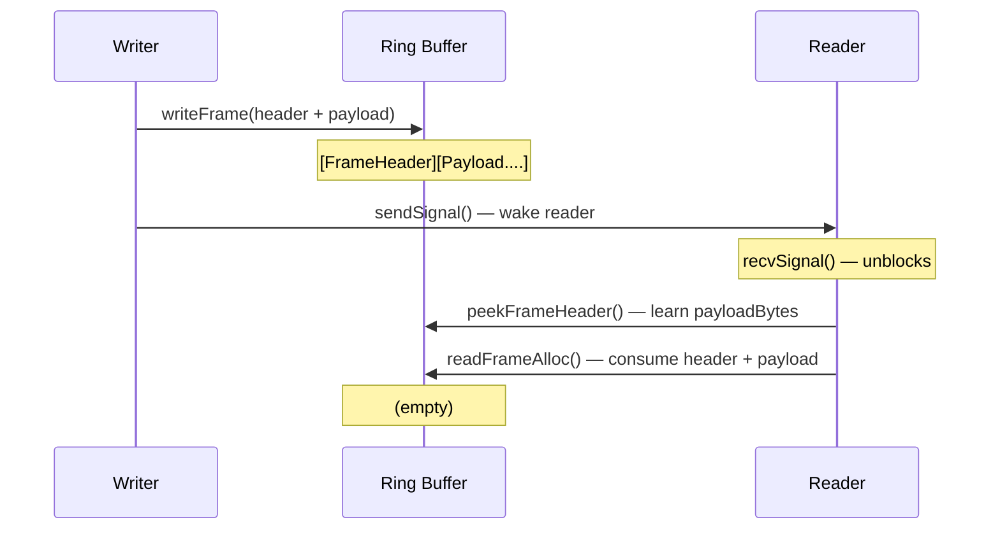
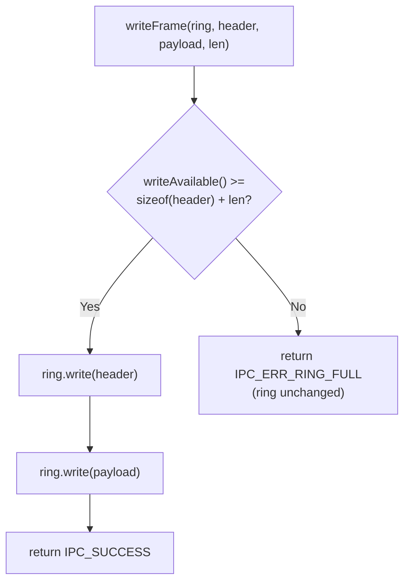
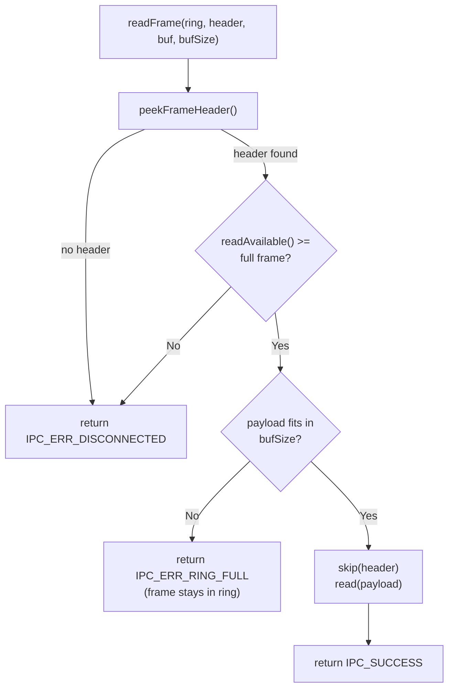

# Frame I/O Walkthrough

The Frame I/O layer (`ms::ipc`) reads and writes framed messages through
the SPSC ring buffers established by the Connection handshake.

## Why a framing layer?

The ring buffer is a raw byte stream. Higher layers (ServiceBase, ClientBase)
need to send structured messages — a header describing the message type,
sequence number, and payload length, followed by the payload itself. Frame
I/O bridges that gap with three simple functions.

## Files

| File | Purpose |
|------|---------|
| `inc/FrameIO.h` | `writeFrame`, `readFrame`, `peekFrameHeader` (inline), `readFrameAlloc` (declaration) |
| `src/FrameIO.cpp` | `readFrameAlloc` implementation (heap-allocating convenience) |

## Frame format

Each frame is written contiguously into the ring buffer:

```
[ FrameHeader (24 bytes) ][ payload (N bytes) ]
```

The `FrameHeader` is written in native endian — no byte-swapping needed
because both processes are on the same machine (same-machine IPC via
shared memory).

```cpp
struct FrameHeader {
    uint16_t version;       // protocol version
    uint16_t flags;         // FRAME_REQUEST, FRAME_RESPONSE, FRAME_NOTIFY
    uint32_t serviceId;     // which service
    uint32_t messageId;     // which method or notification
    uint32_t seq;           // sequence number (for request/response matching)
    uint32_t payloadBytes;  // length of payload following this header
    uint32_t aux;           // auxiliary (e.g., status code in responses)
};
```

## API overview

### Writing a frame

```cpp
int writeFrame(IpcRing *ring,
               const FrameHeader &header,
               const uint8_t *payload,
               uint32_t payloadBytes);
```

Checks `writeAvailable() >= sizeof(FrameHeader) + payloadBytes` before
writing. If there isn't enough space, returns `IPC_ERR_RING_FULL` without
modifying the ring — the write is atomic (all or nothing).

### Peeking at the next header

```cpp
bool peekFrameHeader(const IpcRing *ring, FrameHeader *header);
```

Reads the next 24 bytes without consuming them. Returns `false` if the
ring doesn't contain a full header yet. Use this to learn `payloadBytes`
before allocating a read buffer.

### Reading a frame (fixed buffer)

```cpp
int readFrame(IpcRing *ring, FrameHeader *header,
              uint8_t *payload, uint32_t payloadBufSize);
```

Peeks the header, validates that the full frame is available and fits in
the provided buffer, then consumes header + payload. Returns:
- `IPC_SUCCESS` — frame read successfully
- `IPC_ERR_DISCONNECTED` — not enough data in ring
- `IPC_ERR_RING_FULL` — payload doesn't fit in `payloadBufSize`

If the buffer is too small, nothing is consumed — the frame stays in the
ring for a retry with a larger buffer.

### Reading a frame (heap-allocated)

```cpp
int readFrameAlloc(IpcRing *ring, FrameHeader *header,
                   std::vector<uint8_t> *payload);
```

Convenience wrapper that resizes the vector to fit the payload. Useful
when the caller doesn't know payload size in advance. Defined in
`FrameIO.cpp` to keep the header lightweight.

## Write/read flow



## writeFrame — atomic check



## readFrame — non-destructive error recovery



## Typical usage pattern

```cpp
// Writer side
FrameHeader hdr{};
hdr.version = kProtocolVersion;
hdr.flags = FRAME_REQUEST;
hdr.serviceId = 1;
hdr.messageId = 42;
hdr.seq = nextSeq++;
hdr.payloadBytes = requestLen;

writeFrame(conn.txRing, hdr, requestData, requestLen);
platform::sendSignal(conn.socketFd);  // wake the other side

// Reader side (after recvSignal wakes us)
FrameHeader inHdr{};
std::vector<uint8_t> payload;
if (readFrameAlloc(conn.rxRing, &inHdr, &payload) == IPC_SUCCESS) {
    // dispatch based on inHdr.flags, serviceId, messageId
}
```

## Design decisions

**Inline functions** — `writeFrame`, `peekFrameHeader`, and `readFrame`
are `inline` in the header. They're small, hot-path functions with zero
heap allocations. `readFrameAlloc` is in the `.cpp` because it uses
`std::vector`.

**No endian conversion** — both processes share the same memory on the same
machine. The `FrameHeader` struct is written directly via the ring buffer's
`write()` / `peek()` / `read()`. No `htole16` / `le16toh` overhead.

**Atomic writes** — `writeFrame` checks available space before writing.
If there isn't room for the complete frame (header + payload), nothing is
written. This prevents partial frames in the ring buffer.

**Non-destructive error recovery** — `readFrame` with an undersized buffer
returns `IPC_ERR_RING_FULL` without consuming the frame. The caller can
retry with a larger buffer or use `readFrameAlloc` instead.
