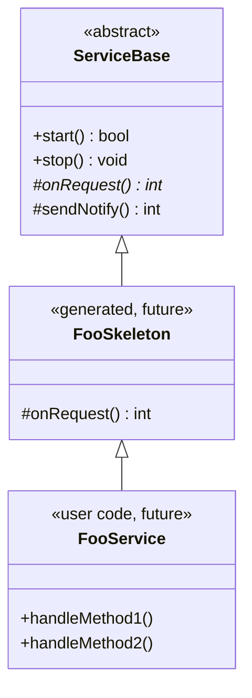
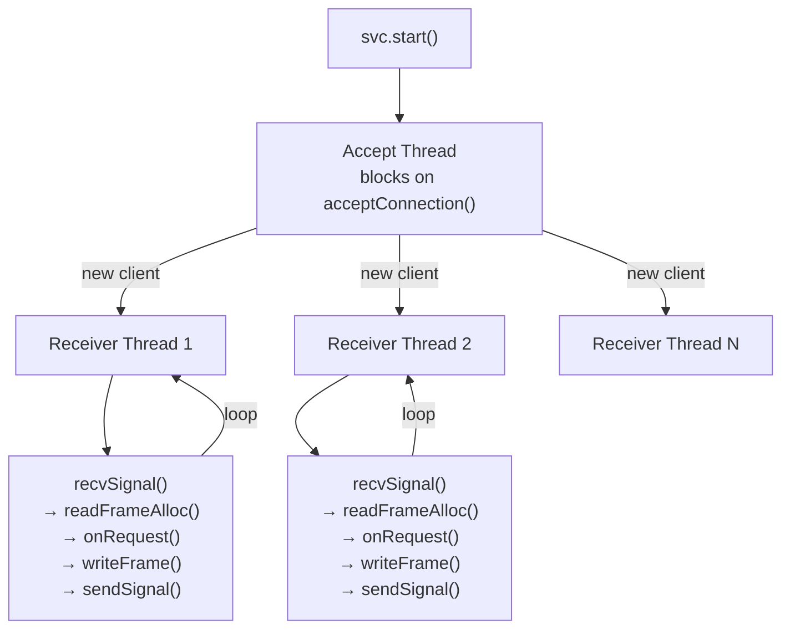
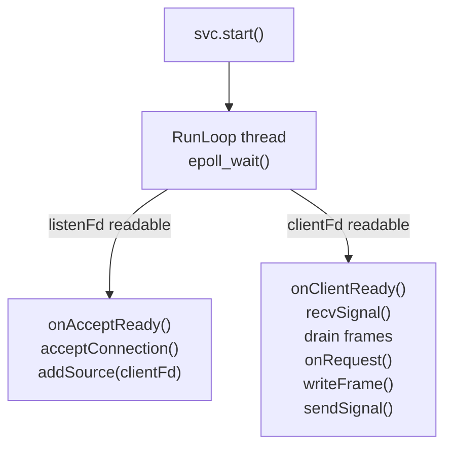
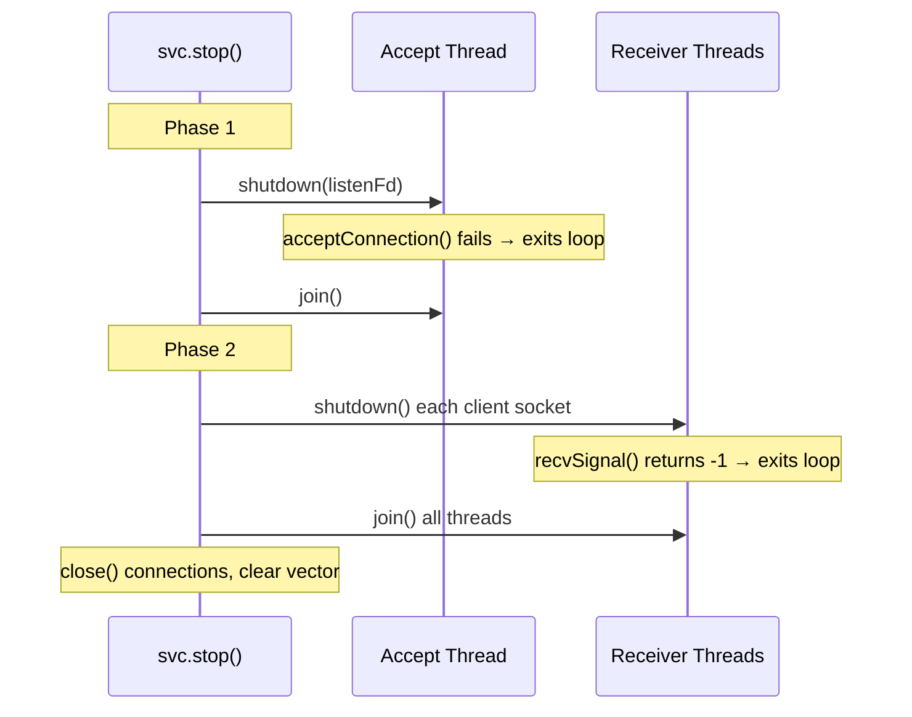
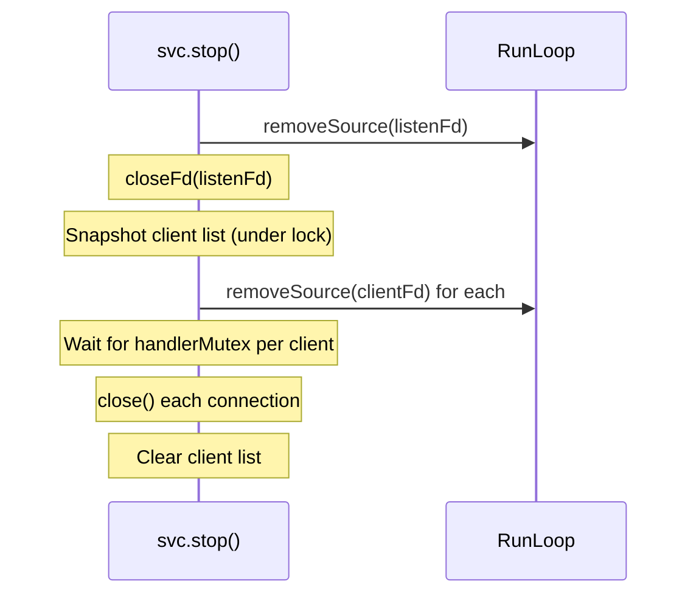
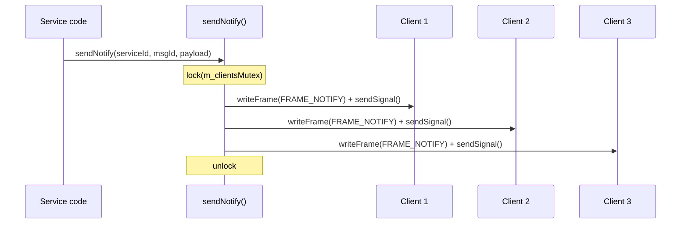

# ServiceBase Walkthrough

ServiceBase is the server-side base class for IPC services. Generated
FooSkeleton classes inherit from it and implement `onRequest()` as a
switch on messageId. User code inherits from FooSkeleton and provides
the concrete handler methods.



## Files

| File | Purpose |
|------|---------|
| `inc/ServiceBase.h` | Class declaration |
| `src/ServiceBase.cpp` | Lifecycle, threading, dispatch, notification broadcast |

## Threading model

ServiceBase supports two modes: **threaded** (default) and **RunLoop**.
Pass a `ms::RunLoop*` to the constructor to use RunLoop mode; pass
`nullptr` (or omit) for threaded mode.

### Threaded mode (default)



Each receiver thread:
1. Blocks on `platform::recvSignal()` waiting for the client to signal
2. Drains all available frames from the client's rx ring buffer
3. For each `FRAME_REQUEST`, calls `onRequest()` (virtual dispatch)
4. Builds a `FRAME_RESPONSE` with the return status in `aux`
5. Writes the response via `writeFrame()` and signals the client

### RunLoop mode



Zero internal threads — the listen fd and all client fds are registered
as RunLoop sources. The RunLoop's epoll thread dispatches
`onAcceptReady()` for new connections and `onClientReady()` for incoming
requests. If a handler blocks, the entire RunLoop blocks (by design).

A `handlerMutex` per client prevents `stop()` from closing a connection
while a handler is still executing.

## Lifecycle

### Starting

```cpp
// Threaded mode (default):
EchoService svc("my-service");
svc.start();  // creates listen socket, spawns accept thread

// RunLoop mode:
ms::RunLoop loop;
loop.init("svc");
EchoService svc("my-service", &loop);
svc.start();  // registers listen fd on RunLoop (no threads spawned)
```

`start()` calls `platform::serverSocket()` to create an abstract namespace
UDS socket. In threaded mode, it spawns the accept loop on a dedicated
thread. In RunLoop mode, it registers the listen fd as a RunLoop source.

### Stopping

```cpp
svc.stop();
```

#### Threaded mode (two-phase shutdown)



#### RunLoop mode shutdown



The destructor calls `stop()` automatically.

## API

### Public

```cpp
// loop = nullptr → threaded mode (internal threads)
// loop = &myLoop → RunLoop mode (zero internal threads)
explicit ServiceBase(const char *serviceName, ms::RunLoop *loop = nullptr);
virtual ~ServiceBase();

bool start();        // create listen socket, spawn threads or register sources
void stop();         // shutdown: join threads or remove sources, cleanup
bool isRunning() const;  // atomic flag
```

### Protected (for subclasses)

```cpp
// Pure virtual — subclass dispatches by messageId.
// Returns IPC_SUCCESS or error code (stored in response aux).
virtual int onRequest(uint32_t messageId,
                      const std::vector<uint8_t> &request,
                      std::vector<uint8_t> *response) = 0;

// Broadcast FRAME_NOTIFY to all connected clients.
int sendNotify(uint32_t serviceId, uint32_t messageId,
               const uint8_t *payload, uint32_t payloadBytes);
```

## Notification broadcast



`sendNotify()` iterates all connected clients under a mutex, writing
a `FRAME_NOTIFY` frame to each client's tx ring and signaling the socket.
Returns the first error if any write or signal fails.

```cpp
// In a NotifyTestService subclass:
int testNotify(uint32_t messageId, const uint8_t *payload, uint32_t len)
{
    return sendNotify(1, messageId, payload, len);
}
```

## Typical subclass pattern

```cpp
class EchoService : public ServiceBase
{
public:
    using ServiceBase::ServiceBase;

protected:
    int onRequest(uint32_t messageId, const std::vector<uint8_t> &request,
                  std::vector<uint8_t> *response) override
    {
        if (messageId == 1)
        {
            *response = request;  // echo back
            return IPC_SUCCESS;
        }
        return IPC_ERR_INVALID_METHOD;
    }
};
```

## Connection ownership

`acceptLoop()` receives a `Connection` from `acceptConnection()` and
transfers it into a heap-allocated `ClientConn`. The local `Connection`
is zeroed out after the transfer so it doesn't appear to own the file
descriptors. `Connection` has no RAII destructor — `close()` is explicit,
called during `stop()`.

## Design decisions

**Optional RunLoop** — the RunLoop parameter is optional (`nullptr` by
default). Threaded mode keeps the dependency minimal; RunLoop mode enables
zero-thread operation when integrating into an event-driven application.

**Virtual dispatch** — `onRequest()` is a pure virtual method rather than
a `std::function` callback. This allows generated skeletons to implement
the switch as a normal override.

**Per-client threads (threaded mode)** — each client gets its own receiver
thread. This simplifies the implementation (no multiplexing) and ensures
one slow client doesn't block others.

**Multiplexed handlers (RunLoop mode)** — all clients share the RunLoop
thread via epoll. A `handlerMutex` per client prevents `stop()` from
closing a connection while a handler is in-flight.

**Two-phase shutdown (threaded mode)** — stopping the accept thread
before stopping receiver threads prevents new connections from arriving
during teardown. Using `shutdown(fd, SHUT_RDWR)` to unblock blocking
socket calls is cleaner than using a pipe or eventfd for cancellation.

**Snapshot-then-wait shutdown (RunLoop mode)** — `stop()` snapshots the
client list under `m_clientsMutex`, releases the lock, then waits for
each client's `handlerMutex`. This avoids a deadlock where `stop()` holds
`m_clientsMutex` while a handler holds `handlerMutex` and calls
`removeClient()` which also needs `m_clientsMutex`.
