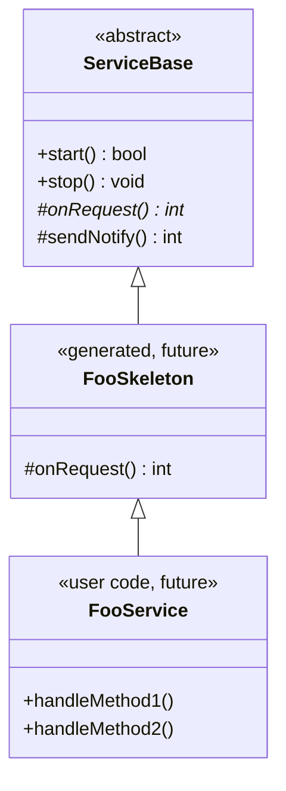
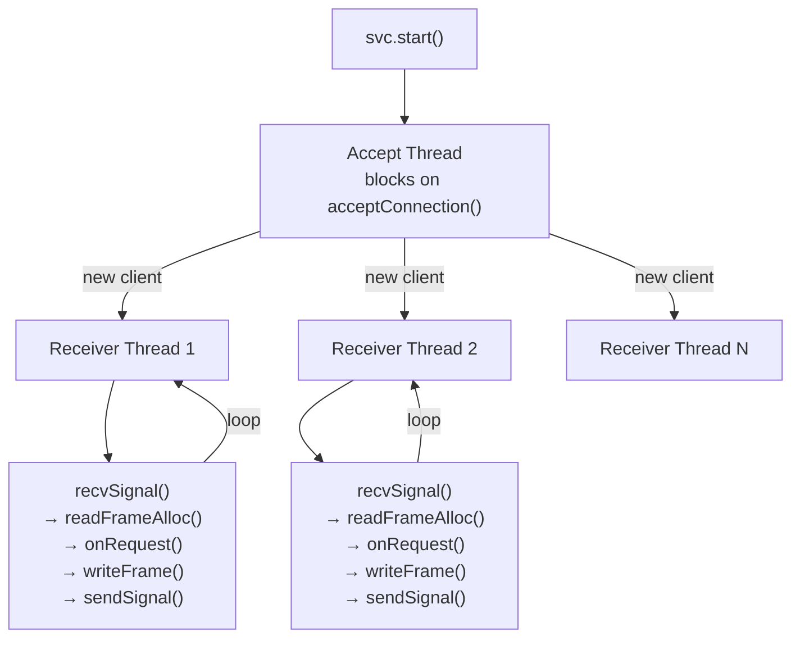
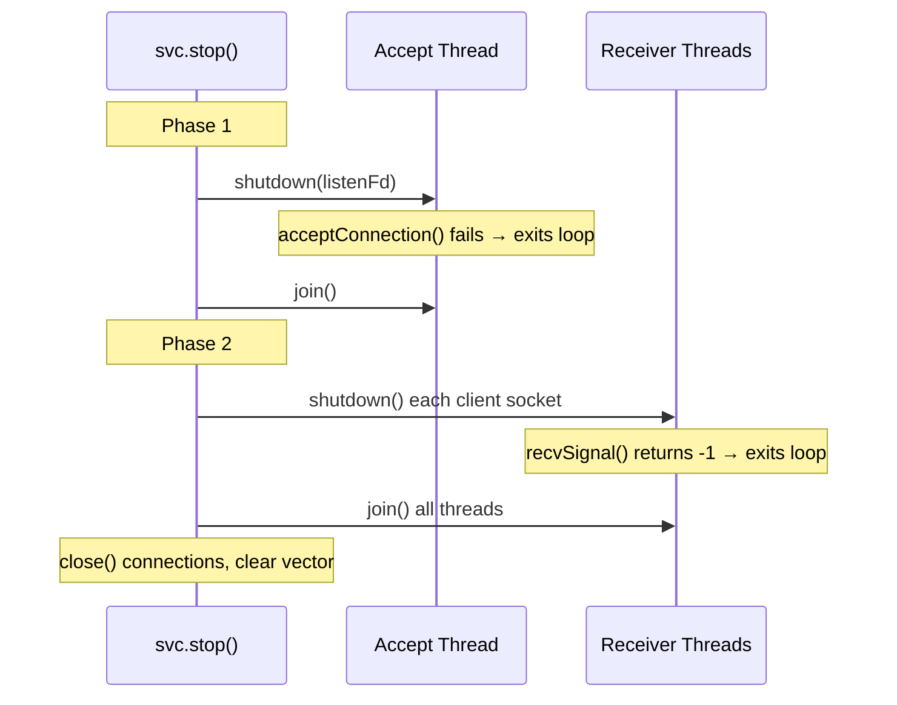
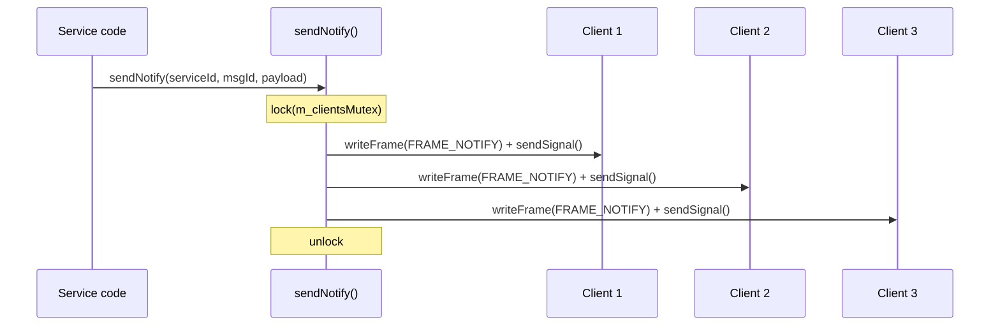

# ServiceBase Walkthrough

ServiceBase is the server-side base class for IPC services. Generated
FooSkeleton classes inherit from it and implement `onRequest()` as a
switch on messageId. User code inherits from FooSkeleton and provides
the concrete handler methods.



## Files

| File | Purpose |
|------|---------|
| `inc/ServiceBase.h` | Class declaration |
| `src/ServiceBase.cpp` | Lifecycle, threading, dispatch, notification broadcast |

## Threading model

ServiceBase uses internal threads — no RunLoop dependency.



Each receiver thread:
1. Blocks on `platform::recvSignal()` waiting for the client to signal
2. Drains all available frames from the client's rx ring buffer
3. For each `FRAME_REQUEST`, calls `onRequest()` (virtual dispatch)
4. Builds a `FRAME_RESPONSE` with the return status in `aux`
5. Writes the response via `writeFrame()` and signals the client

## Lifecycle

### Starting

```cpp
EchoService svc("my-service");
svc.start();  // creates listen socket, spawns accept thread
```

`start()` calls `platform::serverSocket()` to create an abstract namespace
UDS socket, then spawns the accept loop on a dedicated thread.

### Stopping (two-phase shutdown)

```cpp
svc.stop();
```



The destructor calls `stop()` automatically.

## API

### Public

```cpp
explicit ServiceBase(const char *serviceName);
virtual ~ServiceBase();

bool start();        // create listen socket, spawn accept thread
void stop();         // two-phase shutdown, join all threads
bool isRunning() const;  // atomic flag
```

### Protected (for subclasses)

```cpp
// Pure virtual — subclass dispatches by messageId.
// Returns IPC_SUCCESS or error code (stored in response aux).
virtual int onRequest(uint32_t messageId,
                      const std::vector<uint8_t> &request,
                      std::vector<uint8_t> *response) = 0;

// Broadcast FRAME_NOTIFY to all connected clients.
int sendNotify(uint32_t serviceId, uint32_t messageId,
               const uint8_t *payload, uint32_t payloadBytes);
```

## Notification broadcast



`sendNotify()` iterates all connected clients under a mutex, writing
a `FRAME_NOTIFY` frame to each client's tx ring and signaling the socket.
Returns the first error if any write or signal fails.

```cpp
// In a NotifyTestService subclass:
int testNotify(uint32_t messageId, const uint8_t *payload, uint32_t len)
{
    return sendNotify(1, messageId, payload, len);
}
```

## Typical subclass pattern

```cpp
class EchoService : public ServiceBase
{
public:
    using ServiceBase::ServiceBase;

protected:
    int onRequest(uint32_t messageId, const std::vector<uint8_t> &request,
                  std::vector<uint8_t> *response) override
    {
        if (messageId == 1)
        {
            *response = request;  // echo back
            return IPC_SUCCESS;
        }
        return IPC_ERR_INVALID_METHOD;
    }
};
```

## Connection ownership

`acceptLoop()` receives a `Connection` from `acceptConnection()` and
transfers it into a heap-allocated `ClientConn`. The local `Connection`
is zeroed out after the transfer so it doesn't appear to own the file
descriptors. `Connection` has no RAII destructor — `close()` is explicit,
called during `stop()`.

## Design decisions

**Internal threads** — ServiceBase owns its threads rather than requiring
a RunLoop. This keeps the dependency graph simple and avoids coupling the
IPC framework to a specific event loop implementation.

**Virtual dispatch** — `onRequest()` is a pure virtual method rather than
a `std::function` callback. This eliminates the need for a handler mutex
and allows generated skeletons to implement the switch as a normal override.

**Per-client threads** — each client gets its own receiver thread. This
simplifies the implementation (no multiplexing) and ensures one slow client
doesn't block others. For high-connection-count scenarios, a future
RunLoop-based variant could multiplex using epoll.

**Two-phase shutdown** — stopping the accept thread before stopping
receiver threads prevents new connections from arriving during teardown.
Using `shutdown(fd, SHUT_RDWR)` to unblock blocking socket calls is
cleaner than using a pipe or eventfd for cancellation.
