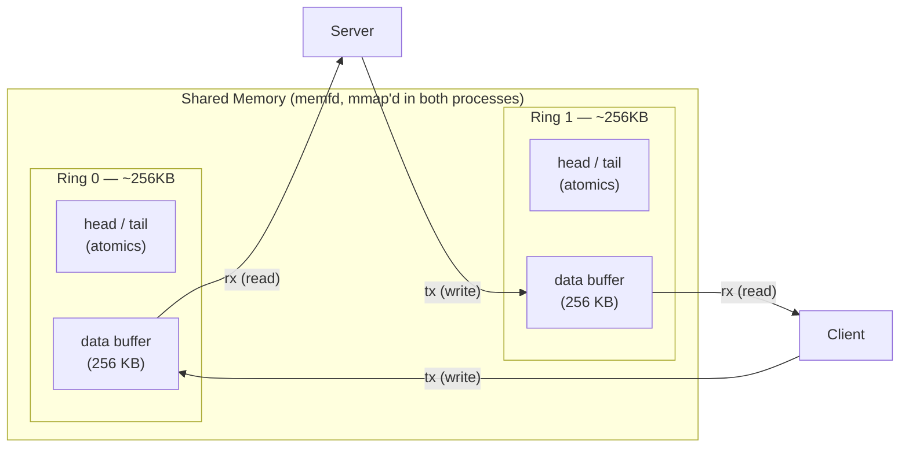
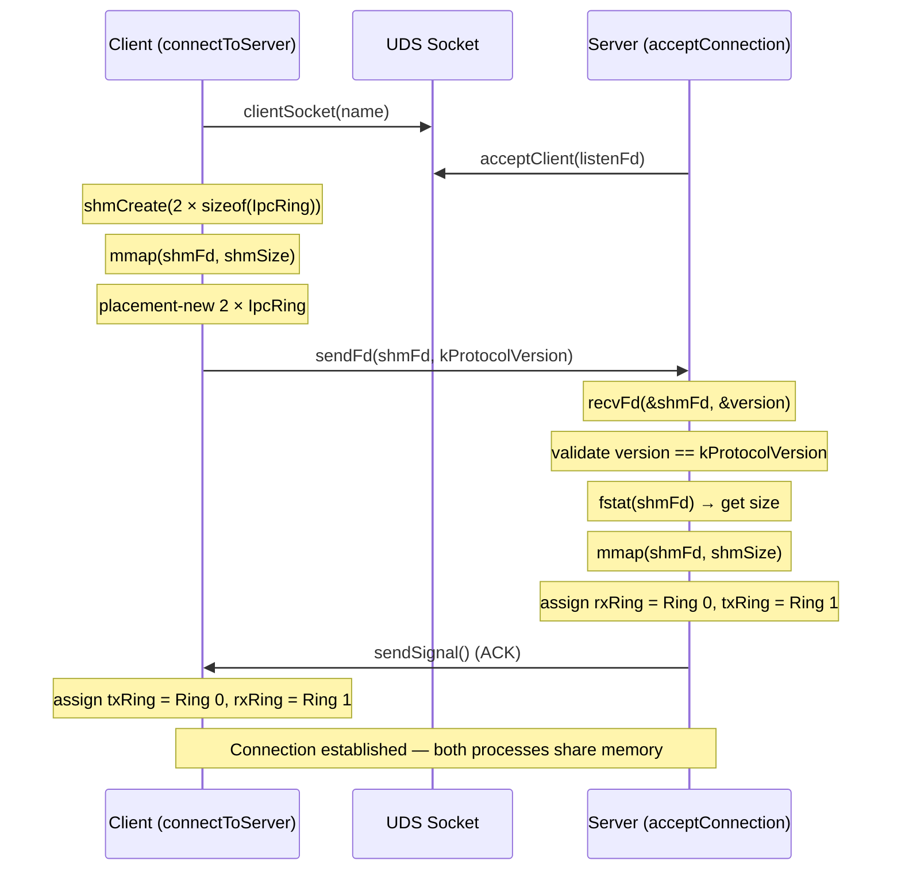
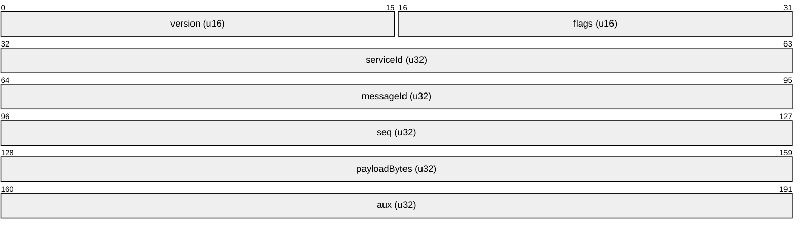
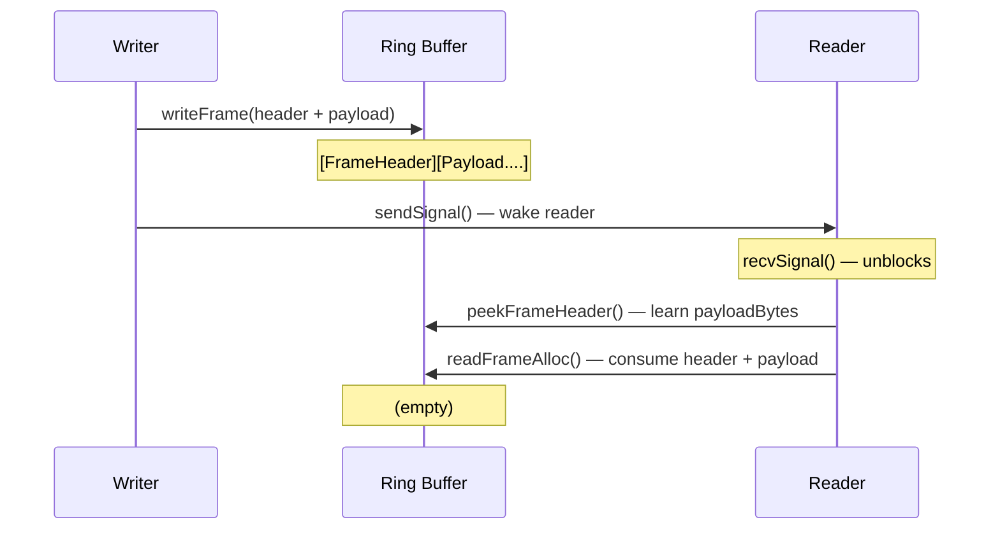
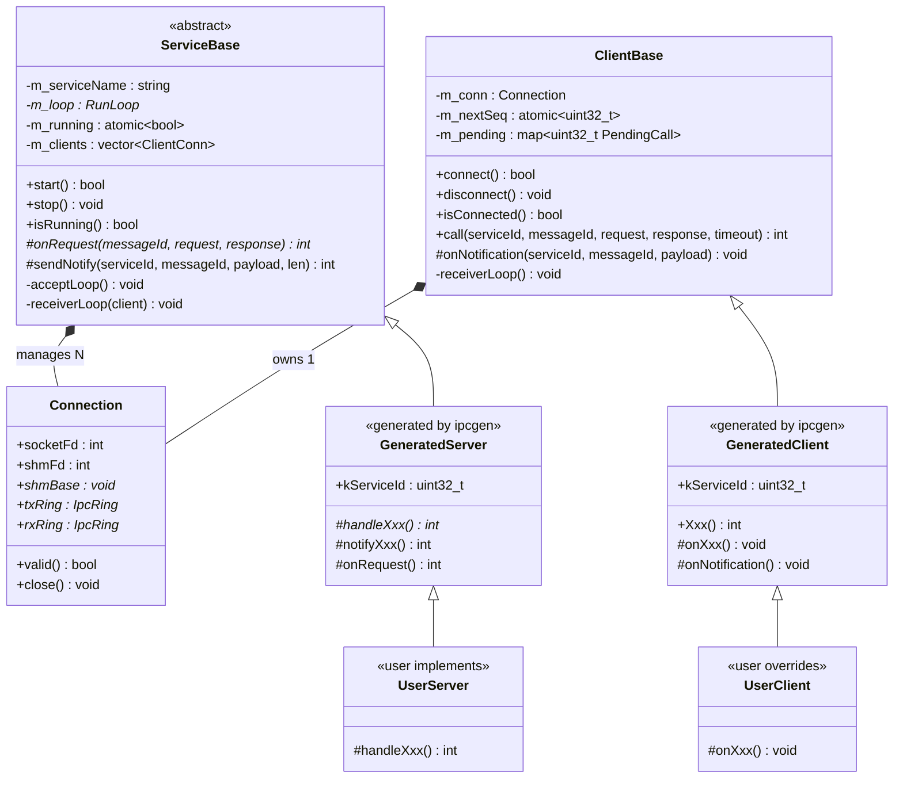
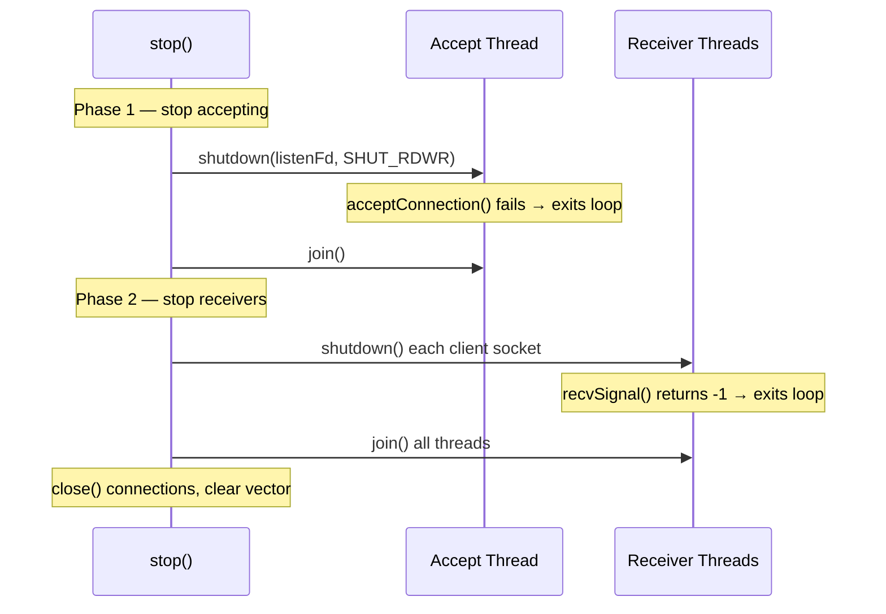
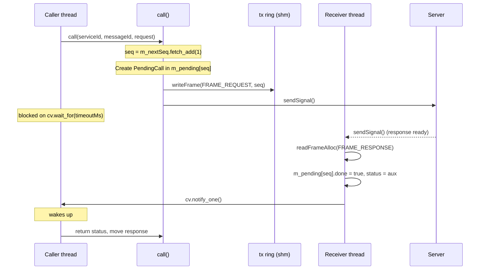

# aether Low-Level Design

## 1. Scope

This document covers the class interfaces, API specifications, and
implementation details of the aether core runtime. For the high-level
architecture, see [aether-hld.md](aether-hld.md).

---

# Part A — API Reference

## 2. Types (`inc/Types.h`)

### 2.1 Constants

| Constant | Type | Value | Purpose |
|----------|------|-------|---------|
| `kProtocolVersion` | `uint16_t` | 1 | Validated during handshake; mismatch rejects connection |
| `kRingSize` | `uint32_t` | 256 * 1024 | Size of each ring buffer's data region (256 KB) |

### 2.2 IpcRing

```cpp
using IpcRing = ms::spsc::ByteRingBuffer<kRingSize>;
```

Lock-free SPSC byte ring buffer from the ouroboros library. One
producer and one consumer per ring — no mutex required for read/write.
Total size per ring: ~256 KB including control block. Two rings per
connection (~512 KB total shared memory).

### 2.3 IpcError

| Code | Value | Meaning |
|------|-------|---------|
| `IPC_SUCCESS` | 0 | Operation completed successfully |
| `IPC_ERR_DISCONNECTED` | -1 | Not connected or connection lost during operation |
| `IPC_ERR_TIMEOUT` | -2 | `call()` timed out waiting for response |
| `IPC_ERR_INVALID_SERVICE` | -3 | Unknown `serviceId` in request dispatch |
| `IPC_ERR_INVALID_METHOD` | -4 | Unknown `messageId` in `onRequest()` dispatch |
| `IPC_ERR_VERSION_MISMATCH` | -5 | Protocol version mismatch during handshake |
| `IPC_ERR_RING_FULL` | -6 | Ring buffer has insufficient space for the frame |
| `IPC_ERR_STOPPED` | -7 | Service stopped while a call was pending |
| `IPC_ERR_INVALID_ARGUMENT` | -8 | Invalid caller input or malformed argument buffer |
| `IPC_ERR_TRANSPORT` | -9 | Transport-level failure outside the shared-memory data path |
| `IPC_ERR_CRC` | -10 | CRC mismatch on a framed transport |
| `IPC_ERR_NOT_SUPPORTED` | -11 | Feature unavailable on the active platform/backend |
| `IPC_ERR_NO_SPACE` | -12 | Static registration table is full |
| `IPC_ERR_OVERFLOW` | -13 | Payload exceeds the configured buffer capacity |

Error code ranges: negative = framework errors, zero = success,
positive = user-defined application errors (returned by `onRequest()`
and delivered in the frame's `aux` field).

### 2.4 FrameHeader

```cpp
struct FrameHeader
{
    uint16_t version;       // protocol version (kProtocolVersion)
    uint16_t flags;         // frame type (FrameFlags)
    uint32_t serviceId;     // which service this frame targets
    uint32_t messageId;     // which method or notification
    uint32_t seq;           // sequence number for request/response correlation
    uint32_t payloadBytes;  // byte length of the payload following this header
    uint32_t aux;           // auxiliary data (response status code)
};
static_assert(sizeof(FrameHeader) == 24);
```

| Field | Description |
|-------|-------------|
| `version` | Set to `kProtocolVersion`. Allows future protocol evolution. |
| `flags` | One of `FRAME_REQUEST`, `FRAME_RESPONSE`, `FRAME_NOTIFY`. |
| `serviceId` | FNV-1a hash of the service name (from generated code). |
| `messageId` | Method or notification ID (from the IDL `[method=N]` / `[notify=N]`). |
| `seq` | Unique per-call sequence number. Server echoes it in the response. |
| `payloadBytes` | Number of payload bytes following the 24-byte header. May be 0. |
| `aux` | In responses: the return value of `onRequest()`. Unused in requests/notifications. |

### 2.5 FrameFlags

| Flag | Value | Direction | Purpose |
|------|-------|-----------|---------|
| `FRAME_REQUEST` | 0x0001 | client → server | RPC request |
| `FRAME_RESPONSE` | 0x0002 | server → client | RPC response |
| `FRAME_NOTIFY` | 0x0004 | server → client | Notification broadcast |

---

## 3. Platform (`inc/Platform.h`)

**Namespace:** `aether::ipc::platform`
**Files:** `inc/Platform.h`, `src/PlatformLinux.cpp`, `src/PlatformMac.cpp`, `src/PlatformWindows.cpp`

**Portability note:** The higher IPC layers keep one platform contract, but the
backend differs by OS. Linux uses abstract-namespace Unix domain sockets with
`SOCK_SEQPACKET` and `memfd_create()`. macOS uses pathname Unix domain sockets
with `SOCK_STREAM`, `SCM_RIGHTS`, `SO_NOSIGPIPE`, and `shm_open()` +
`ftruncate()` + `mmap()` + immediate `shm_unlink()`. Windows uses named pipes
for the control channel and named file mappings for shared memory.

### 3.1 serverSocket()

**Signature:** `platform::Handle serverSocket(const char *name)`
**Description:** Create a listening local endpoint for a service name.

| Parameter | Type | Direction | Description |
|-----------|------|-----------|-------------|
| `name` | `const char *` | in | Service name. Backend derives a local endpoint name from it. |

**Returns:** Valid platform handle on success, `kInvalidHandle` on failure.
**Thread safety:** Safe to call from any thread.
**Notes:** Linux uses `SOCK_SEQPACKET` with `SOCK_CLOEXEC`. macOS uses pathname sockets under `$TMPDIR` when available. Windows returns a listener token for a named-pipe endpoint.

### 3.2 clientSocket()

**Signature:** `platform::Handle clientSocket(const char *name)`
**Description:** Connect to a service's local endpoint.

| Parameter | Type | Direction | Description |
|-----------|------|-----------|-------------|
| `name` | `const char *` | in | Service name. Backend derives the peer endpoint from it. |

**Returns:** Valid platform handle on success, `kInvalidHandle` on failure.
**Thread safety:** Safe to call from any thread.

### 3.3 acceptClient()

**Signature:** `platform::Handle acceptClient(platform::Handle listenFd)`
**Description:** Accept a client connection on a listening endpoint.

| Parameter | Type | Direction | Description |
|-----------|------|-----------|-------------|
| `listenFd` | `platform::Handle` | in | Listening endpoint from `serverSocket()`. |

**Returns:** Valid platform handle on success, `kInvalidHandle` on failure.
**Thread safety:** Only one thread should call accept on a given `listenFd`.

### 3.4 sendFd()

**Signature:** `int sendFd(platform::Handle sockFd, platform::Handle fdToSend, const void *data, uint32_t dataLen)`
**Description:** Send the shared-memory handle plus handshake data over the control channel.

| Parameter | Type | Direction | Description |
|-----------|------|-----------|-------------|
| `sockFd` | `platform::Handle` | in | Control channel handle to send on. |
| `fdToSend` | `platform::Handle` | in | Shared-memory handle or mapping identifier for the peer. |
| `data` | `const void *` | in | Ancillary data bytes to send alongside the FD. |
| `dataLen` | `uint32_t` | in | Size of ancillary data in bytes. |

**Returns:** 0 on success, -1 on failure.
**Thread safety:** Not thread-safe on the same `sockFd`.

### 3.5 recvFd()

**Signature:** `int recvFd(platform::Handle sockFd, platform::Handle *receivedFd, void *data, uint32_t dataLen)`
**Description:** Receive the shared-memory handle plus handshake data from the control channel.

| Parameter | Type | Direction | Description |
|-----------|------|-----------|-------------|
| `sockFd` | `platform::Handle` | in | Control channel handle to receive on. |
| `receivedFd` | `platform::Handle *` | out | Set to the received shared-memory handle on success. |
| `data` | `void *` | out | Buffer for ancillary data. |
| `dataLen` | `uint32_t` | in | Size of the data buffer. |

**Returns:** Bytes received (> 0) on success, -1 on failure. Returns -1 if no shared-memory handle was received.
**Thread safety:** Not thread-safe on the same `sockFd`.
**Notes:** Linux and macOS transfer the shared-memory handle via `SCM_RIGHTS`. Windows opens the named file mapping described by the handshake payload.

### 3.6 sendSignal()

**Signature:** `int sendSignal(int sockFd)`
**Description:** Send a single zero byte as a wakeup signal.

| Parameter | Type | Direction | Description |
|-----------|------|-----------|-------------|
| `sockFd` | `int` | in | UDS socket to signal on. |

**Returns:** 0 on success, -1 on failure.
**Thread safety:** Safe to call from any thread (single byte, atomic send).
**Notes:** Uses `MSG_NOSIGNAL` to prevent SIGPIPE when the peer has disconnected. Returns -1 with `errno = EPIPE` instead of raising a signal.

### 3.7 recvSignal()

**Signature:** `int recvSignal(int sockFd)`
**Description:** Receive a single wakeup byte. Blocks until a byte arrives or the socket is shut down.

| Parameter | Type | Direction | Description |
|-----------|------|-----------|-------------|
| `sockFd` | `int` | in | UDS socket to receive on. |

**Returns:** 0 on success, -1 on failure (including socket shutdown).
**Thread safety:** Only one thread should block on a given `sockFd`.

### 3.8 shmCreate()

**Signature:** `int shmCreate(uint32_t size)`
**Description:** Create an anonymous shared memory region.

| Parameter | Type | Direction | Description |
|-----------|------|-----------|-------------|
| `size` | `uint32_t` | in | Size of the region in bytes. |

**Returns:** File descriptor >= 0 on success, -1 on failure.
**Thread safety:** Safe to call from any thread.
**Notes:** Linux uses `memfd_create("ipc_shm", MFD_CLOEXEC)` + `ftruncate(fd, size)`. The FD has no filesystem entry.

### 3.9 setSocketTimeouts()

**Signature:** `int setSocketTimeouts(int sockFd, uint32_t timeoutMs)`
**Description:** Set the send timeout (`SO_SNDTIMEO`) on a socket. Prevents `send()`/`sendmsg()` from blocking indefinitely when the peer stops reading.

| Parameter | Type | Direction | Description |
|-----------|------|-----------|-------------|
| `sockFd` | `int` | in | Socket to configure. |
| `timeoutMs` | `uint32_t` | in | Timeout in milliseconds. |

**Returns:** 0 on success, -1 on failure.
**Thread safety:** Not thread-safe on the same `sockFd`.
**Notes:** Only sets `SO_SNDTIMEO`, not `SO_RCVTIMEO`. Receiver threads intentionally block on `recv()` and rely on `shutdown()` to unblock — a receive timeout would cause spurious disconnect detection.

### 3.10 getPeerUid() (Linux only)

**Signature:** `int getPeerUid(Handle sockFd, uint32_t *uid)`
**Description:** Get the peer process's UID from a connected Unix domain socket using `SO_PEERCRED`.
**Availability:** Linux only (`#if !defined(_WIN32) && !defined(__APPLE__)`).

| Parameter | Type | Direction | Description |
|-----------|------|-----------|-------------|
| `sockFd` | `Handle` | in | Connected UDS socket (either side of an accepted connection). |
| `uid` | `uint32_t *` | out | Receives the peer's UID on success. |

**Returns:** 0 on success and sets `*uid`, -1 on failure.
**Thread safety:** Safe to call from any thread on a valid socket.
**Notes:** Uses `getsockopt(SOL_SOCKET, SO_PEERCRED)`. Works on both the accepted fd and the client fd of a UDS connection.

### 3.11 closeFd()

**Signature:** `void closeFd(int fd)`
**Description:** Close a file descriptor. Safe to call with -1 (no-op).

| Parameter | Type | Direction | Description |
|-----------|------|-----------|-------------|
| `fd` | `int` | in | File descriptor to close. -1 is silently ignored. |

**Returns:** void.
**Thread safety:** Not thread-safe on the same `fd`.

---

## 4. Connection (`inc/Connection.h`)

**Namespace:** `aether::ipc`
**Files:** `inc/Connection.h`, `src/Connection.cpp`

### 4.1 Connection struct

```cpp
struct Connection
{
    int socketFd = -1;
    int shmFd = -1;
    void *shmBase = nullptr;
    uint32_t shmSize = 0;
    IpcRing *txRing = nullptr;
    IpcRing *rxRing = nullptr;

    Connection() = default;
    Connection(const Connection &) = delete;
    Connection &operator=(const Connection &) = delete;
    Connection(Connection &&other) noexcept;
    Connection &operator=(Connection &&other) noexcept;

    bool valid() const;
    void close();
};
```

**Move semantics:** Connection is non-copyable and move-only. Moving transfers
ownership of file descriptors and the mmap'd region, resetting the source to
defaults. Move-assignment calls `close()` on the destination first.

| Field | Description |
|-------|-------------|
| `socketFd` | UDS socket for signaling (sendSignal / recvSignal). |
| `shmFd` | Shared memory file descriptor (from `memfd_create`). |
| `shmBase` | Base pointer of the `mmap`'d shared memory region. |
| `shmSize` | Total size of the shared memory region (`2 * sizeof(IpcRing)`). |
| `txRing` | Ring buffer pointer for sending frames to the peer. |
| `rxRing` | Ring buffer pointer for receiving frames from the peer. |

### 4.2 valid()

**Signature:** `bool valid() const`
**Description:** Check if this connection is established and usable.
**Returns:** `true` if `socketFd >= 0` and `shmBase != nullptr`.

### 4.3 close()

**Signature:** `void close()`
**Description:** Tear down the connection: unmap shared memory, close file descriptors, reset all fields to defaults.
**Thread safety:** Not thread-safe. Caller must ensure no concurrent reads/writes.
**Steps:** `munmap(shmBase, shmSize)` → `closeFd(shmFd)` → `closeFd(socketFd)` → reset fields.

### 4.4 acceptConnection()

**Signature:** `Connection acceptConnection(int listenFd)`
**Description:** Server side: accept one client and perform the shared memory handshake.

| Parameter | Type | Direction | Description |
|-----------|------|-----------|-------------|
| `listenFd` | `int` | in | Listening socket from `platform::serverSocket()`. |

**Returns:** A valid `Connection` on success. An invalid connection (`valid() == false`) on failure.
**Thread safety:** Only one thread should accept on a given `listenFd`.
**Errors:** On any failure (accept, FD receive, version mismatch, mmap), all resources are cleaned up and an invalid connection is returned.

### 4.5 connectToServer()

**Signature:** `Connection connectToServer(const char *name)`
**Description:** Client side: connect to a named server and perform the shared memory handshake.

| Parameter | Type | Direction | Description |
|-----------|------|-----------|-------------|
| `name` | `const char *` | in | Service name (same name the server passed to `serverSocket()`). |

**Returns:** A valid `Connection` on success. An invalid connection on failure.
**Thread safety:** Safe to call from any thread.
**Errors:** On any failure (connect, shmCreate, mmap, sendFd, recvSignal), all resources are cleaned up and an invalid connection is returned.

---

## 5. Frame I/O (`inc/FrameIO.h`)

**Namespace:** `aether::ipc`
**Files:** `inc/FrameIO.h` (inline), `src/FrameIO.cpp` (`readFrameAlloc`)

### 5.1 writeFrame()

**Signature:** `int writeFrame(IpcRing *ring, const FrameHeader &header, const uint8_t *payload, uint32_t payloadBytes)`
**Description:** Write a complete frame (header + payload) to a ring buffer. The write is atomic: either the full frame is written or nothing is written.

| Parameter | Type | Direction | Description |
|-----------|------|-----------|-------------|
| `ring` | `IpcRing *` | in/out | Ring buffer to write into. |
| `header` | `const FrameHeader &` | in | 24-byte frame header. |
| `payload` | `const uint8_t *` | in | Payload data. May be `nullptr` if `payloadBytes` is 0. |
| `payloadBytes` | `uint32_t` | in | Number of payload bytes. |

**Returns:** `IPC_SUCCESS` on success, `IPC_ERR_RING_FULL` if insufficient space.
**Thread safety:** Only the ring's single producer should call this.
**Notes:** Inline function. Checks `writeAvailable() >= sizeof(FrameHeader) + payloadBytes` before writing.

### 5.2 peekFrameHeader()

**Signature:** `bool peekFrameHeader(const IpcRing *ring, FrameHeader *header)`
**Description:** Read the next frame header without consuming it from the ring.

| Parameter | Type | Direction | Description |
|-----------|------|-----------|-------------|
| `ring` | `const IpcRing *` | in | Ring buffer to peek at. |
| `header` | `FrameHeader *` | out | Filled with the header if available. |

**Returns:** `true` if a complete header is available, `false` otherwise.
**Thread safety:** Only the ring's single consumer should call this.
**Notes:** Inline function. Use this to learn `payloadBytes` before calling `readFrame()`.

### 5.3 readFrame()

**Signature:** `int readFrame(IpcRing *ring, FrameHeader *header, uint8_t *payload, uint32_t payloadBufSize)`
**Description:** Read a complete frame from the ring into a caller-provided buffer.

| Parameter | Type | Direction | Description |
|-----------|------|-----------|-------------|
| `ring` | `IpcRing *` | in/out | Ring buffer to read from. |
| `header` | `FrameHeader *` | out | Filled with the frame header. |
| `payload` | `uint8_t *` | out | Buffer for payload data. |
| `payloadBufSize` | `uint32_t` | in | Size of the payload buffer. Must be >= `header.payloadBytes`. |

**Returns:**
- `IPC_SUCCESS` — frame read successfully.
- `IPC_ERR_DISCONNECTED` — not enough data in ring for a complete frame.
- `IPC_ERR_RING_FULL` — payload doesn't fit in `payloadBufSize` (frame stays in ring for retry).

**Thread safety:** Only the ring's single consumer should call this.
**Notes:** Inline function. Non-destructive on error — the frame remains in the ring.

### 5.4 readFrameAlloc()

**Signature:** `int readFrameAlloc(IpcRing *ring, FrameHeader *header, std::vector<uint8_t> *payload)`
**Description:** Read a complete frame with heap-allocated payload. Peeks the header, resizes the vector, then reads.

| Parameter | Type | Direction | Description |
|-----------|------|-----------|-------------|
| `ring` | `IpcRing *` | in/out | Ring buffer to read from. |
| `header` | `FrameHeader *` | out | Filled with the frame header. |
| `payload` | `std::vector<uint8_t> *` | out | Resized to `payloadBytes` and filled with payload data. |

**Returns:** `IPC_SUCCESS` or `IPC_ERR_DISCONNECTED`.
**Thread safety:** Only the ring's single consumer should call this.
**Notes:** Non-inline (in `FrameIO.cpp`) because it uses `std::vector`.

---

## 6. ServiceBase (`inc/ServiceBase.h`)

**Namespace:** `aether::ipc`
**Files:** `inc/ServiceBase.h`, `src/ServiceBase.cpp`

### 6.1 Constructor

**Signature:** `explicit ServiceBase(const char *serviceName, ms::RunLoop *loop = nullptr)`
**Description:** Create a service base with the given name.

| Parameter | Type | Direction | Description |
|-----------|------|-----------|-------------|
| `serviceName` | `const char *` | in | Logical service name used to derive the platform-local endpoint address. |
| `loop` | `ms::RunLoop *` | in | Optional RunLoop. `nullptr` = threaded mode (internal threads). Non-null = RunLoop mode (zero internal threads). |

### 6.2 start()

**Signature:** `bool start()`
**Description:** Create the listening socket and begin accepting connections.
**Returns:** `true` on success, `false` if the listening socket could not be created.
**Behavior:**
- Threaded mode: spawns an accept thread that blocks on `acceptConnection()`.
- RunLoop mode: registers the listen fd on the RunLoop; `onAcceptReady()` fires when clients connect.

### 6.3 stop()

**Signature:** `void stop()`
**Description:** Shut down the service: stop accepting connections, close all client connections, and clean up.
**Thread safety:** Safe to call from any thread. Also called by the destructor.
**Behavior:**
- Sets `m_running = false`.
- Threaded mode: shuts down the listen socket → joins the accept thread → shuts down each client socket → joins receiver threads → closes connections.
- RunLoop mode: removes listen fd and all client fds from the RunLoop → waits for in-flight handlers → closes connections.

### 6.4 setMaxClients()

**Signature:** `void setMaxClients(uint32_t max)`
**Description:** Set the maximum number of concurrent client connections the service will accept. When the limit is reached, new connections are accepted at the socket level but immediately closed, causing `connectToServer()` on the client side to fail. Dead (disconnected) clients are reaped before checking the limit, so slots are reclaimed promptly.

| Parameter | Type | Direction | Description |
|-----------|------|-----------|-------------|
| `max` | `uint32_t` | in | Maximum number of concurrent clients. 0 = unlimited (default). |

**Thread safety:** Thread-safe; may be called while the service is running. The new limit takes effect on the next connection attempt.
**Notes:** Each client connection consumes ~512 KB of shared memory and one thread (threaded mode) or one RunLoop source (RunLoop mode). Setting a limit prevents resource exhaustion from excessive connections.

### 6.5 isRunning()

**Signature:** `bool isRunning() const`
**Description:** Check if the service is started and accepting connections.
**Returns:** `true` if `start()` succeeded and `stop()` has not been called.
**Thread safety:** Lock-free (reads an `atomic<bool>`).

### 6.6 onRequest() (pure virtual)

**Signature:** `virtual int onRequest(uint32_t messageId, const std::vector<uint8_t> &request, std::vector<uint8_t> *response) = 0`
**Description:** Called for each incoming `FRAME_REQUEST`. Subclass implements this as a switch on `messageId`.

| Parameter | Type | Direction | Description |
|-----------|------|-----------|-------------|
| `messageId` | `uint32_t` | in | Method ID from the frame header. |
| `request` | `const std::vector<uint8_t> &` | in | Marshaled request payload (may be empty). |
| `response` | `std::vector<uint8_t> *` | out | Subclass fills this with the marshaled response payload. |

**Returns:** `IPC_SUCCESS` or a user-defined error code. The return value is placed in the response frame's `aux` field and delivered to the caller.
**Thread safety:** Called on the receiver thread (threaded mode) or the RunLoop thread (RunLoop mode). One call at a time per client connection.

### 6.7 setAllowedPeerUid() / clearPeerUidFilter()

**Signature:** `void setAllowedPeerUid(uint32_t uid)` -- enable filter
**Signature:** `void clearPeerUidFilter()` -- disable filter (allow all)
**Description:** Restrict accepted connections to peers with the given UID, or clear the restriction.

| Parameter | Type | Direction | Description |
|-----------|------|-----------|-------------|
| `uid` | `uint32_t` | in | Allowed peer UID. |

**Behavior:**
- `setAllowedPeerUid(uid)` enables the filter. Each newly accepted connection is checked via `platform::getPeerUid()`. If the peer's UID does not match, the connection is immediately closed.
- `clearPeerUidFilter()` disables the filter. All connections are accepted (this is the default state).
- Linux only (`SO_PEERCRED`). On macOS and Windows the filter is a no-op (all connections are accepted regardless of the setting).

**Thread safety:** Both methods are thread-safe (atomic stores). Can be called before or after `start()`.

### 6.8 sendNotify()

**Signature:** `int sendNotify(uint32_t serviceId, uint32_t messageId, const uint8_t *payload, uint32_t payloadBytes)`
**Description:** Broadcast a `FRAME_NOTIFY` to all connected clients.

| Parameter | Type | Direction | Description |
|-----------|------|-----------|-------------|
| `serviceId` | `uint32_t` | in | Service ID (FNV-1a hash of service name). |
| `messageId` | `uint32_t` | in | Notification ID from the IDL. |
| `payload` | `const uint8_t *` | in | Marshaled notification payload. |
| `payloadBytes` | `uint32_t` | in | Size of the payload in bytes. |

**Returns:** `IPC_SUCCESS` if all clients were notified, or the first error code if any `writeFrame()` or `sendSignal()` fails.
**Thread safety:** Safe to call from any thread (acquires `m_clientsMutex` internally).
**Notes:** Returns immediately if no clients are connected. Marks clients as dead when `sendSignal()` fails and reaps them in the same call via a two-phase partition-and-join.

---

## 7. ClientBase (`inc/ClientBase.h`)

**Namespace:** `aether::ipc`
**Files:** `inc/ClientBase.h`, `src/ClientBase.cpp`

### 7.1 Constructor

**Signature:** `explicit ClientBase(const char *serviceName, ms::RunLoop *loop = nullptr)`
**Description:** Create a client base targeting the given service name.

| Parameter | Type | Direction | Description |
|-----------|------|-----------|-------------|
| `serviceName` | `const char *` | in | Name of the service to connect to. |
| `loop` | `ms::RunLoop *` | in | Optional RunLoop. `nullptr` = threaded mode. Non-null = RunLoop mode. |

### 7.2 connect()

**Signature:** `bool connect()`
**Description:** Connect to the server and perform the shared memory handshake.
**Returns:** `true` on success, `false` if the handshake failed (server not running, version mismatch, etc.).
**Behavior:**
- Calls `connectToServer(m_serviceName)` to establish the connection.
- Threaded mode: spawns a receiver thread.
- RunLoop mode: registers the socket fd on the RunLoop.

### 7.3 disconnect()

**Signature:** `void disconnect()`
**Description:** Disconnect from the server and clean up. Also called by the destructor.
**Thread safety:** Safe to call from any thread.
**Behavior:**
- Sets `m_running = false`.
- Threaded mode: shuts down the socket → joins the receiver thread.
- RunLoop mode: removes the source from the RunLoop → waits for in-flight handler.
- Fails all pending calls with `IPC_ERR_DISCONNECTED` and notifies their condition variables.
- Calls `m_conn.close()`.

### 7.4 isConnected()

**Signature:** `bool isConnected() const`
**Description:** Check if the client is connected.
**Returns:** `true` if `connect()` succeeded and `disconnect()` has not been called.
**Thread safety:** Lock-free (reads an `atomic<bool>`).

### 7.5 call()

**Signature:** `int call(uint32_t serviceId, uint32_t messageId, const std::vector<uint8_t> &request, std::vector<uint8_t> *response, uint32_t timeoutMs = 2000)`
**Description:** Send a synchronous RPC request and block until the response arrives or timeout.

| Parameter | Type | Direction | Description |
|-----------|------|-----------|-------------|
| `serviceId` | `uint32_t` | in | Service ID (FNV-1a hash). |
| `messageId` | `uint32_t` | in | Method ID from the IDL. |
| `request` | `const std::vector<uint8_t> &` | in | Marshaled request payload. |
| `response` | `std::vector<uint8_t> *` | out | Filled with the marshaled response on success. |
| `timeoutMs` | `uint32_t` | in | Maximum wait time in milliseconds. Default: 2000. |

**Returns:**
- `IPC_SUCCESS` — response received.
- `IPC_ERR_DISCONNECTED` — not connected or connection lost.
- `IPC_ERR_TIMEOUT` — no response within `timeoutMs`.
- `IPC_ERR_RING_FULL` — request frame doesn't fit in the ring.
- Server status — the value from the response frame's `aux` field.

**Thread safety:** Safe to call from multiple threads concurrently. Each call gets a unique sequence number via atomic `fetch_add`, and `m_sendMutex` serializes txRing writes to maintain the SPSC invariant.
**Important:** Do NOT call from the RunLoop thread in RunLoop mode — it will deadlock because the response arrives on the same thread.

### 7.6 onNotification() (virtual)

**Signature:** `virtual void onNotification(uint32_t serviceId, uint32_t messageId, const std::vector<uint8_t> &payload)`
**Description:** Called for each incoming `FRAME_NOTIFY`. Default implementation does nothing.

| Parameter | Type | Direction | Description |
|-----------|------|-----------|-------------|
| `serviceId` | `uint32_t` | in | Service ID from the notification frame. |
| `messageId` | `uint32_t` | in | Notification ID from the frame. |
| `payload` | `const std::vector<uint8_t> &` | in | Marshaled notification payload. |

**Thread safety:** Called on the receiver thread (threaded mode) or RunLoop thread (RunLoop mode).

---

# Part B — Implementation Details

## 8. Platform internals

### 8.1 Linux syscall mapping

| Platform function | Linux syscalls |
|-------------------|---------------|
| `serverSocket()` | `socket(AF_UNIX, SOCK_SEQPACKET \| SOCK_CLOEXEC)`, `bind`, `listen` |
| `clientSocket()` | `socket(AF_UNIX, SOCK_SEQPACKET \| SOCK_CLOEXEC)`, `connect` |
| `acceptClient()` | `accept4(SOCK_CLOEXEC)` |
| `sendFd()` | `sendmsg` with `SCM_RIGHTS` control message, `MSG_NOSIGNAL` |
| `recvFd()` | `recvmsg` with `SCM_RIGHTS` control message (closes extra fds) |
| `sendSignal()` | `send(sockFd, &byte, 1, MSG_NOSIGNAL \| MSG_DONTWAIT)` |
| `recvSignal()` | `recv(sockFd, &byte, 1, 0)` (blocks) |
| `setSocketTimeouts()` | `setsockopt(SO_SNDTIMEO)` |
| `shmCreate()` | `memfd_create("ipc_shm", MFD_CLOEXEC)`, `ftruncate` |
| `closeFd()` | `close` (no-op if fd == -1) |

### 8.2 Abstract namespace address

Socket addresses are built by `buildAddr()`:

```
sockaddr_un.sun_family = AF_UNIX
sockaddr_un.sun_path[0] = '\0'          // abstract namespace marker
sockaddr_un.sun_path[1..] = "ipc_<name>"
```

Abstract namespace sockets have no filesystem entry and are automatically
cleaned up when the process exits.

### 8.3 Design notes

- **`SOCK_SEQPACKET`** preserves message boundaries (each `send()` is one
  `recv()`). Important for FD passing and signal bytes.
- **`SOCK_CLOEXEC` / `MFD_CLOEXEC`** on all file descriptors prevents
  leaking into child processes.
- **`MSG_NOSIGNAL`** on all `send()`/`sendmsg()` calls prevents SIGPIPE
  when the peer disconnects. Returns `EPIPE` instead.
- **`SO_SNDTIMEO` (5 s)** on connected sockets prevents `send()` from
  blocking indefinitely when a peer stops reading.
- **No heap allocations** — all addresses use stack-allocated `sockaddr_un`.

## 9. Connection internals

### 9.1 Shared memory layout



Total shared memory per connection: `2 * sizeof(IpcRing)` (~512 KB).
Ring assignments are opposite for each side:

| Side | txRing | rxRing |
|------|--------|--------|
| Client | Ring 0 | Ring 1 |
| Server | Ring 1 | Ring 0 |

### 9.2 Handshake protocol



**Key details:**
- The **client** creates the shared memory, does placement-new on both rings, and sends the FD.
- The **server** validates the protocol version, validates `shmFd >= 0`, `fstat`s for the size, and `mmap`s.
- Both sides set `SO_SNDTIMEO` (5 s) after socket establishment to prevent send blocking.
- **ACK** is a single signal byte. **NACK** is implicit — the server closes the socket.
- On any failure, both sides clean up (munmap, close FDs) and return an invalid connection.

### 9.3 Connection teardown

`Connection::close()` steps:
1. `munmap(shmBase, shmSize)` — unmap shared memory
2. `closeFd(shmFd)` — close shared memory fd
3. `closeFd(socketFd)` — close socket
4. Reset all fields to defaults

### 9.4 Multi-client isolation

Each client-server pair gets its own UDS socket, shared memory region,
and pair of ring buffers. No shared state between connections. A crashing
client affects only its own connection.

## 10. Frame I/O internals

### 10.1 Wire format



Total: 24 bytes header + `payloadBytes` bytes payload, written
contiguously in the ring buffer. Native endian (same-machine IPC).

### 10.2 Atomic write semantics

`writeFrame()` checks `writeAvailable() >= sizeof(FrameHeader) + payloadBytes`
before writing anything. If space is insufficient, the ring is not modified
and `IPC_ERR_RING_FULL` is returned. This prevents partial frames.

### 10.3 Non-destructive read errors

`readFrame()` with an undersized payload buffer returns `IPC_ERR_RING_FULL`
without consuming the frame. The caller can retry with a larger buffer or
switch to `readFrameAlloc()`.

### 10.4 Write/read flow



## 11. Class hierarchy



## 12. ServiceBase internals

### 12.1 Accept loop (threaded mode)

```
while (m_running):
    conn = acceptConnection(m_listenFd)
    if conn.valid():
        create ClientConn(conn)
        spawn receiverLoop(client) thread
        add to m_clients (under m_clientsMutex)
```

### 12.2 Receiver loop (threaded mode, per client)

```
while (m_running):
    recvSignal(socketFd)          // blocks until wakeup
    while peekFrameHeader(rxRing):
        readFrameAlloc(rxRing, &header, &payload)
        if FRAME_REQUEST:
            response = {}
            status = onRequest(header.messageId, payload, &response)
            responseHeader.flags = FRAME_RESPONSE
            responseHeader.seq = header.seq
            responseHeader.aux = status
            writeFrame(txRing, responseHeader, response)
            sendSignal(socketFd)
```

### 12.3 RunLoop mode

- `onAcceptReady()`: Called when `m_listenFd` is readable. Accepts
  connection, registers client fd on the RunLoop with `onClientReady`.
- `onClientReady(client)`: Called when a client fd is readable. Locks
  `handlerMutex`, drains frames, dispatches requests, sends responses.

### 12.4 Notification broadcast

`sendNotify()`:
1. Early-out if `m_clients` is empty
2. Lock `m_clientsMutex`
3. For each connected client:
   - Skip if `dead` flag set (fast path, no lock)
   - Lock `sendMutex`, re-check `dead` flag (TOCTOU guard)
   - `writeFrame()` to client's txRing
   - `sendSignal()` on client's socket (marks dead on failure)
4. Partition dead clients out of `m_clients`
5. Unlock `m_clientsMutex`
6. Join threads and close connections for reaped clients

### 12.5 Two-phase shutdown (threaded mode)



### 12.6 RunLoop mode shutdown

`stop()` snapshots the client list under `m_clientsMutex`, releases the
lock, then removes sources and waits for each client's `handlerMutex`.
This avoids deadlock when a handler calls `removeClient()`.

## 13. ClientBase internals

### 13.1 Synchronous RPC algorithm



Steps:
1. Generate sequence number: `seq = m_nextSeq.fetch_add(1)`
2. Create `shared_ptr<PendingCall>` in `m_pending[seq]` (under `m_pendingMutex`)
3. Build `FrameHeader` with `FRAME_REQUEST`, `seq`, service/message IDs
4. `writeFrame()` to `txRing`
5. `sendSignal()` on socket
6. `cv.wait_for(timeoutMs)` — blocks caller thread
7. On wakeup: if `done == true`, copy response and return status; if timeout, return `IPC_ERR_TIMEOUT`
8. Remove from `m_pending`

### 13.2 Receiver loop

```
while (m_running):
    recvSignal(socketFd)
    while peekFrameHeader(rxRing):
        readFrameAlloc(rxRing, &header, &payload)
        if FRAME_RESPONSE:
            lock m_pendingMutex
            find m_pending[header.seq]
            set done = true, status = header.aux, response = payload
            cv.notify_one()
        if FRAME_NOTIFY:
            onNotification(header.serviceId, header.messageId, payload)
```

### 13.3 Disconnect procedure

1. Set `m_running = false`
2. Threaded: `shutdown(socketFd)` → join receiver thread
3. RunLoop: `removeSource(socketFd)` → wait for `m_handlerMutex`
4. Fail all pending calls: set `status = IPC_ERR_DISCONNECTED`, `done = true`, `cv.notify_one()` for each
5. Clear `m_pending`
6. `m_conn.close()`

## 14. Synchronization

### 14.1 Mutexes

| Mutex | Owner | Protects |
|-------|-------|----------|
| `m_clientsMutex` | ServiceBase | `m_clients` vector; held during notification broadcast |
| `sendMutex` | ServiceBase::ClientConn | Serializes server→client txRing writes (SPSC invariant); also guards dead-flag transitions |
| `handlerMutex` | ServiceBase::ClientConn | Guards RunLoop handler execution per client; prevents `stop()` from closing a connection during dispatch |
| `m_sendMutex` | ClientBase | Serializes client→server txRing writes (SPSC invariant); protects concurrent `call()` from multiple threads |
| `m_pendingMutex` | ClientBase | `m_pending` map (insert, lookup, removal) |
| `m_handlerMutex` | ClientBase | Guards RunLoop handler execution; prevents `disconnect()` from closing connection during dispatch |

### 14.2 Atomics

| Atomic | Owner | Purpose |
|--------|-------|---------|
| `m_running` | ServiceBase, ClientBase | Checked by loops to know when to exit |
| `m_nextSeq` | ClientBase | Lock-free generation of unique sequence numbers via `fetch_add(1)` |

### 14.3 Lock-free data path

The SPSC ring buffers use atomic head/tail pointers with acquire/release
memory ordering. No mutex is needed for ring buffer reads and writes —
only one producer and one consumer per ring.

### 14.4 Condition variables

Each `PendingCall` has a `condition_variable`. The calling thread blocks
on `cv.wait_for()`. The receiver thread calls `cv.notify_one()` when the
matching response arrives. `shared_ptr<PendingCall>` ensures the object
lives long enough even if the map entry is erased during cleanup.

## 15. File index

| File | Purpose |
|------|---------|
| `inc/Types.h` | Protocol constants, error codes, frame header, frame flags |
| `inc/Platform.h` | Platform abstraction: sockets, shared memory, signaling |
| `inc/Connection.h` | Connection struct and handshake functions |
| `inc/FrameIO.h` | Frame read/write functions (mostly inline) |
| `inc/ServiceBase.h` | Server-side service base class |
| `inc/ClientBase.h` | Client-side RPC base class |
| `src/PlatformLinux.cpp` | Linux implementation of platform functions |
| `src/Connection.cpp` | Handshake implementation and `Connection::close()` |
| `src/FrameIO.cpp` | `readFrameAlloc()` implementation |
| `src/ServiceBase.cpp` | Service lifecycle, threading, dispatch, notifications |
| `src/ClientBase.cpp` | Client connect, sync RPC, receiver loop |
