# Aether IPC -- Architecture Guide

This guide walks through the Aether IPC framework using the visual diagrams in
`doc/diagrams/`. It is meant as a starting point for new readers. For full
specification details, see the [High-Level Design](aether-hld.md) and
[Vision](aether-vision.md) documents.

## 1. Introduction

Aether is a cross-language RPC framework with IDL code generation. You define a
service contract once in IDL and the code generator produces typed server
skeletons and client stubs for C++, Python (ctypes over the C API), and C99
(bare-metal MCU dispatch tables).

The primary audience is systems-level and embedded developers who need
low-latency IPC between processes on the same machine (via shared memory) or
between a desktop and an embedded device (via serial or USB). If you need a
typed contract between a PySide6 GUI and a C++ service, or between a desktop
application and an STM32 over UART, Aether handles both with the same wire
protocol.

Aether is not a networking library. It does not provide cross-machine
communication. For that, use gRPC or similar. Aether focuses on local IPC and
desktop-to-device links where latency and footprint matter.

## 2. The Big Picture

<!-- TODO: export diagrams/overview/aether-architecture.excalidraw to PNG -->
<!--  -->

The architecture diagram shows the five runtime layers stacked bottom to top:
Platform, Connection, FrameIO, ServiceBase/ClientBase, and Generated Code. The
dashed boundary around the lower four layers marks what ships as `libaether` --
the compiled library that user code and generated stubs link against. Everything
above that boundary is generated or user-written.

The key insight is that each layer depends only on the one below it. Platform
provides OS abstractions (sockets, shared memory, FD passing). Connection uses
Platform to perform the handshake and set up shared memory rings. FrameIO reads
and writes framed messages into those rings. ServiceBase and ClientBase
orchestrate threading, dispatch, and RPC correlation on top of FrameIO.

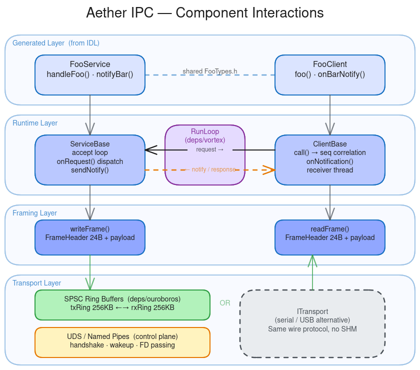

The components diagram shows how the pieces interact at runtime. A service
process contains a ServiceBase that accepts connections and dispatches requests.
A client process contains a ClientBase that sends requests and waits for
responses. Between them sits a shared memory region with two SPSC ring buffers
(one per direction) and a control channel used only for wakeup signals after the
initial handshake.

## 3. How an RPC Call Works

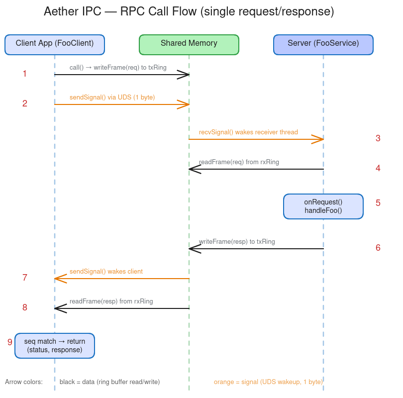

The RPC flow diagram traces a single synchronous `call()` through nine steps:

1. The client thread calls `call()` with a service ID, message ID, and payload.
2. ClientBase assigns a sequence number and stores a pending-call entry with a
   condition variable.
3. The request frame (24-byte header + payload) is written into the client-to-server
   ring buffer.
4. A 1-byte wakeup signal is sent over the control channel.
5. The server receiver thread wakes up, reads the frame from the ring, and
   dispatches it to `onRequest()`.
6. The handler processes the request and returns a status code plus response payload.
7. The response frame is written into the server-to-client ring buffer.
8. A wakeup signal is sent back to the client.
9. The client receiver thread reads the response, matches it by sequence number,
   and wakes the caller via the condition variable.

The entire data path stays in shared memory. The control channel carries only
single-byte signals, so the hot path is a `memcpy` plus one `send()` call.

## 4. Code Generation

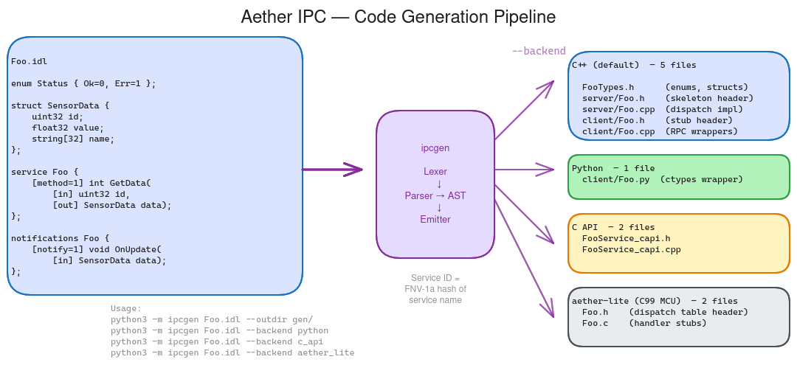

The codegen diagram shows the `ipcgen` tool reading an IDL file and producing
output for four backends: C++ (default), C API, Python, and aether-lite (C99
MCU). Each backend generates a different set of files tailored to its target
environment.

The default C++ backend produces five files per service: a shared types header,
server header and source, and client header and source. The C API backend wraps
the C++ runtime behind opaque handles for use by language bindings. The Python
backend generates ctypes stubs that call through the C API. The aether-lite
backend produces a static C99 dispatch table for bare-metal microcontrollers.

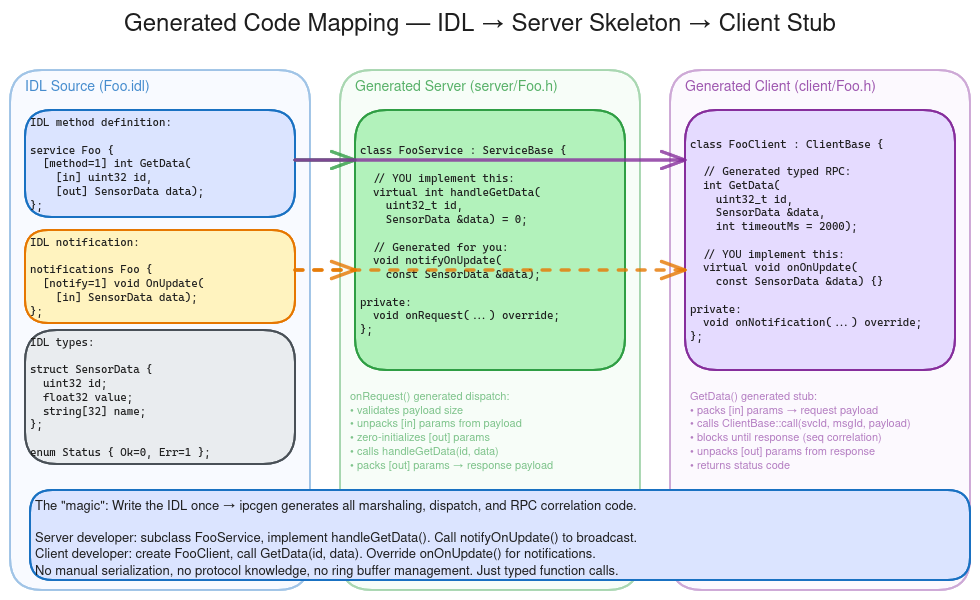

The generated-code-mapping diagram shows how IDL constructs map to generated
artifacts. An IDL `service` block becomes a server skeleton class (inheriting
ServiceBase) with a pure virtual `onRequest()`, and a client stub class
(inheriting ClientBase) with typed `call` methods. IDL `struct` and `enum`
definitions become POD types in the shared types header. Service IDs are FNV-1a
32-bit hashes of the service name.

## 5. The Runtime Layer

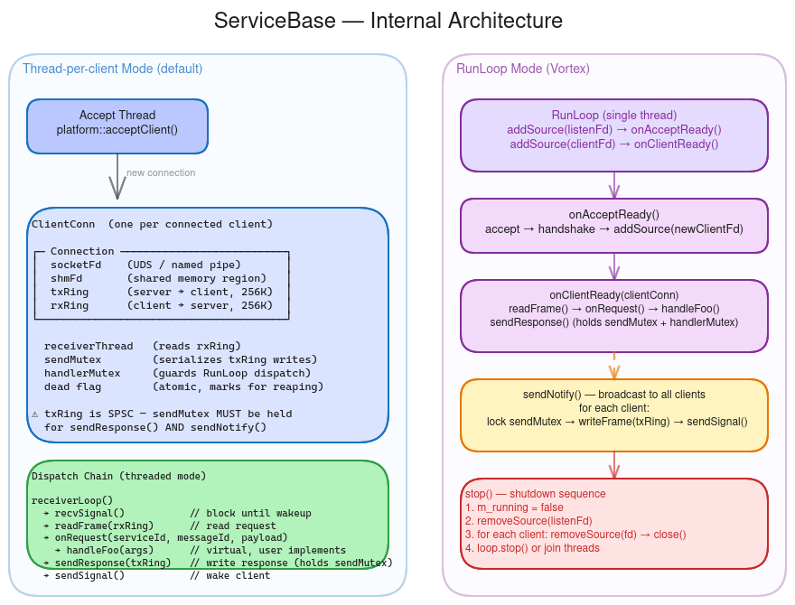

The ServiceBase internals diagram shows the two operating modes. In threaded
mode (the default), ServiceBase runs an accept thread that listens for new
connections, plus one receiver thread per connected client. Each receiver thread
reads frames from the shared memory ring, dispatches to `onRequest()`, and
writes the response back. In RunLoop mode, all of this happens on a single
event-driven thread with no internal threads created.

The diagram also shows the `ClientConn` structure, which holds the per-client
connection state: the shared memory mapping, the two ring buffer pointers, the
control socket, and the `sendMutex` that serializes writes to the
server-to-client ring (necessary because the ring is SPSC but notifications and
responses may originate from different contexts).

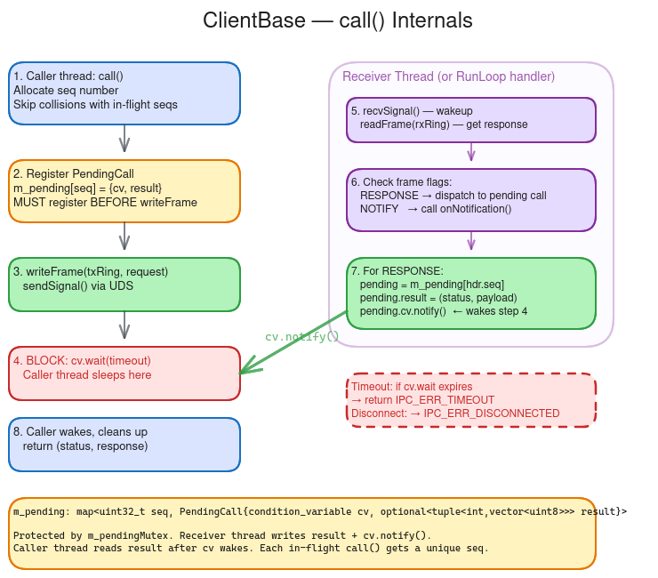

The ClientBase internals diagram traces the `call()` method in detail. The
caller assigns a sequence number, creates a pending-call entry containing a
condition variable, writes the request frame, signals the server, and then
blocks on the condition variable with a timeout. When the response arrives, the
receiver thread matches it by sequence number and wakes the caller. If the
connection drops, all pending calls are failed with `IPC_ERR_DISCONNECTED`.

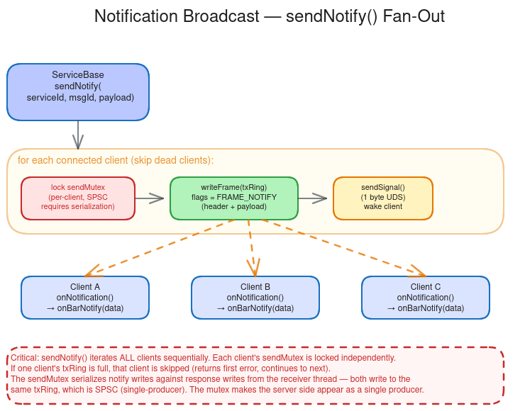

The notification broadcast diagram shows `sendNotify()` fanning out a
notification frame to all connected clients. ServiceBase locks the client list,
iterates over each `ClientConn`, writes the notification frame into each
client's server-to-client ring (under `sendMutex`), and sends a wakeup signal.
Each client's receiver thread independently reads the notification and delivers
it to `onNotification()`.

## 6. The Wire Protocol

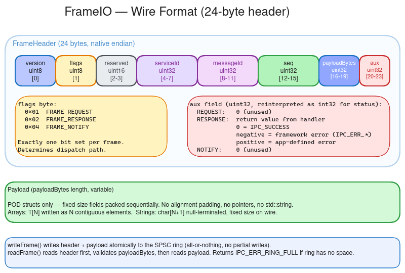

The wire format diagram shows the 24-byte `FrameHeader` layout. The header
contains a 2-byte protocol version, 2-byte flags field (request, response, or
notification), 4-byte service ID, 4-byte message ID, 4-byte sequence number,
4-byte payload length, and 4-byte auxiliary field (used for status codes in
responses).

All fields use native endian because Aether is designed for same-machine IPC
and same-architecture serial links. There is no byte-swapping overhead. Frames
are written atomically into the ring buffer -- either the entire frame
(header + payload) fits, or the write fails with `IPC_ERR_RING_FULL`.

This same 24-byte header is used across all transports: shared memory, serial,
and USB. Only the delivery mechanism changes.

## 7. Connection Handshake

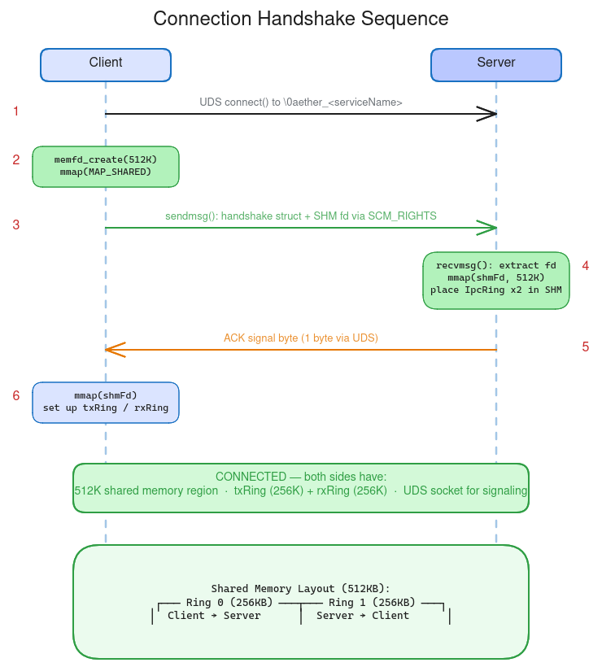

The handshake diagram shows the six-step connection setup between a client and
server. The client connects to the server's listening endpoint (Unix domain
socket on Linux/macOS, named pipe on Windows). The client creates a shared
memory region containing two SPSC ring buffers and transfers it to the server
(via FD passing on Linux/macOS, or a named file mapping on Windows). Both sides
map the region and construct the ring buffers via placement-new.

After the handshake completes, the control channel carries only wakeup signals.
All payload data flows through the shared memory rings. This design means the
handshake is the only complex OS-specific operation -- once it finishes, the
data path is a simple memory copy plus a one-byte signal.

## 8. Transport Options

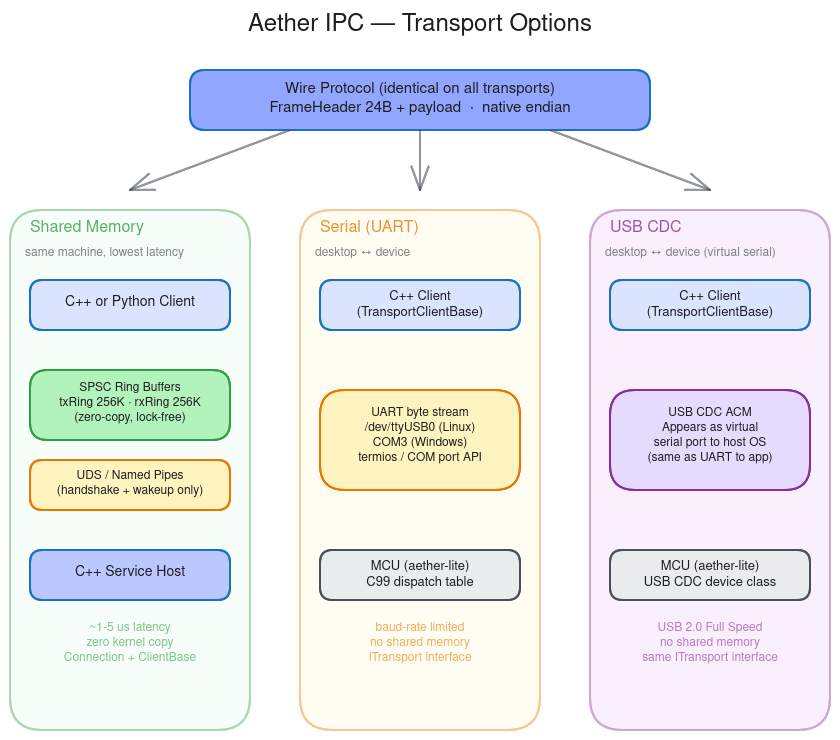

The transports diagram compares the three supported transports side by side:
shared memory (same-machine), serial (UART), and USB (CDC virtual serial port).
All three use the identical 24-byte wire protocol. The shared memory transport
uses lock-free SPSC rings for data and a local socket for signaling. The serial
and USB transports send frames as a byte stream over the physical link.

The `ITransport` interface and `TransportClientBase` class abstract the
transport layer so that client code can switch between shared memory and serial
without changing application logic.

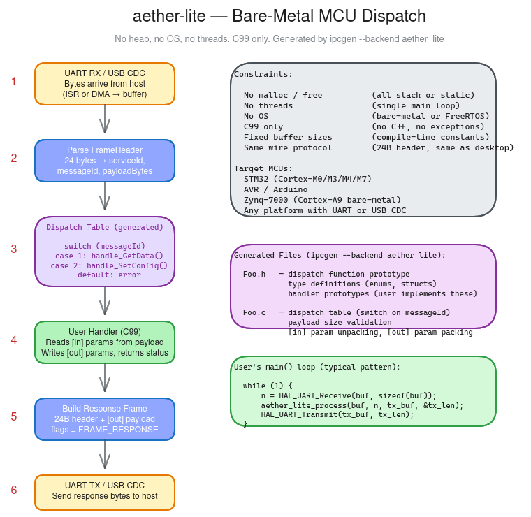

The aether-lite diagram shows the bare-metal MCU dispatch flow. On a
microcontroller with no OS, heap, or threads, the `ipcgen --backend aether_lite`
output generates a static C99 dispatch table. The MCU firmware reads frames from
UART or USB, looks up the handler by service ID and message ID, calls the
handler, and writes the response frame back. This is a synchronous,
single-threaded loop with zero dynamic allocation.

## 9. Platform Abstraction

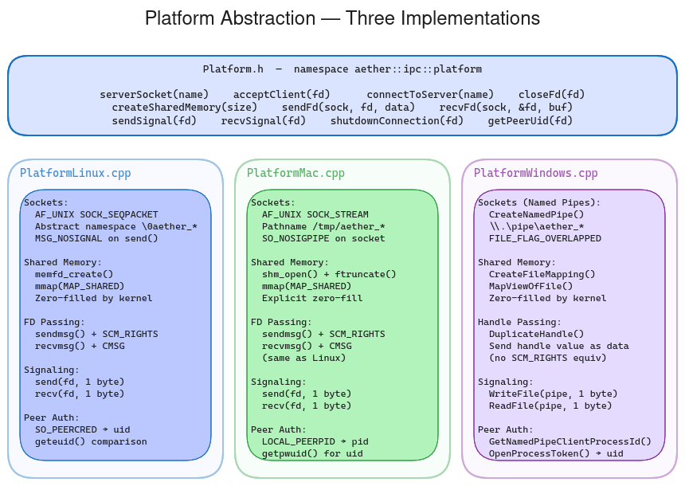

The platform abstraction diagram compares the OS primitives used on Linux,
macOS, and Windows. Each column shows what the Platform layer maps to on that
OS: local sockets (UDS vs named pipes), shared memory creation (`memfd_create`
vs `shm_open` vs named file mappings), handle/FD passing (`SCM_RIGHTS` vs
`DuplicateHandle`), and the event loop primitive (epoll vs kqueue vs IOCP).

The Platform layer (`Platform.h` with per-OS implementations) is intentionally
thin. It provides just enough abstraction so that Connection, FrameIO, and the
service layer above it remain platform-agnostic. Adding a new platform means
implementing the Platform interface -- everything above it works unchanged.

## 10. RunLoop Integration

<!-- TODO: export diagrams/runtime/runloop-integration.excalidraw to PNG -->
<!--  -->

The RunLoop integration diagram shows how ServiceBase and ClientBase wire into
the Vortex event loop. When a `vortex::RunLoop*` is passed to the constructor,
no internal threads are created. Instead, control channel file descriptors are
registered on the RunLoop, and all accept, dispatch, and notification handling
happens in the RunLoop's thread.

This mode enables multiple services and clients to share a single thread,
which is important for applications that need deterministic threading (embedded,
real-time, or GUI main-thread dispatch). The tradeoff is that long-running
request handlers block the RunLoop, so handlers must be fast or offload work.

The default threaded mode (no RunLoop) is simpler to use and requires no
external dependencies beyond the core runtime. RunLoop mode is opt-in for
applications that need it.

## 11. Where to Go Next

- **[High-Level Design](aether-hld.md)** -- Full specification of the runtime
  architecture, threading model, error handling, and design decisions.
- **[Vision & Platform Requirements](aether-vision.md)** -- Why Aether exists,
  language roles, usage scenarios, transport and platform support matrix.
- **[ipcgen High-Level Design](ipcgen-hld.md)** -- IDL syntax, code generation
  pipeline, backend details.
- **[CLAUDE.md](../CLAUDE.md)** -- Build commands, test commands, coding
  conventions, and project structure reference.
