# ms-ipc Architecture

## Layer stack

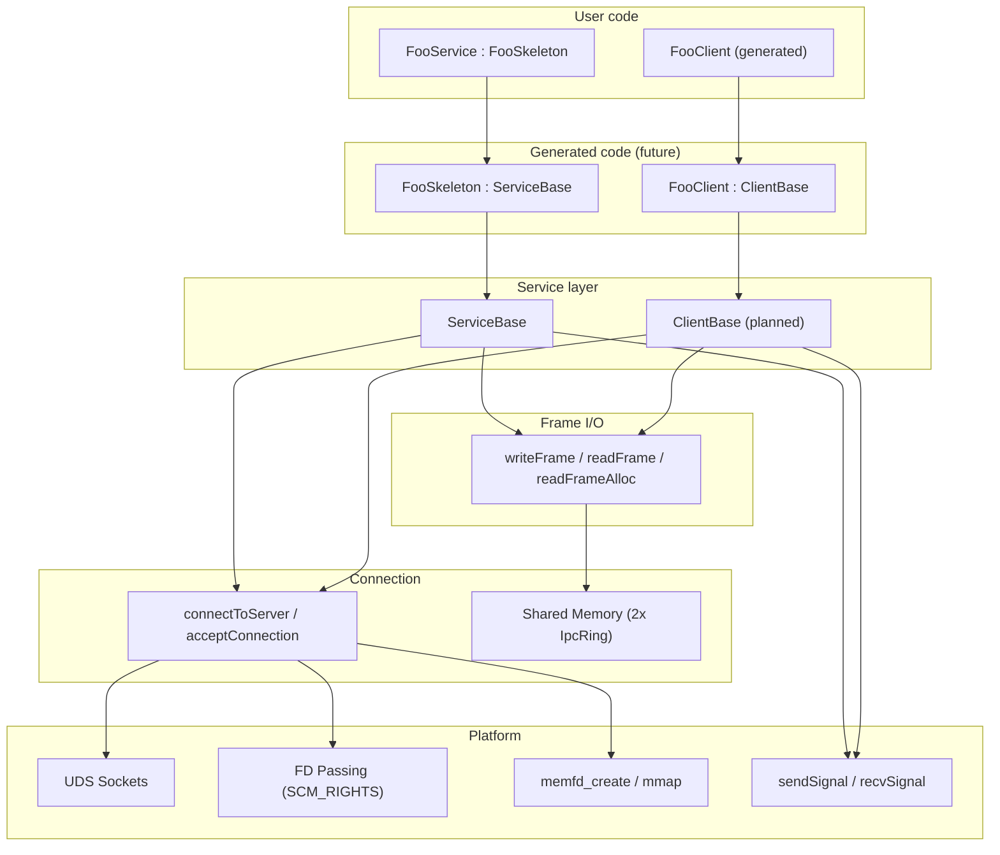

## Data plane vs control plane

The key architectural insight: **data never touches the socket**. The UDS
socket is only used for lightweight signaling and the initial handshake.
All payload data flows through shared memory ring buffers.

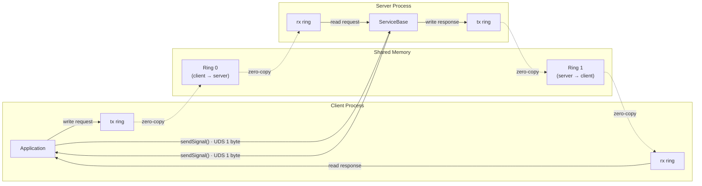

## Connection establishment

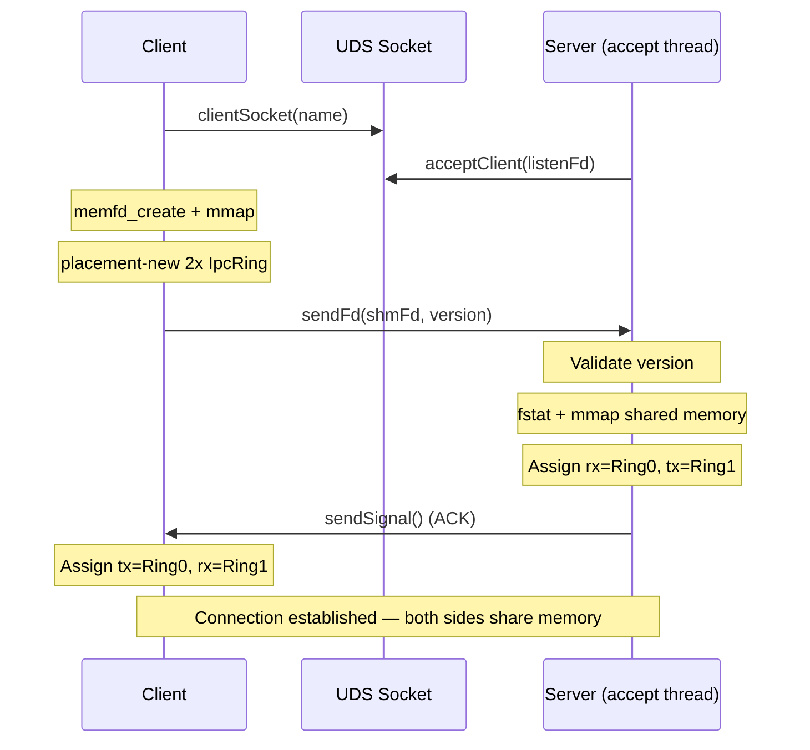

## Frame format

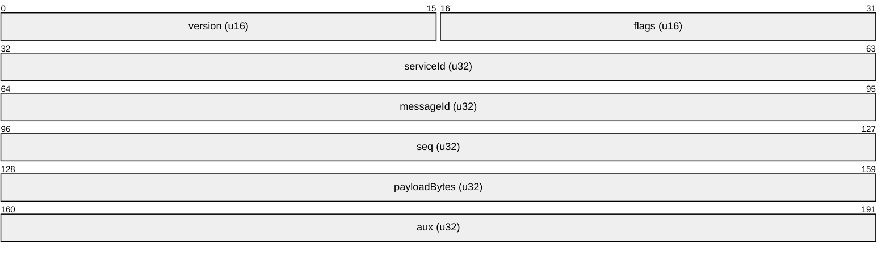

Frames are written contiguously into the ring buffer:

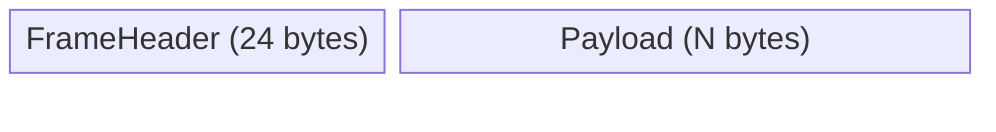

Flag values:
- `FRAME_REQUEST` (0x01) — client → server RPC call
- `FRAME_RESPONSE` (0x02) — server → client reply (status in `aux`)
- `FRAME_NOTIFY` (0x04) — server → client broadcast

## Request/response flow

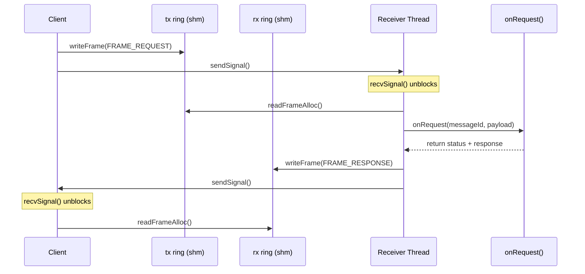

## Notification broadcast

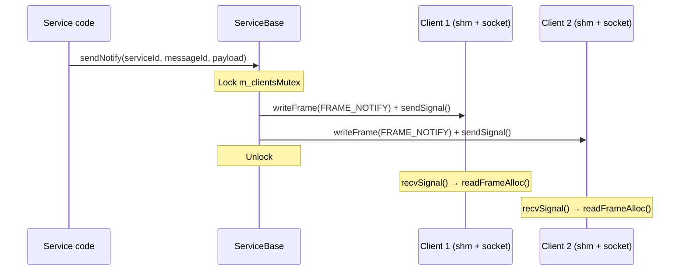

## ServiceBase threading model

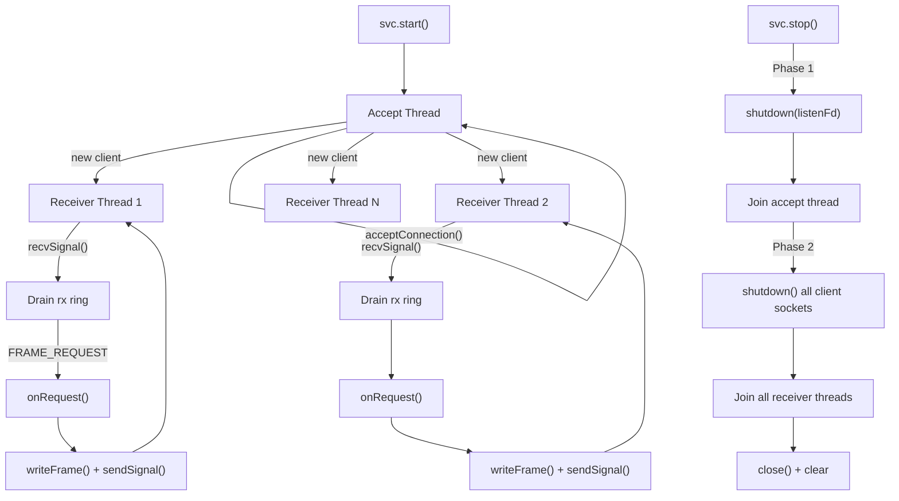

## Two-phase shutdown

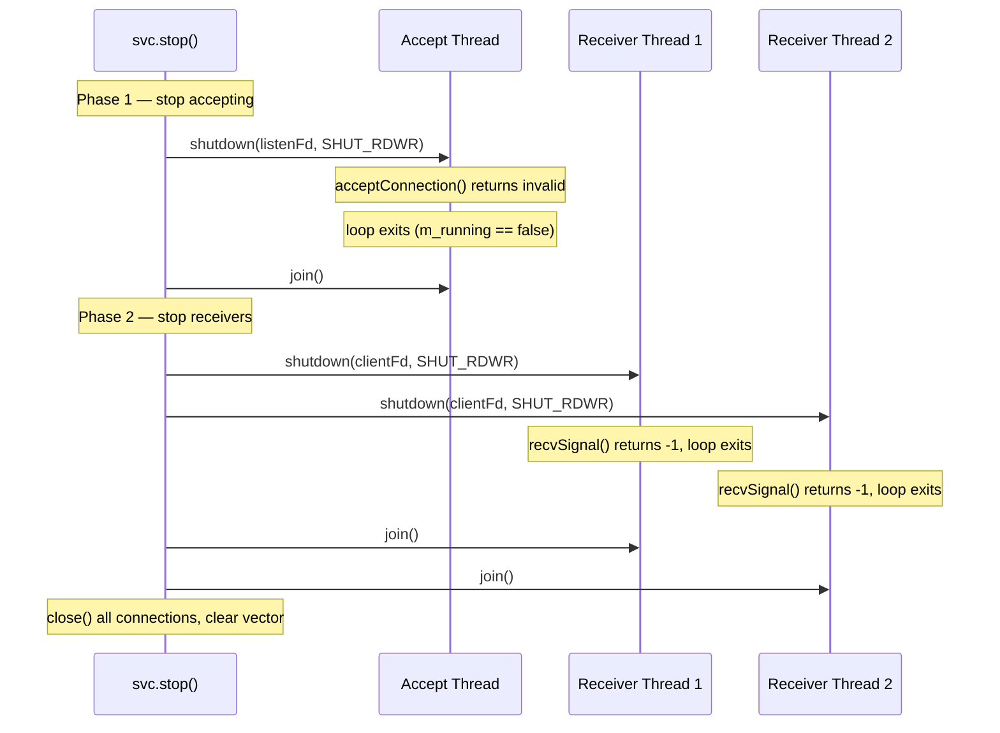

## Class hierarchy (current + planned)

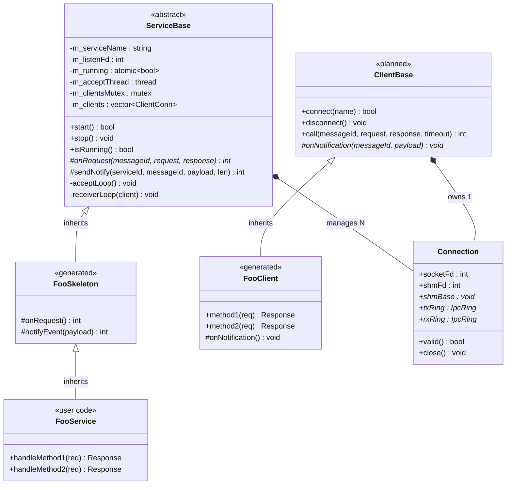

## Shared memory layout (per connection)

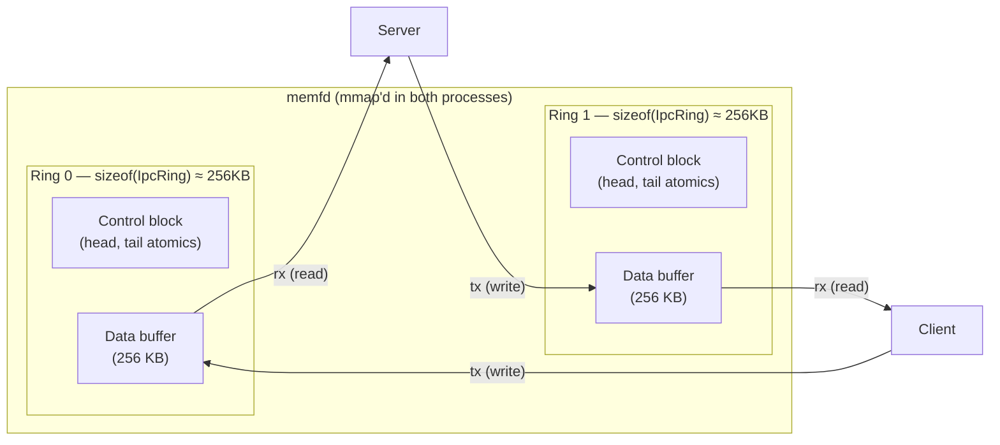

## Error code space

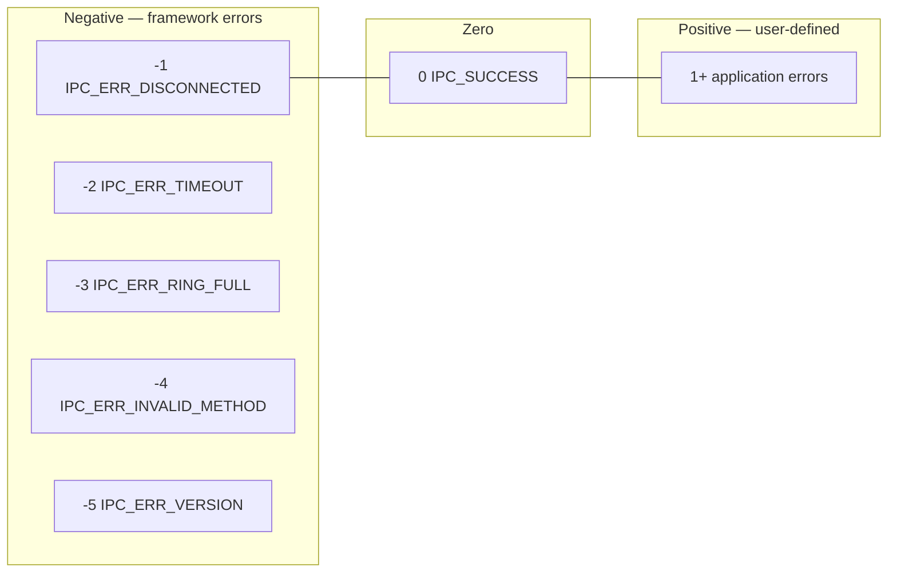

## What's built vs planned

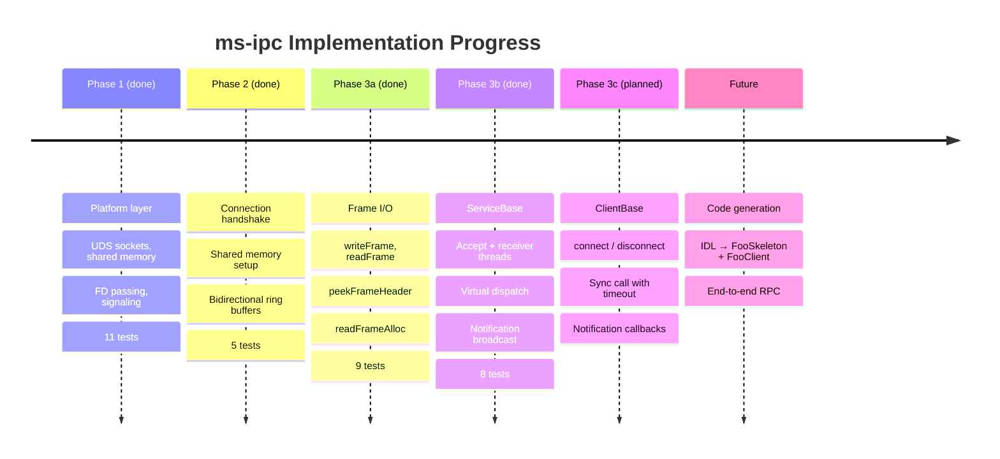
