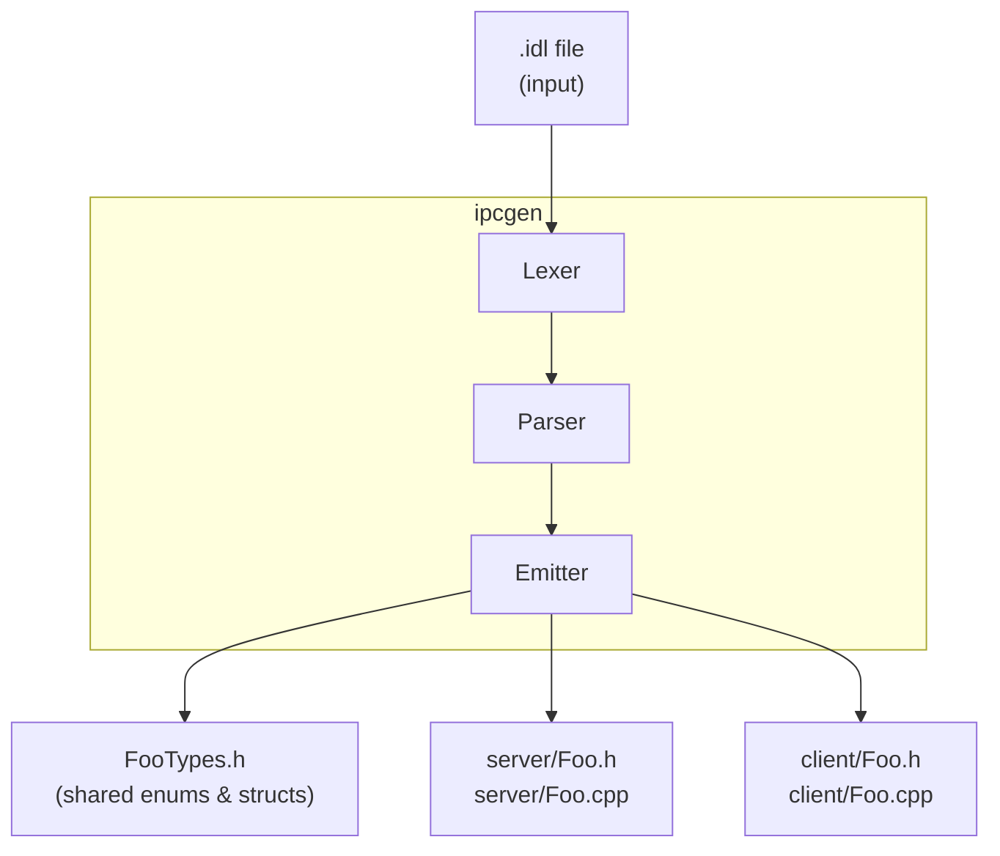

# ipcgen High-Level Design

## 1. Purpose

ipcgen is an IDL-to-C++ code generator for the ms-ipc framework. It reads
a service interface definition file (`.idl`) and produces type-safe C++
server and client classes that handle all marshaling, dispatch, and
notification routing. The developer implements pure virtual handlers
(server) and calls typed methods (client) — no manual serialization.

## 2. Scope

This document covers the code generator tool at `tools/ipcgen/`. For the
IPC runtime it generates code against, see [ms-ipc-hld.md](ms-ipc-hld.md).

## 3. System context



ipcgen is a build-time tool. It runs once per IDL file and produces C++
source files that are compiled alongside the application. The generated
code depends on `ServiceBase` and `ClientBase` from the ms-ipc runtime.

## 4. IDL language

### 4.1 Overview

The IDL describes a single service interface consisting of:

- **Enums** — named integer constants
- **Structs** — fixed-size data types with typed fields
- **Service block** — RPC methods with `[in]` and `[out]` parameters
- **Notifications block** — server-to-client broadcasts with `[in]` parameters

### 4.2 Type system

| Category | IDL syntax | C++ mapping |
|----------|-----------|-------------|
| Integers | `uint8`, `uint16`, `uint32`, `uint64`, `int8`..`int64` | `uint8_t`, `uint16_t`, etc. |
| Floats | `float32`, `float64` | `float`, `double` |
| Boolean | `bool` | `bool` |
| Arrays | `T[N]` (any scalar, enum, or struct) | `std::array<T, N>` |
| Strings | `string[N]` (bounded, null-terminated) | `char[N+1]` |
| User-defined | enum name, struct name | Same name in C++ |

All types have fixed, known sizes at compile time. There are no
variable-length types — this keeps the wire format simple (`memcpy`-based)
and structs POD-compatible.

### 4.3 Parameter directions

| Direction | Meaning | Server handler | Client method |
|-----------|---------|----------------|---------------|
| `[in]` | Client sends to server | Pass by value | Pass by value |
| `[out]` | Server returns to client | Pass by pointer | Pass by pointer |

Strings are special: `[in] string[N]` maps to `const char *`, `[out] string[N]`
maps to `char *`.

### 4.4 Service IDs

Each service gets a `kServiceId` derived from the service name using
FNV-1a 32-bit hash. This eliminates manual ID assignment and ensures
consistent IDs across server and client.

## 5. Generated output

For a service named `Foo` with enums/structs, ipcgen produces five files:

### 5.1 `FooTypes.h` (shared)

- Enum definitions with explicit `uint32_t` underlying type
- Struct definitions with typed fields
- `#include <array>` only when array fields exist (not for string-only structs)

### 5.2 `server/Foo.h`

- Class `Foo` inheriting `ServiceBase`
- `kServiceId` constant
- `MethodId` and `NotifyId` enums
- Pure virtual `handleXxx()` methods — the developer implements these
- Concrete `notifyXxx()` methods — the developer calls these to broadcast
- `onRequest()` override declaration

### 5.3 `server/Foo.cpp`

- `onRequest()` — switch/case dispatcher that:
  1. Unmarshals `[in]` params from the request buffer
  2. Calls the appropriate `handleXxx()` virtual
  3. Marshals `[out]` params into the response buffer
- `notifyXxx()` methods — marshal params and call `sendNotify()`

### 5.4 `client/Foo.h`

- Class `Foo` inheriting `ClientBase`
- `kServiceId` constant
- `MethodId` and `NotifyId` enums
- Public RPC methods (e.g., `int GetDeviceCount(uint32_t *count, uint32_t timeoutMs = 2000)`)
- Protected virtual `onXxx()` notification callbacks (default no-op)
- `onNotification()` override declaration

### 5.5 `client/Foo.cpp`

- RPC method implementations — marshal `[in]` params, call `call()`,
  unmarshal `[out]` params
- `onNotification()` — switch/case dispatcher that unmarshals notification
  params and calls the appropriate `onXxx()` virtual callback

## 6. Pipeline

The code generation pipeline has three stages:


### 6.1 Lexer (`lexer.py`)

Converts IDL source text into a flat list of tokens. Handles keywords,
identifiers, numbers, symbols, bracketed attributes (`[method=1]`, `[in]`,
`[out]`), single-line comments (`//`), and block comments (`/* */`).

### 6.2 Parser (`parser.py`)

Recursive-descent parser that builds an AST from the token stream. The AST
consists of `IdlFile` containing lists of `EnumDef`, `StructDef`, `Method`,
and `Notification` nodes. Validates type correctness, uniqueness, and
structural constraints during parsing — see ipcgen LLD for the full
validation rules table.

### 6.3 Emitter (`emitter.py`)

Takes the AST and produces C++ source strings. Each output file has its own
emit function. The emitter handles:

- Type resolution (IDL type to C++ type)
- Parameter declaration formatting (value, pointer, array, string variants)
- Wire size calculations for marshaling offsets
- `#include` dependency tracking (e.g., `<array>` only when needed)
- Namespace wrapping

## 7. Key design decisions

| Decision | Rationale |
|----------|-----------|
| Fixed-size wire format only | Keeps serialization trivial (`memcpy`); structs remain POD |
| `string[N]` not `std::string` | Embedded-friendly; fixed wire size; no heap allocation |
| `char *` for string params, not `std::array<char, N>` | Idiomatic C++; natural interop with C strings |
| FNV-1a hash for service IDs | Deterministic, no manual assignment, collision-resistant |
| Single IDL file per service | Keeps the tool simple; no cross-file dependencies |
| Pure virtual handlers | Clean separation: generated code handles plumbing, user code handles logic |
| Separate server/client directories | Prevents accidental linking of both into one binary |

## 8. CLI usage

```bash
python3 -m ipcgen <input.idl> --outdir <output_dir>
```

Creates `<output_dir>/server/` and `<output_dir>/client/` subdirectories
and writes the generated files.

## 9. Testing

| Test file | Scope | Tests |
|-----------|-------|-------|
| `test_hash.py` | FNV-1a hash | 3 |
| `test_lexer.py` | Tokenization | 14 |
| `test_parser.py` | Parsing and AST validation | 80 |
| `test_server_emitter.py` | Server code generation | 8 |
| `test_client_emitter.py` | Client code generation | 8 |
| `test_types_emitter.py` | Types header + detailed emission | 43 |
| `test_end_to_end.py` | Full pipeline (IDL → files) | 7 |

All tests use pytest and run as part of `python3 build.py -t`.
