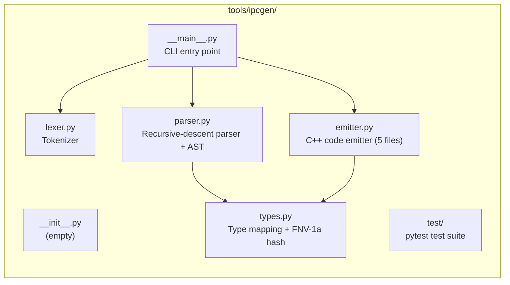
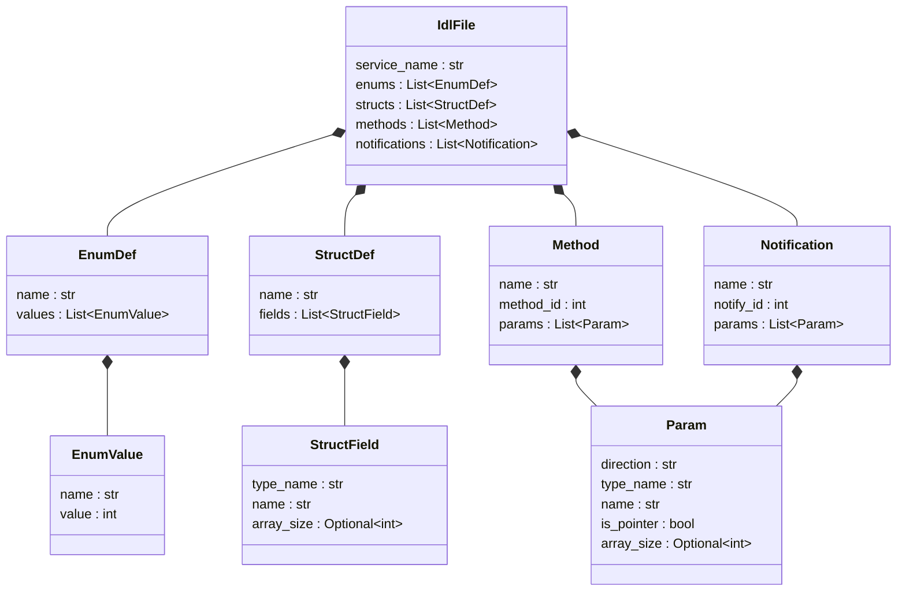
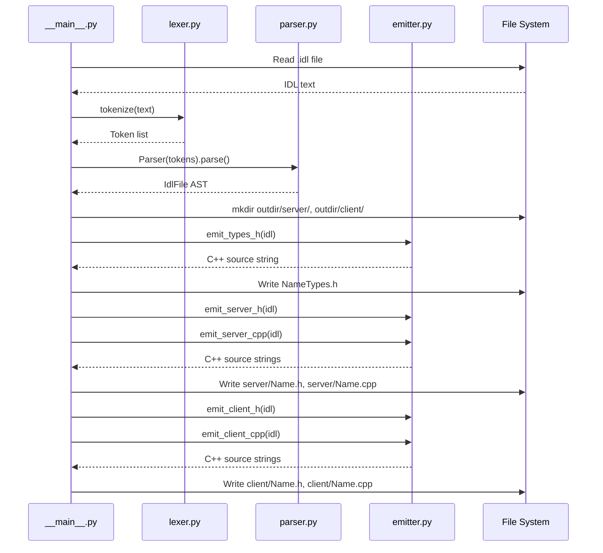

# ipcgen Detailed Design

## 1. Scope

This document covers the implementation details of the ipcgen IDL-to-C++
code generator: token types, grammar rules, AST structure, type mapping,
and code emission logic. For the high-level overview, see
[ipcgen-hld.md](ipcgen-hld.md).

## 2. Module structure



## 3. Type system (`types.py`)

### 3.1 Type map

```python
TYPE_MAP = {
    "uint8":   "uint8_t",
    "uint16":  "uint16_t",
    "uint32":  "uint32_t",
    "uint64":  "uint64_t",
    "int8":    "int8_t",
    "int16":   "int16_t",
    "int32":   "int32_t",
    "int64":   "int64_t",
    "float32": "float",
    "float64": "double",
    "bool":    "bool",
    "string":  "char",
}
```

User-defined enums and structs pass through unchanged — the IDL name equals
the C++ name.

### 3.2 Service ID hash

```python
def fnv1a_32(s: str) -> int:
    h = 0x811c9dc5          # FNV offset basis
    for b in s.encode("utf-8"):
        h ^= b
        h = (h * 0x01000193) & 0xFFFFFFFF   # FNV prime
    return h
```

Example: `fnv1a_32("DeviceMonitor")` → `0x00fefaf3`.

## 4. Lexer (`lexer.py`)

### 4.1 Token types

| Token kind | Example | Description |
|-----------|---------|-------------|
| `KEYWORD` | `service`, `int`, `void`, `enum`, `struct` | Reserved words |
| `IDENT` | `DeviceMonitor`, `uint32`, `deviceId` | Identifiers and type names |
| `NUMBER` | `42`, `0` | Integer literals |
| `SYMBOL` | `{`, `}`, `(`, `)`, `;`, `,`, `*`, `=` | Punctuation |
| `ATTR` | `method=1`, `in`, `out`, `notify=2`, `6` | Content inside `[...]` |
| `EOF` | | End of input |

### 4.2 Token data structure

```python
@dataclass
class Token:
    kind: str       # TOK_KEYWORD, TOK_IDENT, etc.
    value: str      # The text content
    line: int       # Source line number (for error messages)
```

### 4.3 Lexer rules

The `tokenize(text)` function scans left-to-right:

1. **Whitespace** (`\t`, `\r`, ` `) — skip
2. **Newline** (`\n`) — increment line counter, skip
3. **Single-line comment** (`//`) — skip to end of line
4. **Block comment** (`/* ... */`) — skip, count newlines. Error if unterminated
5. **Attribute** (`[...]`) — extract content as `ATTR` token. Error if unterminated
6. **Symbol** (`{}();,*=`) — emit `SYMBOL` token
7. **Number** (digit sequence) — emit `NUMBER` token
8. **Identifier/keyword** (letter or `_`, then alphanumeric or `_`) — emit
   `KEYWORD` if in keyword set, else `IDENT`
9. **Anything else** — `SyntaxError`

### 4.4 Array/string bracket handling

`uint8[6]` tokenizes as:
- `IDENT("uint8")`
- `ATTR("6")`  (the `[6]` becomes an attribute)

The parser checks if the ATTR value is a digit to detect array size.
This same mechanism handles `string[64]` naturally.

## 5. Parser (`parser.py`)

### 5.1 AST overview



### 5.2 AST node definitions

```python
@dataclass
class EnumValue:
    name: str           # e.g. "USB"
    value: int          # e.g. 1

@dataclass
class EnumDef:
    name: str           # e.g. "DeviceType"
    values: List[EnumValue]

@dataclass
class StructField:
    type_name: str      # IDL type: "uint32", "DeviceType", "string"
    name: str           # field name
    array_size: Optional[int]  # e.g. 6 for uint8[6], 64 for string[64]

@dataclass
class StructDef:
    name: str           # e.g. "DeviceInfo"
    fields: List[StructField]

@dataclass
class Param:
    direction: str      # "in" or "out"
    type_name: str      # IDL type
    name: str           # parameter name
    is_pointer: bool    # True for [out] params
    array_size: Optional[int]  # e.g. 16 for uint8[16]

@dataclass
class Method:
    name: str           # e.g. "GetDeviceCount"
    method_id: int      # from [method=N]
    params: List[Param]

@dataclass
class Notification:
    name: str           # e.g. "DeviceConnected"
    notify_id: int      # from [notify=N]
    params: List[Param]

@dataclass
class IdlFile:
    service_name: str
    enums: List[EnumDef]
    structs: List[StructDef]
    methods: List[Method]
    notifications: List[Notification]
```

### 5.3 Grammar (informal)

```
idl_file     → (enum_def | struct_def | service_block | notify_block)* EOF
enum_def     → 'enum' IDENT '{' (IDENT '=' NUMBER ','?)* '}' ';'
struct_def   → 'struct' IDENT '{' (type_ref [ATTR] IDENT ';')+ '}' ';'
service_block → 'service' IDENT '{' method* '}' ';'
notify_block → 'notifications' IDENT '{' notification* '}' ';'
method       → ATTR('method=N') 'int' IDENT '(' param_list ')' ';'
notification → ATTR('notify=N') 'void' IDENT '(' param_list ')' ';'
param_list   → param (',' param)* | ε
param        → ATTR('in'|'out') type_ref [ATTR(N)] IDENT
type_ref     → IDENT  (must be in TYPE_MAP or _user_types)
```

### 5.4 Parser state

```python
class Parser:
    tokens: List[Token]     # input token list
    pos: int                # current position
    _user_types: set        # names of defined enums/structs
```

- `peek()` — return token at current position without advancing
- `advance()` — return current token and increment position
- `expect(kind, value=None)` — advance and verify kind/value, raise `SyntaxError` on mismatch

### 5.5 Validation rules

| Rule | Error |
|------|-------|
| Type not in `TYPE_MAP` and not in `_user_types` | `unknown type 'xxx'` |
| Duplicate enum/struct name | `type 'xxx' already defined` |
| Type name shadows built-in | `type 'xxx' already defined` |
| `string` without `[N]` | `'string' requires a size` |
| Array size < 1 | `array size must be >= 1` |
| Empty struct (no fields) | `struct 'xxx' has no fields` |
| `[out]` in notification params | `notification params must be [in]` |
| Service and notifications name mismatch | `name mismatch` |
| No service block | `No service block found` |

## 6. Emitter (`emitter.py`)

### 6.1 Helper functions

**`_resolve_type(idl_type, idl)`** — maps IDL type to C++. Built-in types
go through `TYPE_MAP`; user-defined types pass through unchanged.

**`_cpp_param_type(type_name, array_size, idl)`** — full C++ type
including array wrapping. Returns `std::array<T, N>` when `array_size` is
set. Not used for strings.

**`_param_decl(p, idl, is_out)`** — complete C++ parameter declaration
(`type name`). Handles string, array, scalar, struct, and enum types:

| Type | `[in]` | `[out]` |
|------|--------|---------|
| Scalar/enum/struct | `uint32_t deviceId` | `uint32_t *count` |
| Array `T[N]` | `std::array<uint8_t, 6> serial` | `uint8_t *buffer` |
| String `string[N]` | `const char *name` | `char *name` |

**`_wire_size(p, idl)`** — C++ expression for the wire size of a param.
Strings return literal `N+1`, others return `sizeof(type)`.

**`_out_size_expr(p, idl)`** — byte-size expression for `[out]` params
in client unmarshal. Strings use literal `N+1`, arrays use
`N * sizeof(element)`, scalars use `sizeof(*name)`.

**`_has_non_string_arrays(items, direction_filter)`** — checks if any
param needs `#include <array>`. Strings don't use `std::array`, so they
are excluded.

### 6.2 Types header (`emit_types_h`)

**Input:** `IdlFile` with enums and structs.

**Output structure:**
```cpp
// Auto-generated by ipcgen — do not edit.
#pragma once
#include <array>        // only if non-string array fields exist
#include <cstdint>

namespace ms::ipc
{

enum EnumName : uint32_t
{
    Value1 = 0,
    Value2 = 1,
};

struct StructName
{
    uint32_t field1;
    std::array<uint8_t, 6> arrayField;    // T[N] → std::array
    char stringField[65];                  // string[64] → char[65]
};

} // namespace ms::ipc
```

**Logic:**
- Enums get `uint32_t` underlying type
- Struct fields: strings → `char name[N+1]`, arrays → `std::array<T, N>`,
  scalars → resolved C++ type
- `#include <array>` only emitted if at least one non-string array field exists

### 6.3 Server header (`emit_server_h`)

**Output structure:**
```cpp
class Name : public ServiceBase
{
public:
    using ServiceBase::ServiceBase;
    static constexpr uint32_t kServiceId = 0x...u;

    enum MethodId : uint32_t { kMethodA = 1, kMethodB = 2 };
    enum NotifyId : uint32_t { kEventA = 1, kEventB = 2 };

protected:
    virtual int handleMethodA([in] params..., [out] params...) = 0;
    int notifyEventA([in] params...);

    int onRequest(uint32_t messageId, const std::vector<uint8_t> &request,
                  std::vector<uint8_t> *response) override;
};
```

**Logic:**
- Handler signatures use `_param_decl()` for all params
- `[out]` params are pointers (string → `char *`, array → `T *`, scalar → `T *`)
- `[in]` params are pass-by-value (string → `const char *`, array → `std::array`, scalar → `T`)

### 6.4 Server implementation (`emit_server_cpp`)

**`onRequest()` dispatch:**

For each method:
1. **Unmarshal `[in]` params:** declare local variable, `memcpy` from
   `request.data() + offset`. Strings get null-termination: `name[N] = '\0'`.
   Track cumulative offset.
2. **Declare `[out]` params:** strings → `char name[N+1] = {}`,
   arrays → `T name[N]`, scalars → `T name`.
3. **Call handler:** `int _rc = handleMethodName(in_args..., out_args...)`.
   Strings and arrays decay to pointer; scalars use `&`.
4. **Marshal `[out]` params:** `response->resize(total_size)`,
   `memcpy` each param into response buffer at tracked offset.
5. Return `_rc`.

Default case returns `IPC_ERR_INVALID_METHOD`.

**Notification senders (`notifyXxx()`):**

For each notification:
1. Calculate total payload size from all `[in]` params
2. For strings: create temp buffer `_name[N+1] = {}`, `strncpy` from
   `const char *` param, `memcpy` temp buffer into payload
3. For others: `memcpy(&param, payload, sizeof(param))`
4. Call `sendNotify(kServiceId, kNotifyId, payload.data(), payload.size())`

### 6.5 Client header (`emit_client_h`)

**Output structure:**
```cpp
class Name : public ClientBase
{
public:
    using ClientBase::ClientBase;
    static constexpr uint32_t kServiceId = 0x...u;

    int MethodA([in] params..., [out] params..., uint32_t timeoutMs = 2000);

protected:
    virtual void onEventA([in] params...) {}

    void onNotification(uint32_t serviceId, uint32_t messageId,
                        const std::vector<uint8_t> &payload) override;
};
```

**Logic:**
- RPC methods are public, have all params plus `timeoutMs` with default
- Notification callbacks are protected virtual with empty default body
- `_param_decl()` used for all parameter declarations

### 6.6 Client implementation (`emit_client_cpp`)

**RPC methods (`Name::MethodName()`):**

1. **Marshal `[in]` params:** calculate total size, allocate request vector.
   Strings: temp buffer + `strncpy` + `memcpy`. Others: `memcpy(&param)`.
   Empty request vector if no `[in]` params.
2. **Call:** `int _rc = call(kServiceId, kMethodId, request, &response, timeoutMs)`
3. **Unmarshal `[out]` params:** if success and response large enough,
   `memcpy` each param from response buffer. Null-check each pointer.
   Strings use literal `N+1` for size, arrays use `N * sizeof(element)`,
   scalars use `sizeof(*param)`.
4. Return `_rc`.

**Notification dispatch (`onNotification()`):**

1. Guard: `if (serviceId != kServiceId) return`
2. Switch on `messageId`
3. For each notification: unmarshal params with `memcpy`. Strings get
   null-termination: `name[N] = '\0'`. Call `onNotifyName(params...)`.

## 7. Marshaling format

All params are marshaled contiguously with no padding between them:


| Type | Wire size | Marshal method |
|------|-----------|----------------|
| Scalar (`uint32`, etc.) | `sizeof(T)` | `memcpy(&value, buf, sizeof)` |
| Enum | `sizeof(uint32_t)` | Same as scalar |
| Struct | `sizeof(Struct)` | `memcpy(&value, buf, sizeof)` |
| Array `T[N]` | `N * sizeof(T)` | `memcpy(&array, buf, sizeof)` |
| String `string[N]` | `N+1` bytes | `memcpy` fixed buffer; null-terminate on unmarshal |

Offsets are tracked as compile-time expressions (e.g., `sizeof(uint32_t) + 65`).

## 8. CLI entry point (`__main__.py`)



```python
def main():
    # Parse CLI args: input .idl file, --outdir
    # Read IDL text
    tokens = tokenize(text)
    idl = Parser(tokens).parse()

    # Create output directories: outdir/server/, outdir/client/
    # Generate and write files:
    #   outdir/NameTypes.h        (if enums/structs exist)
    #   outdir/server/Name.h
    #   outdir/server/Name.cpp
    #   outdir/client/Name.h
    #   outdir/client/Name.cpp
```

## 9. Error handling

All errors are raised as Python `SyntaxError` with line numbers:

```
SyntaxError: Line 5: unknown type 'foobar'
SyntaxError: Line 12: 'string' requires a size, e.g. string[64]
SyntaxError: Line 3: expected [method=N], got [foo=1]
```

The generator does not produce partial output — if parsing fails, no files
are written.

## 10. Test coverage

Tests are organized by pipeline stage:

| File | What it tests | Approach |
|------|--------------|----------|
| `test_hash.py` | FNV-1a correctness | Known value verification |
| `test_lexer.py` | All token types, comments, errors | Assert token sequences |
| `test_parser.py` | All AST node types, all validation rules | Parse IDL strings, check AST fields |
| `test_server_emitter.py` | Server header + cpp structure | Check string containment in output |
| `test_client_emitter.py` | Client header + cpp structure | Check string containment in output |
| `test_types_emitter.py` | Types header, detailed marshal/unmarshal code | Check exact code patterns |
| `test_end_to_end.py` | Full pipeline: IDL → files | Write to tmpdir, verify file contents |

Each test creates an IDL string, runs it through the relevant pipeline
stages, and asserts properties of the output.
