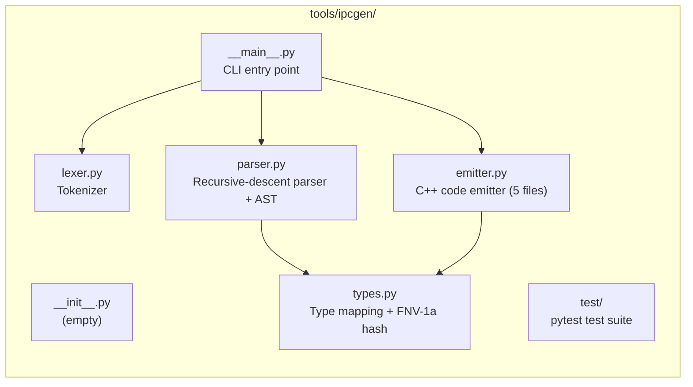
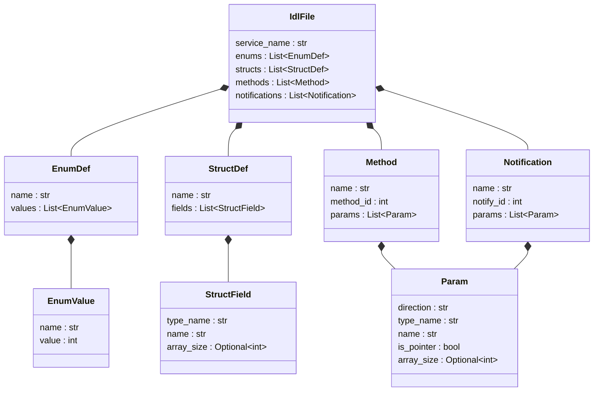
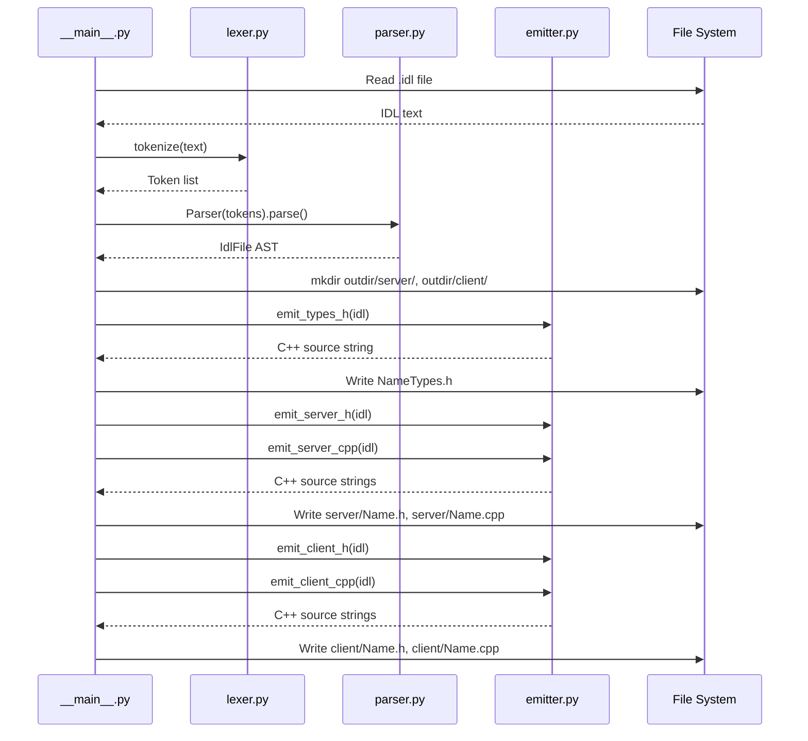

# ipcgen Low-Level Design

## 1. Scope

This document covers the module APIs (Part A) and implementation details
(Part B) of the ipcgen IDL-to-C++ code generator. For the high-level
overview, see [ipcgen-hld.md](ipcgen-hld.md).

---

# Part A — Module APIs

## 2. types.py

Type system constants and hashing utilities used by the parser and emitter.

### 2.1 TYPE_MAP

IDL-to-C++ type mapping dictionary.

| IDL type | C++ type |
|----------|----------|
| `uint8` | `uint8_t` |
| `uint16` | `uint16_t` |
| `uint32` | `uint32_t` |
| `uint64` | `uint64_t` |
| `int8` | `int8_t` |
| `int16` | `int16_t` |
| `int32` | `int32_t` |
| `int64` | `int64_t` |
| `float32` | `float` |
| `float64` | `double` |
| `bool` | `bool` |
| `string` | `char` |

User-defined enums and structs pass through unchanged — the IDL name
equals the C++ name.

### 2.2 cpp_type()

**Signature:** `def cpp_type(idl_type: str) -> str`

**Description:** Maps an IDL type name to its C++ equivalent via `TYPE_MAP`.

| Parameter | Type | Description |
|-----------|------|-------------|
| `idl_type` | `str` | IDL type name (must be a key in `TYPE_MAP`) |

**Returns:** C++ type name string.

**Raises:** `KeyError` if `idl_type` is not in `TYPE_MAP`.

### 2.3 fnv1a_32()

**Signature:** `def fnv1a_32(s: str) -> int`

**Description:** Computes an FNV-1a 32-bit hash of a string. Used to
derive `kServiceId` from the service name.

| Parameter | Type | Description |
|-----------|------|-------------|
| `s` | `str` | Input string (UTF-8 encoded for hashing) |

**Returns:** 32-bit unsigned integer hash value.

**Example:** `fnv1a_32("DeviceMonitor")` → `0x00fefaf3`.

## 3. lexer.py

Tokenizer that converts IDL source text into a flat list of tokens.

### 3.1 Token kinds

| Constant | Value | Description |
|----------|-------|-------------|
| `TOK_KEYWORD` | `"KEYWORD"` | Reserved words (`service`, `notifications`, `int`, `void`, `enum`, `struct`) |
| `TOK_IDENT` | `"IDENT"` | Identifiers and type names |
| `TOK_NUMBER` | `"NUMBER"` | Integer literals |
| `TOK_SYMBOL` | `"SYMBOL"` | Punctuation: `{`, `}`, `(`, `)`, `;`, `,`, `*`, `=` |
| `TOK_ATTR` | `"ATTR"` | Content inside `[...]` brackets (e.g., `method=1`, `in`, `out`) |
| `TOK_EOF` | `"EOF"` | End of input |

### 3.2 KEYWORDS

```python
KEYWORDS = {"service", "notifications", "int", "void", "enum", "struct"}
```

Words in this set produce `TOK_KEYWORD` tokens; all other identifier-like
sequences produce `TOK_IDENT`.

### 3.3 Token

**Signature:** `@dataclass class Token`

| Field | Type | Description |
|-------|------|-------------|
| `kind` | `str` | Token kind (one of the `TOK_*` constants) |
| `value` | `str` | Text content of the token |
| `line` | `int` | Source line number (1-based, for error messages) |

### 3.4 tokenize()

**Signature:** `def tokenize(text: str) -> List[Token]`

**Description:** Converts IDL source text into a list of tokens. Handles
keywords, identifiers, numbers, symbols, bracketed attributes, single-line
comments (`//`), block comments (`/* */`), and whitespace. The list always
ends with a `TOK_EOF` token.

| Parameter | Type | Description |
|-----------|------|-------------|
| `text` | `str` | IDL source text |

**Returns:** List of `Token` objects, terminated by a `TOK_EOF` token.

**Raises:** `SyntaxError` with line number on unterminated block comments,
unterminated attributes (`[` without `]`), or unexpected characters.

## 4. parser.py

Recursive-descent parser that builds an AST from a token stream, with
validation during parsing.

### 4.1 AST node classes

#### EnumValue

| Field | Type | Description |
|-------|------|-------------|
| `name` | `str` | Enum member name (e.g., `"USB"`) |
| `value` | `int` | Integer value (e.g., `1`) |

#### EnumDef

| Field | Type | Description |
|-------|------|-------------|
| `name` | `str` | Enum type name (e.g., `"DeviceType"`) |
| `values` | `List[EnumValue]` | List of enum members |

#### StructField

| Field | Type | Description |
|-------|------|-------------|
| `type_name` | `str` | IDL type name (e.g., `"uint32"`, `"DeviceType"`, `"string"`) |
| `name` | `str` | Field name |
| `array_size` | `Optional[int]` | Array/string size (e.g., `6` for `uint8[6]`, `64` for `string[64]`). `None` for scalars |

#### StructDef

| Field | Type | Description |
|-------|------|-------------|
| `name` | `str` | Struct type name (e.g., `"DeviceInfo"`) |
| `fields` | `List[StructField]` | List of struct fields |

#### Param

| Field | Type | Description |
|-------|------|-------------|
| `direction` | `str` | `"in"` or `"out"` |
| `type_name` | `str` | IDL type name |
| `name` | `str` | Parameter name |
| `is_pointer` | `bool` | `True` for `[out]` params (set automatically) |
| `array_size` | `Optional[int]` | Array/string size. `None` for scalars |

#### Method

| Field | Type | Description |
|-------|------|-------------|
| `name` | `str` | Method name (e.g., `"GetDeviceCount"`) |
| `method_id` | `int` | ID from `[method=N]` attribute |
| `params` | `List[Param]` | Method parameters |

#### Notification

| Field | Type | Description |
|-------|------|-------------|
| `name` | `str` | Notification name (e.g., `"DeviceConnected"`) |
| `notify_id` | `int` | ID from `[notify=N]` attribute |
| `params` | `List[Param]` | Notification parameters (must all be `[in]`) |

#### IdlFile

| Field | Type | Description |
|-------|------|-------------|
| `service_name` | `str` | Service name (from `service` or `notifications` block) |
| `enums` | `List[EnumDef]` | Enum definitions (default: `[]`) |
| `structs` | `List[StructDef]` | Struct definitions (default: `[]`) |
| `methods` | `List[Method]` | RPC methods (default: `[]`) |
| `notifications` | `List[Notification]` | Notifications (default: `[]`) |

### 4.2 Parser class

**Signature:** `class Parser`

**Constructor:** `def __init__(self, tokens: List[Token])`

| Parameter | Type | Description |
|-----------|------|-------------|
| `tokens` | `List[Token]` | Token list produced by `tokenize()` |

**Instance state:**

| Attribute | Type | Description |
|-----------|------|-------------|
| `tokens` | `List[Token]` | Input token list |
| `pos` | `int` | Current position in token list |
| `_user_types` | `set` | Names of defined enums/structs (for type validation) |

#### peek()

**Signature:** `def peek(self) -> Token`

**Description:** Returns the token at the current position without advancing.

#### advance()

**Signature:** `def advance(self) -> Token`

**Description:** Returns the token at the current position and increments
the position.

#### expect()

**Signature:** `def expect(self, kind: str, value: Optional[str] = None) -> Token`

**Description:** Advances and verifies the token's kind (and optionally
value). Raises `SyntaxError` on mismatch.

| Parameter | Type | Description |
|-----------|------|-------------|
| `kind` | `str` | Expected token kind |
| `value` | `Optional[str]` | Expected token value (if `None`, any value accepted) |

**Returns:** The consumed `Token`.

**Raises:** `SyntaxError` with line number if kind or value doesn't match.

#### parse()

**Signature:** `def parse(self) -> IdlFile`

**Description:** Parses the entire token stream and returns an `IdlFile`
AST. This is the main entry point — call it once after constructing the
`Parser`.

**Returns:** `IdlFile` containing all parsed enums, structs, methods,
and notifications.

**Raises:** `SyntaxError` if the input is invalid (see validation rules below).

### 4.3 Validation rules

All errors are raised as `SyntaxError` with line numbers.

| Rule | Error message |
|------|---------------|
| Type not in `TYPE_MAP` and not in `_user_types` | `unknown type 'xxx'` |
| Duplicate enum/struct name | `type 'xxx' already defined` |
| Type name shadows built-in | `type 'xxx' already defined` |
| `string` without `[N]` size | `'string' requires a size, e.g. string[64]` |
| Array size < 1 | `array size must be >= 1` |
| Empty struct (no fields) | `struct 'xxx' has no fields` |
| `[out]` in notification params | `notification params must be [in]` |
| Service and notifications name mismatch | `name mismatch` |
| No service block in file | `No service block found` |
| Invalid method attribute | `expected [method=N], got [...]` |
| Invalid notification attribute | `expected [notify=N], got [...]` |
| Invalid parameter direction | `expected [in] or [out], got [...]` |

## 5. emitter.py

C++ code emitter that generates server and client source files from the AST.

### 5.1 emit_types_h()

**Signature:** `def emit_types_h(idl: IdlFile) -> str`

**Description:** Generates a shared types header (`{Name}Types.h`) with
enum and struct definitions.

| Parameter | Type | Description |
|-----------|------|-------------|
| `idl` | `IdlFile` | Parsed AST |

**Returns:** Complete C++ header file content as a string.

**Output includes:**
- `#pragma once` guard
- `#include <array>` only if non-string array fields exist
- `#include <cstdint>` always
- Enums with `uint32_t` underlying type
- Structs with resolved C++ field types
- All wrapped in `namespace ms::ipc`

### 5.2 emit_server_h()

**Signature:** `def emit_server_h(idl: IdlFile) -> str`

**Description:** Generates the server header (`server/{Name}.h`) with a
class inheriting `ServiceBase`.

| Parameter | Type | Description |
|-----------|------|-------------|
| `idl` | `IdlFile` | Parsed AST |

**Returns:** Complete C++ header file content as a string.

**Output includes:**
- Class `{Name}` inheriting `ServiceBase`
- `kServiceId` constant (FNV-1a hash of service name)
- `MethodId` and `NotifyId` enums
- Pure virtual `handle{Method}()` declarations for each method
- Concrete `notify{Name}()` declarations for each notification
- `onRequest()` override declaration

### 5.3 emit_server_cpp()

**Signature:** `def emit_server_cpp(idl: IdlFile) -> str`

**Description:** Generates the server implementation
(`server/{Name}.cpp`) with request dispatch and notification senders.

| Parameter | Type | Description |
|-----------|------|-------------|
| `idl` | `IdlFile` | Parsed AST |

**Returns:** Complete C++ source file content as a string.

**Output includes:**
- `onRequest()` — switch/case dispatcher that unmarshals `[in]` params,
  calls the `handle{Method}()` virtual, and marshals `[out]` params
- `notify{Name}()` methods — marshal `[in]` params and call `sendNotify()`
- Default case returns `IPC_ERR_INVALID_METHOD`

### 5.4 emit_client_h()

**Signature:** `def emit_client_h(idl: IdlFile) -> str`

**Description:** Generates the client header (`client/{Name}.h`) with a
class inheriting `ClientBase`.

| Parameter | Type | Description |
|-----------|------|-------------|
| `idl` | `IdlFile` | Parsed AST |

**Returns:** Complete C++ header file content as a string.

**Output includes:**
- Class `{Name}` inheriting `ClientBase`
- `kServiceId` constant
- `MethodId` and `NotifyId` enums
- Public RPC methods with all params plus `uint32_t timeoutMs = 2000`
- Protected virtual `on{Notify}()` callbacks with empty default body
- `onNotification()` override declaration

### 5.5 emit_client_cpp()

**Signature:** `def emit_client_cpp(idl: IdlFile) -> str`

**Description:** Generates the client implementation
(`client/{Name}.cpp`) with typed RPC methods and notification dispatch.

| Parameter | Type | Description |
|-----------|------|-------------|
| `idl` | `IdlFile` | Parsed AST |

**Returns:** Complete C++ source file content as a string.

**Output includes:**
- RPC method implementations — marshal `[in]` params, call `call()`,
  unmarshal `[out]` params on success
- `onNotification()` — switch/case dispatcher that unmarshals notification
  params and calls the `on{Notify}()` virtual callbacks

## 6. CLI (`__main__.py`)

### 6.1 main()

**Signature:** `def main() -> None`

**Description:** CLI entry point that orchestrates the full code generation
pipeline: parse arguments, read IDL, tokenize, parse, emit, write files.

**Arguments (via `argparse`):**

| Argument | Required | Description |
|----------|----------|-------------|
| `idl` | yes | Path to input `.idl` file |
| `--outdir` | yes | Output directory path |

**Usage:**

```bash
python3 -m ipcgen <input.idl> --outdir <output_dir>
```

**Behavior:**
1. Reads the `.idl` file
2. Tokenizes and parses to AST
3. Creates `outdir/server/` and `outdir/client/` directories
4. Generates and writes up to 5 files:
   - `{outdir}/{Name}Types.h` (only if enums or structs exist)
   - `{outdir}/server/{Name}.h`
   - `{outdir}/server/{Name}.cpp`
   - `{outdir}/client/{Name}.h`
   - `{outdir}/client/{Name}.cpp`
5. Prints each file path and a summary with service name and ID

**Exit:** `SyntaxError` from lexer or parser terminates with a traceback.
No partial output is written on failure — parsing completes before any
file I/O.

---

# Part B — Implementation Details

## 7. Module structure



## 8. Lexer internals

### 8.1 Scanning rules

The `tokenize()` function scans left-to-right with a single pass:

| Priority | Pattern | Action |
|----------|---------|--------|
| 1 | `\n` | Increment line counter, skip |
| 2 | `\t`, `\r`, ` ` | Skip |
| 3 | `//` | Skip to end of line |
| 4 | `/*` ... `*/` | Skip, count newlines. Error if unterminated |
| 5 | `[` ... `]` | Extract content as `TOK_ATTR`. Error if unterminated |
| 6 | `{}();,*=` | Emit `TOK_SYMBOL` |
| 7 | Digit sequence | Emit `TOK_NUMBER` |
| 8 | Letter/`_` then alphanumeric/`_` | Emit `TOK_KEYWORD` if in `KEYWORDS`, else `TOK_IDENT` |
| 9 | Anything else | `SyntaxError` |

### 8.2 Array/string bracket handling

`uint8[6]` tokenizes as two tokens:
- `IDENT("uint8")`
- `ATTR("6")`

The `[6]` becomes an attribute token because rule 5 captures all `[...]`
content. The parser detects array sizes by checking if the ATTR value is
a digit string. This same mechanism handles `string[64]` naturally.

## 9. Parser internals

### 9.1 Grammar

```
idl_file     → (enum_def | struct_def | service_block | notify_block)* EOF
enum_def     → 'enum' IDENT '{' (IDENT '=' NUMBER ','?)* '}' ';'
struct_def   → 'struct' IDENT '{' (type_ref [ATTR] IDENT ';')+ '}' ';'
service_block → 'service' IDENT '{' method* '}' ';'
notify_block → 'notifications' IDENT '{' notification* '}' ';'
method       → ATTR('method=N') 'int' IDENT '(' param_list ')' ';'
notification → ATTR('notify=N') 'void' IDENT '(' param_list ')' ';'
param_list   → param (',' param)* | ε
param        → ATTR('in'|'out') type_ref [ATTR(N)] IDENT
type_ref     → IDENT  (must be in TYPE_MAP or _user_types)
```

### 9.2 Recursive descent structure

Each grammar rule maps to a private method:

| Method | Parses |
|--------|--------|
| `parse()` | Top-level: loops over enum/struct/service/notifications blocks |
| `_parse_enum()` | `enum Name { A = 0, B = 1 };` |
| `_parse_struct()` | `struct Name { type field; ... };` |
| `_parse_service()` | `service Name { methods... };` |
| `_parse_notifications()` | `notifications Name { notifs... };` |
| `_parse_method()` | `[method=N] int Name(params);` |
| `_parse_notification()` | `[notify=N] void Name(params);` |
| `_parse_params()` | `(param, param, ...)` |
| `_parse_param()` | `[in] type name` or `[out] type name` |

### 9.3 User type tracking

The parser maintains a `_user_types` set that grows as enums and structs
are parsed. When a type reference is encountered (in struct fields or
method/notification parameters), the parser checks both `TYPE_MAP` and
`_user_types`. This means types must be defined before use — forward
references are not supported.

### 9.4 AST class diagram



## 10. Emitter internals

### 10.1 Helper functions

The emitter uses several private helpers for type resolution and C++
code generation:

#### _resolve_type()

**Signature:** `def _resolve_type(idl_type: str, idl: IdlFile) -> str`

Maps IDL type to C++. Built-in types go through `TYPE_MAP`; user-defined
types (enums, structs) pass through unchanged.

#### _cpp_param_type()

**Signature:** `def _cpp_param_type(type_name: str, array_size: Optional[int], idl: IdlFile) -> str`

Full C++ type including array wrapping. Returns `std::array<T, N>` when
`array_size` is set. Not used for string types.

#### _param_decl()

**Signature:** `def _param_decl(p, idl: IdlFile, is_out: bool = False) -> str`

Complete C++ parameter declaration (`type name`). Handles all type/direction
combinations:

| Type | `[in]` declaration | `[out]` declaration |
|------|--------------------|---------------------|
| Scalar/enum/struct | `uint32_t deviceId` | `uint32_t *count` |
| Array `T[N]` | `std::array<uint8_t, 6> serial` | `uint8_t *buffer` |
| String `string[N]` | `const char *name` | `char *name` |

#### _wire_size()

**Signature:** `def _wire_size(p, idl: IdlFile) -> str`

C++ expression for the wire size of a parameter. Strings return literal
`N+1`; all others return `sizeof(type)`.

#### _out_size_expr()

**Signature:** `def _out_size_expr(p, idl: IdlFile) -> str`

Byte-size expression for `[out]` params in client unmarshal code:
- Strings: literal `N+1`
- Arrays: `N * sizeof(element)`
- Scalars: `sizeof(*name)`

#### _has_non_string_arrays()

**Signature:** `def _has_non_string_arrays(items, direction_filter=None) -> bool`

Checks if any parameter in `items` has an array type that isn't a string.
Used to decide whether `#include <array>` is needed.

#### _emit_enums()

**Signature:** `def _emit_enums(w, idl: IdlFile) -> None`

Emits `MethodId` and `NotifyId` enum blocks into a class body using the
provided write function `w`.

### 10.2 Marshaling format

All parameters are marshaled contiguously with no alignment padding:


| Type | Wire size | Marshal method |
|------|-----------|----------------|
| Scalar (`uint32`, etc.) | `sizeof(T)` | `memcpy(&value, buf, sizeof)` |
| Enum | `sizeof(uint32_t)` | Same as scalar |
| Struct | `sizeof(Struct)` | `memcpy(&value, buf, sizeof)` |
| Array `T[N]` | `N * sizeof(T)` | `memcpy(&array, buf, sizeof)` |
| String `string[N]` | `N+1` bytes | `memcpy` fixed buffer; null-terminate on unmarshal |

Offsets are tracked as compile-time expressions (e.g.,
`sizeof(uint32_t) + 65`).

### 10.3 Server code generation

**`onRequest()` dispatch** — for each method:

1. **Unmarshal `[in]`:** declare local variable, `memcpy` from
   `request.data() + offset`. Strings get null-termination:
   `name[N] = '\0'`. Track cumulative offset.
2. **Declare `[out]`:** strings → `char name[N+1] = {}`,
   arrays → `T name[N]`, scalars → `T name`.
3. **Call handler:** `int _rc = handleMethodName(in_args..., out_args...)`.
   Strings and arrays decay to pointer; scalars use `&`.
4. **Marshal `[out]`:** `response->resize(total_size)`, `memcpy` each
   param into response buffer at tracked offset.
5. Return `_rc`. Default case returns `IPC_ERR_INVALID_METHOD`.

**Notification senders (`notifyXxx()`)** — for each notification:

1. Calculate total payload size from all `[in]` params.
2. Strings: create temp buffer `_name[N+1] = {}`, `strncpy` from
   `const char *` param, `memcpy` temp buffer into payload.
3. Non-strings: `memcpy(&param, payload, sizeof(param))`.
4. Call `sendNotify(kServiceId, kNotifyId, payload.data(), payload.size())`.

### 10.4 Client code generation

**RPC methods** — for each method:

1. **Marshal `[in]`:** calculate total size, allocate request vector.
   Strings: temp buffer + `strncpy` + `memcpy`. Others: `memcpy(&param)`.
   Empty request vector if no `[in]` params.
2. **Call:** `int _rc = call(kServiceId, kMethodId, request, &response, timeoutMs)`.
3. **Unmarshal `[out]`:** if `_rc == IPC_SUCCESS` and response large enough,
   `memcpy` each param from response buffer. Null-check each pointer.
   Strings use literal `N+1`, arrays use `N * sizeof(element)`,
   scalars use `sizeof(*param)`.
4. Return `_rc`.

**Notification dispatch (`onNotification()`):**

1. Guard: `if (serviceId != kServiceId) return`.
2. Switch on `messageId`.
3. For each notification: unmarshal params with `memcpy`. Strings get
   null-termination: `name[N] = '\0'`. Call `onNotifyName(params...)`.

### 10.5 Types header generation

- Enums get `uint32_t` underlying type
- Struct fields: strings → `char name[N+1]`, arrays → `std::array<T, N>`,
  scalars → resolved C++ type
- `#include <array>` only emitted if at least one non-string array field
  exists across all structs

### 10.6 Include dependency tracking

Each emitter function independently determines which `#include` directives
are needed:

| Include | Condition |
|---------|-----------|
| `<array>` | Any non-string array parameter in relevant direction, or non-string array struct field |
| `<cstdint>` | Always |
| `<cstring>` | Server and client source files (for `memcpy`, `strncpy`) |
| `<vector>` | Server and client files (for request/response buffers) |
| `"{Name}Types.h"` | If enums or structs exist |
| `"ServiceBase.h"` | Server header |
| `"ClientBase.h"` | Client header |

## 11. CLI processing



## 12. Error handling

All errors are raised as Python `SyntaxError` with line numbers:

```
SyntaxError: Line 5: unknown type 'foobar'
SyntaxError: Line 12: 'string' requires a size, e.g. string[64]
SyntaxError: Line 3: expected [method=N], got [foo=1]
```

The generator does not produce partial output — parsing completes fully
before any files are written. If tokenization or parsing fails, no
output files are created.

## 13. Test coverage

Tests are organized by pipeline stage:

| File | What it tests | Approach |
|------|--------------|----------|
| `test_hash.py` | FNV-1a correctness | Known value verification |
| `test_lexer.py` | All token types, comments, errors | Assert token sequences |
| `test_parser.py` | All AST node types, all validation rules | Parse IDL strings, check AST fields |
| `test_server_emitter.py` | Server header + cpp structure | Check string containment in output |
| `test_client_emitter.py` | Client header + cpp structure | Check string containment in output |
| `test_types_emitter.py` | Types header, detailed marshal/unmarshal code | Check exact code patterns |
| `test_end_to_end.py` | Full pipeline: IDL → files | Write to tmpdir, verify file contents |

Each test creates an IDL string, runs it through the relevant pipeline
stages, and asserts properties of the output.

## 14. File index

| File | Lines | Purpose |
|------|-------|---------|
| `tools/ipcgen/__init__.py` | 0 | Package marker |
| `tools/ipcgen/__main__.py` | 59 | CLI entry point |
| `tools/ipcgen/types.py` | 34 | Type mapping + FNV-1a hash |
| `tools/ipcgen/lexer.py` | 106 | Tokenizer |
| `tools/ipcgen/parser.py` | 312 | Recursive-descent parser + AST |
| `tools/ipcgen/emitter.py` | 536 | C++ code emitter (5 output files) |
