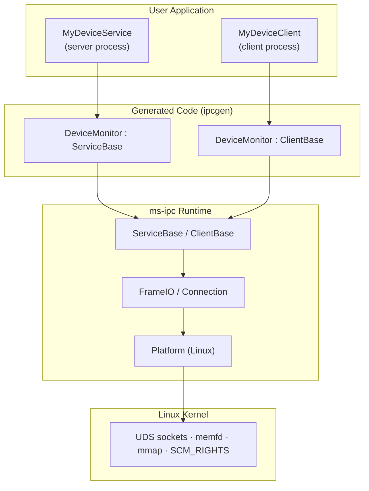
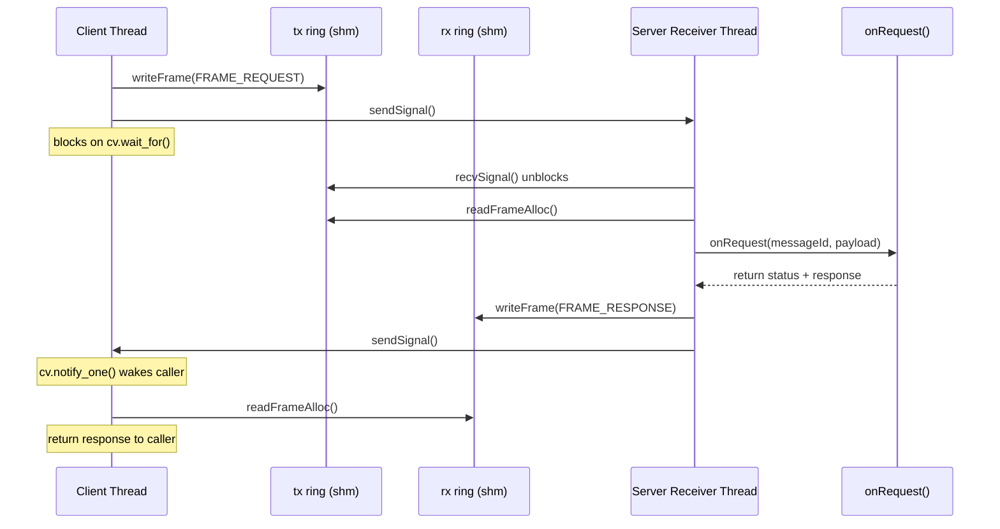
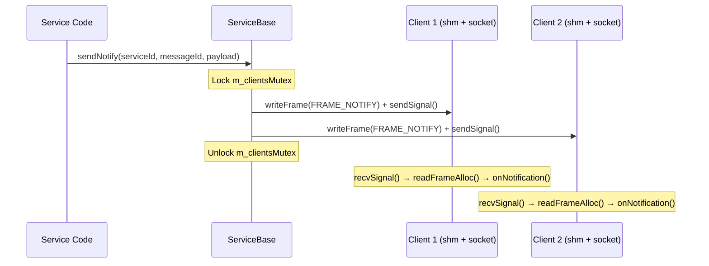

# ms-ipc High-Level Design

## 1. Purpose

ms-ipc is an inter-process communication framework for Linux that provides
type-safe RPC and notification services between processes on the same machine.
It is designed for embedded and systems-level applications where low latency,
predictable performance, and a small footprint are required.

## 2. Scope

This document covers the core IPC runtime (`inc/` and `src/`). For the IDL
code generator, see [ipcgen-hld.md](ipcgen-hld.md).

## 3. System context

ms-ipc sits between user application code and the Linux kernel. Users interact
through the Service layer (directly or via generated code) and never touch
sockets, shared memory, or serialization.

## 4. Architecture

### 4.1 Layer stack

The framework is organized into four layers, each depending only on the
layer below:

| Layer | Files | Responsibility |
|-------|-------|----------------|
| **Service** | `ServiceBase`, `ClientBase` | Lifecycle, threading, RPC dispatch, notifications |
| **Frame I/O** | `FrameIO` | Read/write framed messages through ring buffers |
| **Connection** | `Connection` | Handshake, shared memory setup, bidirectional rings |
| **Platform** | `Platform` | OS primitives: UDS sockets, shared memory, FD passing, signaling |

### 4.2 Split transport

The key architectural decision is separating the **data plane** from the
**control plane**:

- **Data plane** — shared memory with lock-free SPSC ring buffers. All
  request/response/notification payloads flow through shared memory. No data
  touches the socket after connection setup.

- **Control plane** — UDS socket carries only single-byte wakeup signals and
  the initial handshake (FD passing). The socket is never used for payload data.

This separation achieves high throughput with minimal syscall overhead: the
common-case data path is a `memcpy` into the ring buffer plus a 1-byte
`send()` signal.

### 4.3 Connection model

Each client-server connection consists of:

- 1 UDS socket pair (for signaling)
- 1 shared memory region containing 2 SPSC ring buffers
  - Ring 0: client → server (requests)
  - Ring 1: server → client (responses and notifications)

The client creates the shared memory (via `memfd_create`) and passes the
file descriptor to the server during the handshake. Both processes `mmap`
the same region and use placement-new to construct the ring buffers.

### 4.4 Framed protocol

All data is exchanged as frames: a 24-byte `FrameHeader` followed by a
variable-length payload. The header contains:

- Protocol version
- Frame type flags (request / response / notification)
- Service ID and message ID (for routing)
- Sequence number (for request-response correlation)
- Payload size
- Auxiliary field (response status code)

Frames are written atomically into the ring buffer — either the full frame
fits or the write fails with `IPC_ERR_RING_FULL`.

## 5. Key components

### 5.1 ServiceBase

Manages the server side of one named service:

- Listens on a UDS socket in the Linux abstract namespace
- Accepts client connections and performs the shared memory handshake
- Dispatches incoming requests to a pure virtual `onRequest()` method
- Broadcasts notifications to all connected clients via `sendNotify()`
- Handles clean shutdown with two-phase thread termination

### 5.2 ClientBase

Manages the client side of a connection:

- Connects to a named service and completes the handshake
- Provides synchronous RPC via `call()` — blocks until response or timeout
- Routes incoming notifications to a virtual `onNotification()` callback
- Uses sequence numbers to correlate requests to responses
- Fails all pending calls on disconnect

### 5.3 RunLoop integration

Both `ServiceBase` and `ClientBase` accept an optional `ms::RunLoop*`.
When provided:

- No internal threads are created
- Socket file descriptors are registered on the RunLoop
- Request dispatch and notification routing happen in the RunLoop's thread
- Multiple services and clients can share the same RunLoop

When no RunLoop is provided (default), each uses its own threads:
- ServiceBase: 1 accept thread + 1 receiver thread per client
- ClientBase: 1 receiver thread

## 6. Data flow

### 6.1 RPC call

### 6.2 Notification broadcast

## 7. Threading model

### 7.1 Threaded mode (default)

| Thread | Owner | Role |
|--------|-------|------|
| Accept thread | ServiceBase | Waits for new connections |
| Receiver thread (1 per client) | ServiceBase | Reads requests, dispatches, writes responses |
| Receiver thread | ClientBase | Reads responses and notifications |
| Caller thread | User | Calls `client.call()`, blocks until response |

### 7.2 RunLoop mode

All I/O is driven by the RunLoop's `epoll_wait`. No internal threads.
The RunLoop thread handles accept, dispatch, and notification routing for
all services and clients registered on it.

## 8. Error handling

Error codes are split into three ranges:

| Range | Meaning |
|-------|---------|
| Negative | Framework errors (`IPC_ERR_DISCONNECTED`, `IPC_ERR_TIMEOUT`, etc.) |
| Zero | `IPC_SUCCESS` |
| Positive | User-defined application errors (returned by `onRequest()`) |

The framework never throws exceptions. All errors are returned as integer
codes through the `call()` return value.

## 9. Key design decisions

| Decision | Rationale |
|----------|-----------|
| Shared memory for data, UDS for signaling only | Minimizes syscalls on the hot path; data flows via `memcpy` |
| SPSC ring buffers | Lock-free, cache-friendly, predictable latency |
| Abstract namespace sockets | No filesystem cleanup needed; service name is the address |
| Fixed-size frames (24-byte header + payload) | Simple, no variable-length header parsing |
| Native endian | Same-machine only; no byte-swapping overhead |
| `memfd_create` for shared memory | Anonymous, no filesystem; FD passing gives access to peer only |
| Virtual dispatch for handlers | Clean extension model; generated code sits between framework and user |
| Optional RunLoop | Supports both multi-threaded and single-threaded architectures |

## 10. Dependencies

| Component | Purpose |
|-----------|---------|
| ms-ringbuffer | SPSC ring buffer for the data plane |
| ms-runloop | Event loop abstraction (optional) |
| Linux kernel | UDS, memfd_create, mmap, SCM_RIGHTS |
| C++17 | Language standard |

## 11. Limitations

- Linux only (uses `memfd_create`, abstract namespace sockets)
- Same-machine IPC (shared memory, native endian)
- Fixed-size ring buffers (256KB per direction, compile-time configured)
- No encryption or authentication (trusted local environment)
- Single service per name (one listener per abstract socket address)
