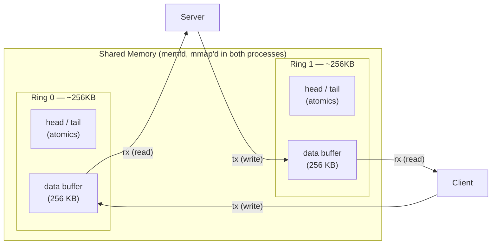
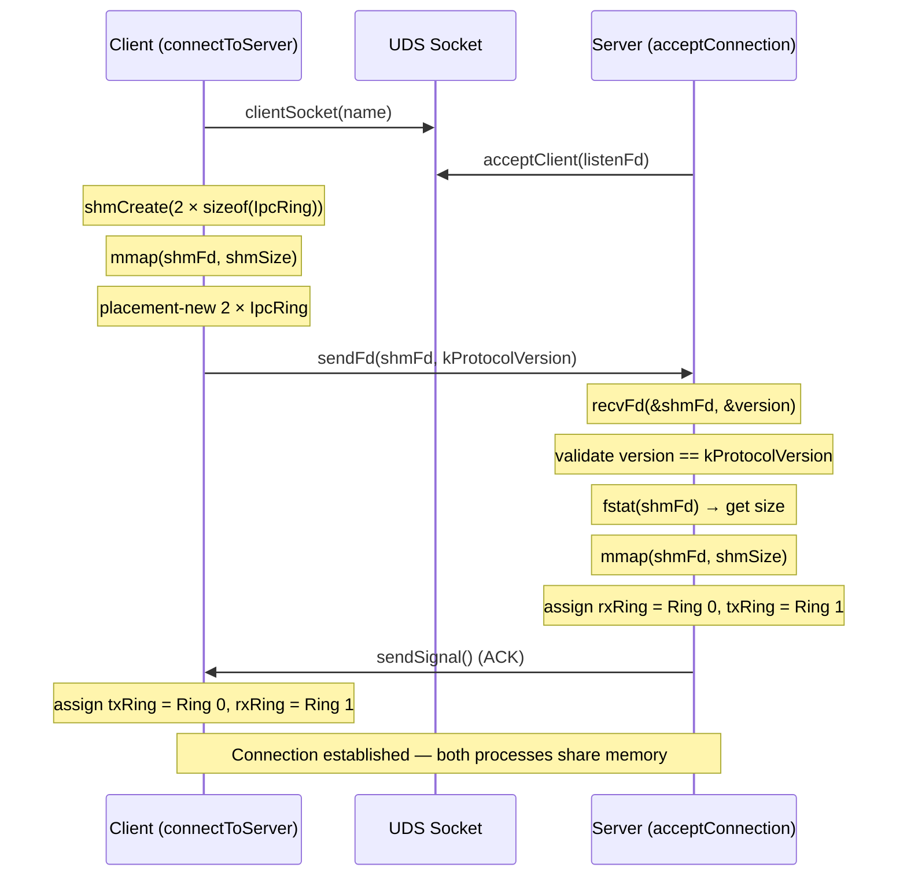
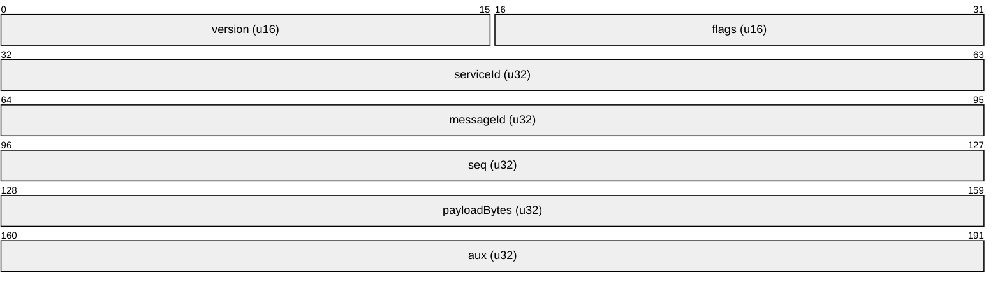
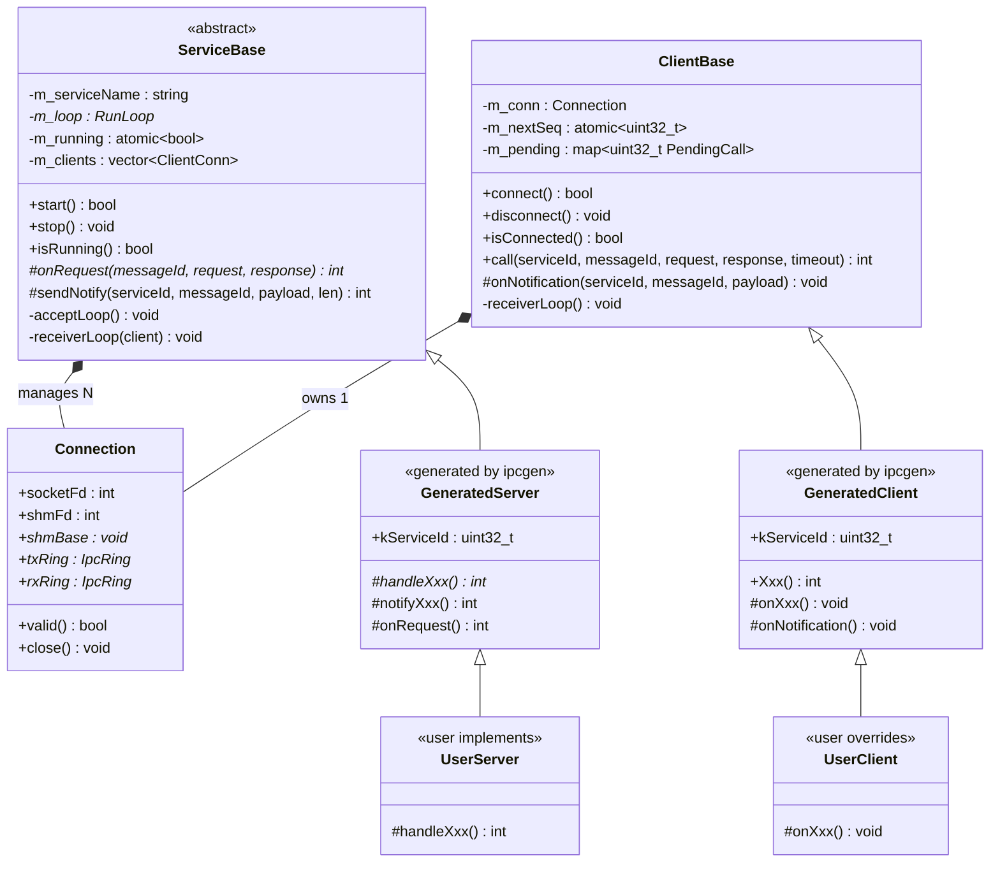

# ms-ipc Detailed Design

## 1. Scope

This document covers the implementation details of the ms-ipc core runtime:
classes, data structures, wire protocol, threading, synchronization, and
platform abstraction. For the high-level architecture, see
[ms-ipc-hld.md](ms-ipc-hld.md).

## 2. Platform layer

**Namespace:** `ms::ipc::platform`
**Files:** `inc/Platform.h`, `src/PlatformLinux.cpp`

### 2.1 UDS sockets

All sockets use `SOCK_SEQPACKET` in the Linux abstract namespace. The
abstract name is `\0ipc_<serviceName>`, constructed by `buildAddr()`.

| Function | Syscalls | Returns |
|----------|----------|---------|
| `serverSocket(name)` | `socket`, `bind`, `listen` | fd or -1 |
| `clientSocket(name)` | `socket`, `connect` | fd or -1 |
| `acceptClient(listenFd)` | `accept` | fd or -1 |

### 2.2 FD passing

`sendFd()` and `recvFd()` use `sendmsg` / `recvmsg` with `SCM_RIGHTS`
ancillary data. This is used once per connection during the handshake to
transfer the shared memory file descriptor.

### 2.3 Signaling

`sendSignal()` sends a single zero byte. `recvSignal()` blocks until a
byte arrives. These are the only socket I/O after the handshake — used as
wakeup notifications when new data is in the ring buffer.

### 2.4 Shared memory

`shmCreate(size)` uses `memfd_create("ipc_shm", 0)` + `ftruncate(size)`.
Returns an anonymous file descriptor with no filesystem entry. The caller
(client) `mmap`s it and sends the fd to the peer (server), which also
`mmap`s it.

## 3. Connection

**Files:** `inc/Connection.h`, `src/Connection.cpp`

### 3.1 Data structure

```cpp
struct Connection
{
    int socketFd;          // UDS socket for signaling
    int shmFd;             // shared memory file descriptor
    void *shmBase;         // mmap'd base pointer
    uint32_t shmSize;      // total region size: 2 * sizeof(IpcRing)
    IpcRing *txRing;       // ring buffer for sending
    IpcRing *rxRing;       // ring buffer for receiving
};
```

### 3.2 Shared memory layout



Total shared memory per connection: `2 * sizeof(IpcRing)` (~512KB).

### 3.3 Handshake protocol



### 3.4 Connection teardown

`Connection::close()`:
1. `munmap(shmBase, shmSize)` — unmap shared memory
2. `closeFd(shmFd)` — close shared memory fd
3. `closeFd(socketFd)` — close socket
4. Reset all fields to defaults

## 4. Frame I/O

**Files:** `inc/FrameIO.h`, `src/FrameIO.cpp`

### 4.1 Frame format



| Byte offset | Field | Type | Size |
|-------------|-------|------|------|
| 0 | version | uint16_t | 2 |
| 2 | flags | uint16_t | 2 |
| 4 | serviceId | uint32_t | 4 |
| 8 | messageId | uint32_t | 4 |
| 12 | seq | uint32_t | 4 |
| 16 | payloadBytes | uint32_t | 4 |
| 20 | aux | uint32_t | 4 |
| 24 | payload | uint8_t[] | payloadBytes |

Total: 24 bytes header + `payloadBytes` bytes payload.

### 4.2 Frame flags

| Flag | Value | Direction | Purpose |
|------|-------|-----------|---------|
| `FRAME_REQUEST` | 0x0001 | client → server | RPC request |
| `FRAME_RESPONSE` | 0x0002 | server → client | RPC response |
| `FRAME_NOTIFY` | 0x0004 | server → client | Notification broadcast |

### 4.3 Functions

**`writeFrame(ring, header, payload, size)`** — inline.
Writes header + payload atomically to the ring. Returns `IPC_SUCCESS` or
`IPC_ERR_RING_FULL`.

**`peekFrameHeader(ring, header)`** — inline.
Reads the header without consuming. Returns true if data available.

**`readFrame(ring, header, buf, bufSize)`** — inline.
Reads header + payload into caller-provided buffer.

**`readFrameAlloc(ring, header, payload)`** — non-inline (in .cpp).
Peeks header, resizes the `std::vector<uint8_t>`, reads payload.

## 5. Class hierarchy



## 6. ServiceBase detail

**Files:** `inc/ServiceBase.h`, `src/ServiceBase.cpp`

### 5.1 Class structure

```cpp
class ServiceBase
{
public:
    ServiceBase(const char *serviceName, ms::RunLoop *loop = nullptr);
    bool start();
    void stop();
    bool isRunning() const;

protected:
    virtual int onRequest(uint32_t messageId,
                          const std::vector<uint8_t> &request,
                          std::vector<uint8_t> *response) = 0;

    int sendNotify(uint32_t serviceId, uint32_t messageId,
                   const uint8_t *payload, uint32_t payloadBytes);

private:
    struct ClientConn {
        Connection conn;
        std::thread thread;
        std::mutex handlerMutex;
    };

    // Threading
    std::string m_serviceName;
    ms::RunLoop *m_loop;
    int m_listenFd;
    std::atomic<bool> m_running;
    std::thread m_acceptThread;
    std::mutex m_clientsMutex;
    std::vector<std::unique_ptr<ClientConn>> m_clients;
};
```

### 5.2 Lifecycle

**`start()`:**
1. Create listening socket via `platform::serverSocket(m_serviceName)`
2. Set `m_running = true`
3. Threaded mode: spawn `m_acceptThread` running `acceptLoop()`
4. RunLoop mode: register `m_listenFd` on RunLoop with `onAcceptReady` callback

**`stop()`:**
1. Set `m_running = false`
2. Threaded mode — two-phase shutdown:
   - Phase 1: `shutdown(m_listenFd)` → join accept thread
   - Phase 2: `shutdown()` each client socket → join receiver threads
3. RunLoop mode:
   - `removeSource(m_listenFd)`
   - For each client: `removeSource(clientFd)`, wait for `handlerMutex`
4. Close all connections, clear client list

### 5.3 Accept loop (threaded)

```
while (m_running):
    conn = acceptConnection(m_listenFd)
    if conn.valid():
        create ClientConn
        spawn receiverLoop(client) thread
        add to m_clients
```

### 5.4 Receiver loop (threaded, per client)

```
while (m_running):
    recvSignal(socketFd)
    while peekFrameHeader(rxRing):
        readFrameAlloc(rxRing, &header, &payload)
        if FRAME_REQUEST:
            response = {}
            status = onRequest(header.messageId, payload, &response)
            writeFrame(txRing, RESPONSE_header, response)
            sendSignal(socketFd)
```

### 5.5 Notification broadcast

`sendNotify()`:
1. Lock `m_clientsMutex`
2. For each connected client:
   - `writeFrame(FRAME_NOTIFY)` to client's txRing
   - `sendSignal()` on client's socket
3. Unlock

### 5.6 RunLoop mode

`onAcceptReady()`: Called when `m_listenFd` is readable. Accepts connection,
registers client fd on RunLoop.

`onClientReady(client)`: Called when client fd is readable. Locks
`handlerMutex`, drains frames, dispatches requests, sends responses.

## 7. ClientBase detail

**Files:** `inc/ClientBase.h`, `src/ClientBase.cpp`

### 6.1 Class structure

```cpp
class ClientBase
{
public:
    ClientBase(const char *serviceName, ms::RunLoop *loop = nullptr);
    bool connect();
    void disconnect();
    bool isConnected() const;

    int call(uint32_t serviceId, uint32_t messageId,
             const std::vector<uint8_t> &request,
             std::vector<uint8_t> *response,
             uint32_t timeoutMs = 2000);

protected:
    virtual void onNotification(uint32_t serviceId, uint32_t messageId,
                                const std::vector<uint8_t> &payload);

private:
    struct PendingCall {
        std::condition_variable cv;
        bool done;
        int status;
        std::vector<uint8_t> response;
    };

    Connection m_conn;
    std::atomic<bool> m_running;
    std::atomic<uint32_t> m_nextSeq;
    std::thread m_receiverThread;
    std::mutex m_handlerMutex;
    std::mutex m_pendingMutex;
    std::unordered_map<uint32_t, std::shared_ptr<PendingCall>> m_pending;
};
```

### 6.2 Synchronous RPC (`call()`)

1. Generate sequence number: `seq = m_nextSeq++`
2. Create `PendingCall` entry in `m_pending[seq]`
3. Build `FrameHeader` with `FRAME_REQUEST`, `seq`, service/message IDs
4. `writeFrame()` to `txRing`
5. `sendSignal()` on socket
6. `cv.wait_for(timeoutMs)` — blocks caller thread
7. On wakeup:
   - If `done == true`: copy response, return status
   - If timeout: return `IPC_ERR_TIMEOUT`
8. Remove from `m_pending`

### 6.3 Receiver loop

```
while (m_running):
    recvSignal(socketFd)
    while peekFrameHeader(rxRing):
        readFrameAlloc(rxRing, &header, &payload)
        if FRAME_RESPONSE:
            lock m_pendingMutex
            find m_pending[header.seq]
            set done = true, status = header.aux, response = payload
            cv.notify_one()
        if FRAME_NOTIFY:
            onNotification(header.serviceId, header.messageId, payload)
```

### 6.4 Disconnect

1. Set `m_running = false`
2. Threaded: `shutdown(socketFd)` → join receiver thread
3. RunLoop: `removeSource(socketFd)`, wait for `m_handlerMutex`
4. Fail all pending calls: set `status = IPC_ERR_DISCONNECTED`, `done = true`,
   `cv.notify_one()` for each
5. Clear `m_pending`
6. `m_conn.close()`

## 8. Synchronization

### 7.1 Mutexes

| Mutex | Owner | Protects |
|-------|-------|----------|
| `m_clientsMutex` | ServiceBase | `m_clients` vector; held during broadcast |
| `handlerMutex` | ServiceBase::ClientConn | Guards RunLoop handler execution per client |
| `m_pendingMutex` | ClientBase | `m_pending` map |
| `m_handlerMutex` | ClientBase | Guards RunLoop handler execution |

### 7.2 Atomics

| Atomic | Owner | Purpose |
|--------|-------|---------|
| `m_running` | ServiceBase, ClientBase | Checked by loops to know when to exit |
| `m_nextSeq` | ClientBase | Generates unique sequence numbers for request-response correlation |

### 7.3 Lock-free data path

The SPSC ring buffers use atomic head/tail pointers with acquire/release
memory ordering. No mutex is needed for the ring buffer reads and writes —
only one producer and one consumer per ring.

### 7.4 Condition variables

Each `PendingCall` has a `condition_variable`. The calling thread blocks on
`cv.wait_for()`. The receiver thread calls `cv.notify_one()` when the
matching response arrives.

## 9. Error codes

```cpp
enum IpcError : int
{
    IPC_SUCCESS             =  0,
    IPC_ERR_DISCONNECTED    = -1,   // connection lost or not connected
    IPC_ERR_TIMEOUT         = -2,   // call() timed out
    IPC_ERR_INVALID_SERVICE = -3,   // reserved
    IPC_ERR_INVALID_METHOD  = -4,   // unknown messageId in onRequest()
    IPC_ERR_VERSION_MISMATCH = -5,  // protocol version mismatch during handshake
    IPC_ERR_RING_FULL       = -6,   // ring buffer full
    IPC_ERR_STOPPED         = -7,   // service stopped while call pending
};
```

User-defined errors are positive integers, returned by `onRequest()` and
delivered to the caller in the frame's `aux` field.

## 10. Protocol constants

| Constant | Value | Purpose |
|----------|-------|---------|
| `kProtocolVersion` | 1 | Validated during handshake |
| `kRingSize` | 256 * 1024 (256KB) | Size of each ring buffer's data region |
| `sizeof(FrameHeader)` | 24 bytes | Fixed frame header size |
| `sizeof(IpcRing)` | ~256KB | Total ring buffer including control block |

## 11. File index

| File | Purpose |
|------|---------|
| `inc/Platform.h` | Platform abstraction: sockets, shared memory, signaling |
| `inc/Types.h` | Protocol constants, error codes, frame header |
| `inc/Connection.h` | Connection struct and handshake functions |
| `inc/FrameIO.h` | Frame read/write functions (mostly inline) |
| `inc/ServiceBase.h` | Server-side service base class |
| `inc/ClientBase.h` | Client-side RPC base class |
| `src/PlatformLinux.cpp` | Linux implementation of platform functions |
| `src/Connection.cpp` | Handshake implementation and `Connection::close()` |
| `src/FrameIO.cpp` | `readFrameAlloc()` implementation |
| `src/ServiceBase.cpp` | Service lifecycle, threading, dispatch, notifications |
| `src/ClientBase.cpp` | Client connect, sync RPC, receiver loop |
