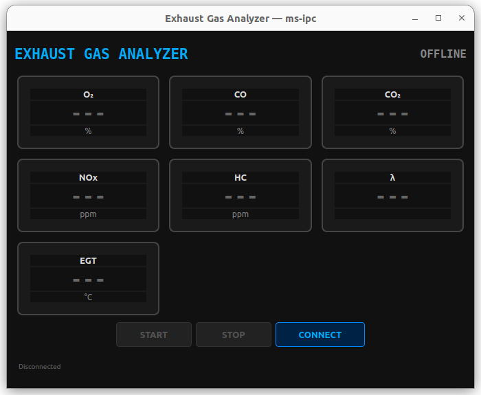
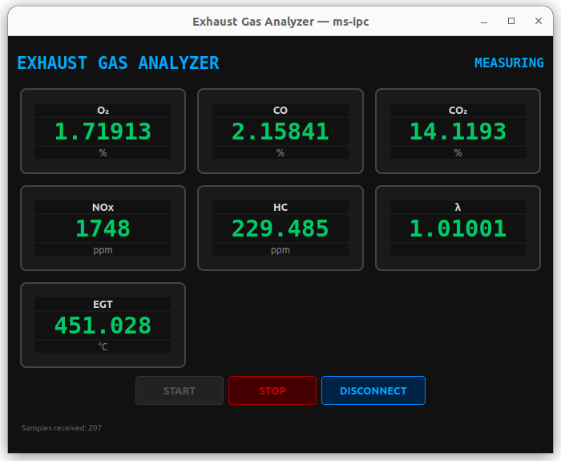

# Exhaust Gas Analyzer Example

Build a richer desktop-style app: a generated IPC service, a simulation server,
and a Qt dashboard client with live notifications.

## Screenshots

Disconnected:



Measuring:



## What You'll Learn
- how Aether-generated bindings scale beyond the small echo examples
- how a GUI client consumes notifications and marshals them onto the UI thread
- how to structure a simulation server around methods plus periodic updates

## Prerequisites
- repository root checkout
- `nix` available so Qt5 is present in the dev environment
- two terminals inside `nix develop`

## Files That Matter
| File | Why it matters |
|------|----------------|
| `ExhaustAnalyzer.idl` | service, enum, and notification contract |
| `gen/server/ExhaustAnalyzer.*` | generated server base class used by `exhaust_server.cpp` |
| `gen/client/ExhaustAnalyzer.*` | generated client class used by `exhaust_client.cpp` |
| `exhaust_server.cpp` | simulation logic, status transitions, and notification broadcast |
| `exhaust_client.cpp` | Qt widgets, signal bridging, and client-side method calls |

## Step 1: Read the IDL
`ExhaustAnalyzer.idl` defines:
- methods to query analyzer status and readings, then start or stop measurement
- `AnalyzerStatus` and `GasReadings` as shared types
- notifications for live readings and status changes

That gives you the same generated client/server split as `echo/`, but with a
larger payload and a UI-driven client.

## Step 2: Generate Code
Run from the repository root:

```bash
python3 -m tools.ipcgen examples/apps/exhaust-analyzer/ExhaustAnalyzer.idl --outdir examples/apps/exhaust-analyzer/gen
```

Generated outputs include:
- `examples/apps/exhaust-analyzer/gen/ExhaustAnalyzerTypes.h`
- `examples/apps/exhaust-analyzer/gen/server/ExhaustAnalyzer.h`
- `examples/apps/exhaust-analyzer/gen/server/ExhaustAnalyzer.cpp`
- `examples/apps/exhaust-analyzer/gen/client/ExhaustAnalyzer.h`
- `examples/apps/exhaust-analyzer/gen/client/ExhaustAnalyzer.cpp`

## Step 3: Review the User Code
- `exhaust_server.cpp` subclasses the generated server base and implements the
  four handlers plus the sensor simulation loop.
- `exhaust_client.cpp` subclasses the generated client, translates callbacks
  into Qt signals, and updates the dashboard widgets.
- Aether handles connection setup, message routing, request/response framing,
  and notification delivery between the two processes.

## Build
Run from the repository root:

```bash
nix develop -c python3 build.py -e
```

## Run
Run from the repository root:

```bash
# Terminal 1
nix develop -c ./build/examples/apps/exhaust-analyzer/exhaust_server

# Terminal 2
nix develop -c ./build/examples/apps/exhaust-analyzer/exhaust_client
```

In the client window, click `CONNECT` and then `START`.

## Expected Output
Server terminal:

```text
Exhaust Gas Analyzer Service
[analyzer] warming up...
[analyzer] ready — waiting for clients
[analyzer] measurement started — broadcasting at 10 Hz
```

Client window:
- status moves from `OFFLINE` to `READY` and then `MEASURING`
- gauges begin updating with live O2, CO, CO2, NOx, HC, lambda, and temperature values

**Disconnected** — gauges idle, waiting to connect to the analyzer service:


**Measuring** — live sensor data streaming at 10 Hz via IPC notifications:


## What Just Happened
The IDL generated the RPC surface, but the interesting app behavior lives in
two places: the server simulation and the Qt dashboard. The server publishes
state transitions and sensor readings, and the client turns those notifications
into UI updates on the Qt event loop.

## What To Modify Next
- add another gas channel or alarm notification to the IDL and regenerate
- change the server simulation thresholds or warmup timing and observe the UI

## Related Examples
- [`../../getting-started/echo/`](../../getting-started/echo/) for the smaller generated client/server path
- [`../../getting-started/sdk-usage/`](../../getting-started/sdk-usage/) if you want the same codegen model against a packaged SDK
